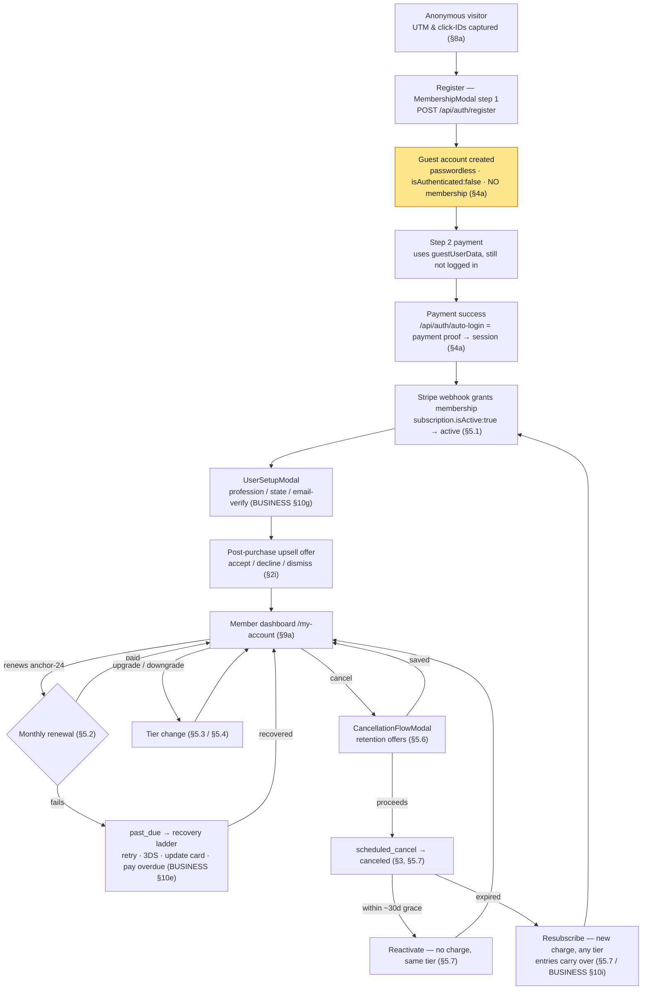
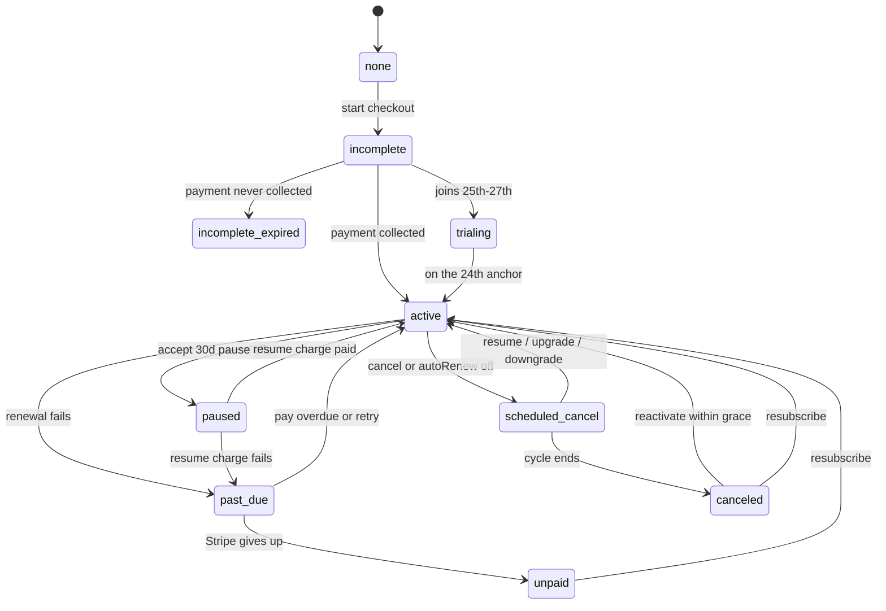

# Tools Australia — Customer Context

> **Audience.** Developers and Claude sessions who need the authoritative reference on *who the customer is*, *what data we hold about them*, and their auth/account flows.
>
> **Scope and complementary contract.** CUSTOMER.md **OWNS** the customer entity and data — the `User` model/fields, customer-type taxonomy, PII footprint, data-rights, and the field-level mapping of which field holds which state. For business **mechanics** (state machine, billing rules, cancellation-flow internals, entries mechanics, perk rules, the member dashboard), CUSTOMER.md links to [BUSINESS.md](BUSINESS.md) rather than restating them — **single source of truth per fact**.
>
> The underlying technical entity is the [`src/models/User.ts`](src/models/User.ts) record, a **mixed-class collection**: the same model also holds **staff and admin** accounts (`userType: "customer" | "staff" | "admin"`, `roleId`). A customer is `userType: "customer"` / `roleId: null` ([User.ts:291-292](src/models/User.ts#L291)). Staff/admin RBAC fields are flagged where they appear but are **out of scope** here — see [docs/auth/](docs/auth/) for those.

---

## 1. Who the customer is

There is **no separate "guest" model**. Registered guests and members are the same `User` collection, differentiated at runtime by what their `subscription` and purchase sub-documents hold. "Member" status is **derived** from `subscription.isActive` / `hasActiveSubscription` ([UserContext.tsx:73-77](src/contexts/UserContext.tsx#L73)) — there is no `isMember` boolean field on the model (though `isMember` IS a derived value computed in `UserContext.tsx:77`, not a model field).

| Customer type | How it's represented in code | What they can do |
| --- | --- | --- |
| **Anonymous visitor** | No `User` record at all (not signed in). Only retroactively traceable via `signupAttribution.anonymousId` *after* they register ([User.ts:241-256](src/models/User.ts#L241)). | Browse the public site. No entries, no partner access. |
| **Registered guest** (account, no membership) | A `User` exists but `subscription` is absent / `isActive: false` (`status` defaults to `"incomplete"`) and the purchase arrays are empty ([User.ts:485-496](src/models/User.ts#L485)). | Signed in; can purchase. Gated out of member-only surfaces until first purchase activates them. Classified as **Guest** in the dashboard ([settings/page.tsx:66-108](src/app/(site)/my-account/settings/page.tsx#L66) — `isMember` derived at 66-70, badge ternary with the neutral Guest fallback at 91-108). |
| **Active member / subscriber** | `subscription.isActive: true` with Stripe `status` of `active` / `trialing` ([User.ts:38-40](src/models/User.ts#L38)). **One subscription at a time.** | Monthly entries, partner discounts, retention modals, full member dashboard at `/my-account/`. |
| **One-time-only buyer** | No active `subscription`, but holds entries in `oneTimePackages` ([User.ts:89-96](src/models/User.ts#L89)) and/or `miniDrawPackages` ([User.ts:99-112](src/models/User.ts#L99)). Can hold **multiple** of these. | Entries / partner access from each pack until its `endDate`; no recurring billing. Shows as **One-time** in the dashboard while a pack is active ([settings/page.tsx:102-107](src/app/(site)/my-account/settings/page.tsx#L102), derived from `acct === "onetime"` in [useDashboardState.ts:139-141](src/hooks/useDashboardState.ts#L139)); falls back to **Guest** only once all packs expire. |

A single customer can be more than one of the last two at once (e.g. an active member who also bought a one-time pack). For the package catalog itself (Tradie / Foreman / Boss subscriptions; Apprentice → VIP one-time packs; Additional and upsell packs) see [BUSINESS.md §2](BUSINESS.md).

---

## Journey map — the customer path at a glance

> **This is a router, not a restatement.** Each stage links to the section that OWNS the detail — CUSTOMER.md for *which field / what data*, [BUSINESS.md](BUSINESS.md) for *mechanics*, `docs/<domain>/` for *internals*. Per the single-source-of-truth contract nothing here re-explains a flow; it points you at the one place that does. Keep it a map: update the pointers when sections move, don't grow mechanics here.

### The membership spine — acquisition → conversion → lifecycle → win-back

The **highlighted** node is the codebase's most non-obvious rule: registering in step 1 does **not** log the user in or grant membership — the guest crosses step 2 as `guestUserData` and only becomes a session after Stripe payment-proof (§4a, [docs/auth/gotchas.md](docs/auth/gotchas.md)). Side flows not on this spine (one-time / Additional packs, Mini Pack entry, perks) are in the router table below.

### Subscription lifecycle states

The canonical 10-state enum lives on [`MembershipStatusHistory`](src/models/MembershipStatusHistory.ts) — the nine Stripe/app states below plus the app-owned `paused` retention state; the full table + transition mechanics are [BUSINESS.md §10](BUSINESS.md). The picture:

Two **ghost states** ride on top of the enum without being in it: `pendingChange` (upgrade charge in-flight) and `previousSubscription` (downgrade benefits held until `endDate`). They change what tier the customer effectively has *right now* — see §3b / [BUSINESS.md §10b](BUSINESS.md).

### Stage → authoritative source

| Journey stage | What happens | Owns the detail |
|---|---|---|
| Acquisition / attribution | UTM + click-IDs captured; converting platform resolved at purchase | §8a, §8b · [docs/tracking/](docs/tracking/) |
| Register (guest bridge) | Step-1 register creates a passwordless guest — **no login, no membership**. Registering with an existing guest's email/mobile updates that plain account; registering with a **staff/admin** email/mobile is rejected (`400`, "please log in") — privileged accounts are never created or mutated via public register (marker: `roleId`/`userType`, not `role`) | §4a, §4b · [docs/auth/gotchas.md](docs/auth/gotchas.md) |
| Login | password / email sign-in code / Google / post-payment auto-login / **SMS sign-in code** (added 2026-08-27). SMS is surfaced on `/login` as *"Can't access your email? Sign in with your mobile"* — the recovery path for a member whose email is wrong or unverified, for whom every other route back in goes through an inbox they cannot read. It resolves the account **by mobile** and texts that same number, so a caller can never redirect another account's code; it is gated on having ever paid, capped at 3 codes/day with a 60s cooldown, and completing it also sets `isMobileVerified` (proving control of the number *is* verification). Ships **dark** until `SMS_ENABLED=true`. The old scaffold (`send-otp`, `verify-otp`, `passwordless-login`) was deleted 2026-08-26 — unreachable in production, and `passwordless-login` delivered the code to a **request-supplied** number. See [docs/auth/gotchas.md](docs/auth/gotchas.md) and [the design spec](docs/superpowers/specs/2026-08-25-mobile-verification-and-sms-login-design.md). | §4c–§4f |
| First payment & activation | Full price at signup; webhook grants membership. Card declines return a 400 with the decline reason, and checkout shows short per-decline-code guidance (e.g. "Not enough funds on this card. Try another card."); sensitive codes (lost/stolen/fraud) get a generic "card declined" message | §5.1 · [BUSINESS.md §9, §10g](BUSINESS.md) · [payment-error-messages.ts](src/utils/payment/stripe/payment-error-messages.ts) |
| Post-purchase setup | UserSetupModal captures profession/state/DOB (all required) **+ gender (optional, never gates "Continue")** + email-verify prompt | [BUSINESS.md §10g](BUSINESS.md) · [docs/USER_SETUP_MODAL.md](docs/USER_SETUP_MODAL.md) |
| Upsell offer | Post-success offer; per-trigger dedup | §2i · [docs/upsell/](docs/upsell/) · [BUSINESS.md §5](BUSINESS.md) |
| Member dashboard | The ROI surface at `/my-account` | §9a · [BUSINESS.md §10h](BUSINESS.md) |
| Renewal (anchor-24) | Monthly renew; 25th–27th joiners anchored to the 24th | §5.2 · [BUSINESS.md §9b](BUSINESS.md) · [BILLING_ANCHOR_24.md](docs/BILLING_ANCHOR_24.md) |
| Upgrade / Downgrade | Immediate charge + cycle reset vs. deferred with benefits preserved | §5.3, §5.4 · [BUSINESS.md §10c, §10d](BUSINESS.md) |
| Auto-renew toggle | Soft-cancel shortcut (`cancel_at_period_end`) | §5.5 · [BUSINESS.md §10a](BUSINESS.md) |
| Past-due recovery | Self-serve retry → 3DS → update card → pay overdue. **The 3DS rung was broken until 2026-09-03**: a member whose bank demanded a 3D Secure challenge got a generic error on Pay Now and could not pay their renewal at all (see [BUSINESS.md §9d](BUSINESS.md)). Pay Now now returns the bank's challenge to the browser like every other 3DS surface. **Any failed renewal — including an admin re-bill of a stranded member — fires the "Subscription Renewal Failed" dunning email**, and leaves the member unpaused / in dunning rather than re-freezing them **If Stripe has temporarily blocked the member's card after too many attempts, Pay Now returns a short, dated message — "This card is temporarily blocked after too many attempts. Use a different card, or try again in 3 days." — and the automated charge run also leaves that card alone for 3 days (it is keyed to the card, so adding a new card works straight away).** | §3a · [BUSINESS.md §9i, §10e](BUSINESS.md) · [FAILED_RENEWAL_PAY_NOW.md](docs/FAILED_RENEWAL_PAY_NOW.md) |
| Cancellation & retention | CancellationFlowModal; five save-offers, seven reasons. **Streak-stakes step (2026-07-15, dark until streak launch):** non-past-due members see a Membership Streak stakes screen between reason and the offers — loss framing (streak ≥ 2: banked renewals + next milestone + pause-freezes-your-streak) or forward framing (streak 0/1: the ladder); "Continue cancelling" always visible; exit recorded as `stakesAction` with `streakMonthsAtStart` on the event. The pause offer card also states the streak freezes. | §5.6 · [BUSINESS.md §13c](BUSINESS.md) · [docs/subscription/cancellation-flow.md](docs/subscription/cancellation-flow.md) |
| Reactivate vs Resubscribe | Grace-window reactivate vs. fully-expired win-back | §5.7 · [BUSINESS.md §10i](BUSINESS.md) |
| Entries & eligibility | How entries are earned; 18+, SA/ACT and employees excluded | §6, §6a · [BUSINESS.md §3](BUSINESS.md) |
| One-time / Additional packs | Non-recurring packs (guest or member) | [BUSINESS.md §2](BUSINESS.md) · [docs/cart-shop-products/](docs/cart-shop-products/) |
| Mini-draw entry | Threshold-triggered Mini Pack purchase | [docs/draws/](docs/draws/) · [BUSINESS.md §3b](BUSINESS.md) |
| Perks | Partner / referral / affiliate / rewards | §7 · [docs/partner/](docs/partner/), [docs/referrals/](docs/referrals/), [docs/affiliate/](docs/affiliate/), [docs/rewards-redeemables/](docs/rewards-redeemables/) |
| Account surface & data rights | Dashboard, PII footprint, delete chat, sign-out clearing | §9 |

---

## 2. The customer data model

Every field below lives on the `User` Mongoose model ([src/models/User.ts](src/models/User.ts); interface lines 3-313, schema 315-1133). This is a **load-bearing** inventory — keep it intact when the model changes.

**PII legend:** **PII** = personal/identifying or payment data (email/phone/address/name/payment/DOB); **Sensitive** = secret/credential material; **—** = non-sensitive.

> **Caveats.** The schema is `strict: true` + `strictQuery: true` — fields not in the schema are rejected ([User.ts:1130-1131](src/models/User.ts#L1130)). `mobile` is normalized to `+61…` format on every save via a pre-save hook ([User.ts:1136-1158](src/models/User.ts#L1136)). The exact client-facing `UserData` shape returned to the browser (defined in `@/hooks/queries/useUserQueries`) is since 2026-07-19 an explicit **include-list wire projection** (`MY_ACCOUNT_USER_FIELDS`, [src/utils/dashboard/my-account-projection.ts](src/utils/dashboard/my-account-projection.ts)): all credential/secret fields below are excluded from API responses, as are `processedPayments`, `upsellHistory`, `upsellPurchases`, `redemptionHistory`, and `cart` — a wire-shape change only; nothing changed in what is *stored* about the customer.

### 2a. Identity & profile

| Field | Type | Meaning | PII |
|---|---|---|---|
| `_id` | string | Mongo document id (typed as string) ([User.ts:4](src/models/User.ts#L4)) | — |
| `firstName` | string (req, ≤50) | Given name ([User.ts:5](src/models/User.ts#L5)) | **PII** |
| `lastName` | string (req, ≤50) | Family name ([User.ts:6](src/models/User.ts#L6)) | **PII** |
| `state` | string (opt) | AU state/territory code; validated against NSW/VIC/QLD/WA/SA/TAS/ACT/NT ([User.ts:10](src/models/User.ts#L10)) | **PII** (coarse) |
| `profession` | string (opt, ≤100) | e.g. Builder, Electrician, Other ([User.ts:11](src/models/User.ts#L11)) | — |
| `gender` | "male" \| "female" (opt) | Optional; **unset = unknown** and deliberately covers both "declined" and "never asked" — there is no opt-out option because the field is never required ([User.ts:12](src/models/User.ts#L12), [src/data/genders.ts](src/data/genders.ts)) | **PII** (coarse) |
| `birthdate` | Date (opt) | DOB; drives age-based eligibility; cannot be future ([User.ts:13](src/models/User.ts#L13)) | **PII** |
| `profileSetupCompleted` | boolean (def false) | Whether profile setup is done ([User.ts:13](src/models/User.ts#L13)) | — |
| `role` | "user" \| "admin" (def "user") | Legacy coarse role marker ([User.ts:14](src/models/User.ts#L14)) | — |

### 2b. Authentication & credentials

| Field | Type | Meaning | PII |
|---|---|---|---|
| `email` | string (req, unique, lowercase) | Login + primary contact; permissive regex-validated — `local@domain.tld` shape only (accepts `+` plus-addressing and any TLD length ≥2 chars), deliverability is the real check ([User.ts:346](src/models/User.ts#L346)) | **PII** |
| `password` | string (opt, ≥6) | bcrypt hash; **optional** — passwordless customers have none ([User.ts:8](src/models/User.ts#L8)) | **Sensitive** |
| `isEmailVerified` | boolean (def false) | Email verified flag ([User.ts:145](src/models/User.ts#L145)) | — |
| `isMobileVerified` | boolean (opt, def false) | Mobile verified flag ([User.ts:146](src/models/User.ts#L146)) | — |
| `emailVerificationToken` / `mobileVerificationToken` | string (opt) | Verification tokens ([User.ts:147-148](src/models/User.ts#L147)) | **Sensitive** |
| `emailVerificationCode` / `…Expires` / `…Attempts` | string / Date / number | 6-char email code + expiry + attempt counter ([User.ts:151-153](src/models/User.ts#L151)) | **Sensitive** (code) |
| `smsOtpCode` / `…Expires` / `…Attempts` | string / Date / number | **Vestigial since 2026-08-26.** Held a *plaintext* SMS OTP for the deleted passwordless-auth routes. Only the admin "resend SMS verification" action still writes them — and that action sends no message (its gateway call is commented out while it returns success). Scheduled for replacement: the new policy stores an **HMAC-SHA256 digest keyed with `NEXTAUTH_SECRET`**, never the code ([mobile-otp.ts](src/utils/auth/mobile-otp.ts)). ([User.ts:159-161](src/models/User.ts#L159)) | **Sensitive** (code) |
| `loginCode` / `…Expires` / `…Attempts` | string / Date / number | Emailed passwordless sign-in code ([User.ts:164-166](src/models/User.ts#L164)) | **Sensitive** (code) |
| `passwordResetToken` / `passwordResetExpires` | string / Date | Single-use reset token + expiry ([User.ts:169-170](src/models/User.ts#L169)) | **Sensitive** (token) |

### 2c. Contact & marketing consent

| Field | Type | Meaning | PII |
|---|---|---|---|
| `mobile` | string (opt) | AU mobile; validated + normalized to `+61…` on save ([User.ts:9](src/models/User.ts#L9), hook [1136-1158](src/models/User.ts#L1136)) | **PII** |
| `acceptsPromotionalEmail` | boolean (opt) | Klaviyo marketing opt-in; **omitted/undefined ⇒ opted in** ([User.ts:180](src/models/User.ts#L180)) | — |
| `pendingKlaviyoMergeFromEmail` | string (opt, lowercase) | Old email to merge from in Klaviyo after a verified email change; cleared after merge ([User.ts:156](src/models/User.ts#L156)) | **PII** |
| `klaviyoSyncedAt` | Date (opt) | When **we** last wrote this customer's Klaviyo marketing profile. Set by the reconciliation sweep with `{ timestamps: false }` so it never bumps `updatedAt`. Internal only — never surfaced to the customer. Added 2026-08-26 (§8-0) | — |

### 2d. Subscription / membership

Embedded subdocument `subscription` (one active membership at a time; [User.ts:29-86](src/models/User.ts#L29), schema 466-595). `packageId` is `Schema.Types.Mixed` to allow ObjectId or string.

| Field | Type | Meaning | PII |
|---|---|---|---|
| `subscription.packageId` | string\|null | Current package id after any changes ([User.ts:30](src/models/User.ts#L30)) | — |
| `subscription.startDate` / `endDate` | Date | Membership start / cycle end ([User.ts:31-32](src/models/User.ts#L31)) | — |
| `subscription.cancelledAt` | Date (opt) | When the user triggered cancellation ([User.ts:33](src/models/User.ts#L33)) | — |
| `subscription.pastDueAt` | Date (opt) | First past_due timestamp ([User.ts:35](src/models/User.ts#L35)) | — |
| `subscription.lastReanchoredInvoiceId` | string (opt) | Idempotency marker for past-due re-anchor ([User.ts:37](src/models/User.ts#L37)) | — |
| `subscription.isActive` | boolean (def false) | Active membership flag ([User.ts:38](src/models/User.ts#L38)) | — |
| `subscription.autoRenew` | boolean (opt, def true) | Auto-renew toggle (soft-cancel shortcut) ([User.ts:39](src/models/User.ts#L39)) | — |
| `subscription.status` | string (def "incomplete") | Stripe status string, plus the app-owned `"paused"` retention state — for the full state machine see [BUSINESS.md §10](BUSINESS.md) ([User.ts:40](src/models/User.ts#L40)) | — |
| `subscription.pausedFrom` / `pausedUntil` | Date (opt) | **Retention-pause window** — set when a member accepts the 30-day `pause_30d` offer (§5.6). `pausedFrom` = the member's period end (freeze begins); `pausedUntil` = auto-resume date (`pausedFrom + 1 month`, the next billing-cycle boundary, calendar-clamped via `addMonths`). While `pausedFrom ≤ now < pausedUntil` the member is frozen (`status="paused"`, `isActive=false`); cleared on resume ([User.ts:50-51](src/models/User.ts#L50)). See [BUSINESS.md §10a](BUSINESS.md) | — |
| `subscription.pendingStripeSubscriptionId` / `…RequestId` / `…CreatedAt` | string / string / Date | Non-canonical pending Stripe sub from initial checkout ([User.ts:43-45](src/models/User.ts#L43)) | — |
| `subscription.previousSubscription` | subdoc (opt) | **Downgrade ghost state**: cached old `packageId`, `packageName`, `benefits{entriesPerMonth, discountPercentage}`, `startDate`, `endDate`, `downgradeDate` ([User.ts:49-59](src/models/User.ts#L49)) | — |
| `subscription.pendingChange` | subdoc (opt) | **Upgrade ghost state**: `newPackageId`, `changeType: "upgrade"`, `stripeSubscriptionId?`, `paymentIntentId?`, `upgradeAmount?` ([User.ts:63-69](src/models/User.ts#L63)) | — |
| `subscription.lastDowngradeDate` / `lastUpgradeDate` | Date (opt) | Anti-gaming / anti-webhook-interference guards ([User.ts:72-75](src/models/User.ts#L72)) | — |
| `subscription.lastMonthAccumulatedEntries` | number (opt) | Carry-over for renewal entry calc; **persists through cancel** ([User.ts:80](src/models/User.ts#L80)) | — |
| `subscription.streakMonths` | number (opt, default 0) | **Membership Streak**: consecutive paid renewals (join = month 0; +1 per paid renewal). Recovery keeps it, a retention pause freezes it, a grace-window (≤30 days) resubscribe **continues it (carried across the resubscribe/renew routes' subscription replacement — in-route grace/reset decision via `carryStreakAcrossSubscriptionReplace`)**, upgrades/downgrades never touch it; only a longer lapse resets it. **A fully refunded counted renewal decrements it by 1** (its `MembershipRenewalCycle` row flips to `refunded` so repairs agree). Written only by the Stripe webhook, the resubscribe/renew carry, the refund reversal, and the backfill script. **Customer-visible (P3, currently DARK behind `DASHBOARD_FEATURES.loyaltyStreak` until launch)**: the `/my-account` streak medallion card, milestones track, wallet Streak bucket, and a once-only celebration toast (localStorage marker `ta-streak-seen:<userId>` — user-scoped client storage, cleared on sign-out; re-seeded downward after a reset). Cobber FAQ ids 69–71 explain the feature to customers. | — |
| `subscription.streakGeneration` | number (opt, default 1) | Bumps on each out-of-grace resubscribe reset; scopes milestone re-earning (P2 engine built — streak rungs auto-grant free entries into the Major Draw once activated at launch; new streak issuances are strictly payment-coupled — cron only re-delivers failed grants). | — |
| `subscription.lastStreakStartInvoiceId` | string (opt) | Idempotency marker for the streak start/reset writer (internal). | — |
| `subscription.lastResubscribedAt` | Date (opt) | Most-recent resubscribe time (drives carry-over banner) ([User.ts:85](src/models/User.ts#L85)) | — |
| `stripeCustomerId` | string (opt) | Stripe customer id ([User.ts:17](src/models/User.ts#L17)) | **PII** (payment link) |
| `stripeSubscriptionId` | string (opt, sparse) | Canonical Stripe subscription id ([User.ts:18](src/models/User.ts#L18)) | — |

**One-time / mini-draw purchase arrays** (a customer can hold many):

| Field | Type | Meaning | PII |
|---|---|---|---|
| `oneTimePackages[]` | array | Each: `packageId, purchaseDate, startDate, endDate, isActive, entriesGranted` ([User.ts:89-96](src/models/User.ts#L89)) | — |
| `miniDrawPackages[]` | array (opt, def []) | Each: `packageId, packageName, miniDrawId?, purchaseDate, startDate, endDate, isActive, entriesGranted, price, partnerDiscountHours, partnerDiscountDays, stripePaymentIntentId` ([User.ts:99-112](src/models/User.ts#L99)) | — |

### 2e. Entries & draw history

| Field | Type | Meaning | PII |
|---|---|---|---|
| `miniDrawParticipation[]` | array (opt, def []) | Per-mini-draw tracking: `miniDrawId, totalEntries, entriesBySource{"mini-draw-package"?, "free-entry"?}, firstParticipatedDate, lastParticipatedDate, isActive` ([User.ts:116-126](src/models/User.ts#L116)) | — |
| `accumulatedEntries` | number (def 0) | Total entries ever received ([User.ts:129](src/models/User.ts#L129)) | — |
| `entryWallet` | number (def 0) | **Deprecated — kept at 0** ([User.ts:130](src/models/User.ts#L130)) | — |
| `rewardsPoints` | number (def 0) | Points earned from purchases (legacy; see §7d) ([User.ts:131](src/models/User.ts#L131)) | — |
| `cart[]` | array | Cart items, `type: "product" \| "ticket"` with `productId?` / `miniDrawId?`, **`sku?`**, `quantity`, `price?` ([User.ts:136-142](src/models/User.ts#L136)). **`sku` added 2026-08-17**: a product line's identity is now `(productId, sku)`, not `productId` alone — two sizes of the same garment are two lines, and removing one does not remove the other. Absent on ticket items and on product lines added before variants existed; those keep their previous behaviour exactly. Not exposed to the browser — `cart` is excluded from the `MY_ACCOUNT_USER_FIELDS` wire projection (see caveats above). | — |

> **Major-draw entries are NOT on `User`.** They were removed; the single source of truth is `MajorDraw.entries` ([User.ts:133,752](src/models/User.ts#L133)). See [BUSINESS.md §3](BUSINESS.md).

**Merchandise is a fourth way a customer can hold entries (2026-08-17).** Buying an eligible shop
item credits free entries into the **Major Draw only** — never a Mini Draw — under the source key
`entriesBySource.shop`. What the customer receives is
`includedEntries × quantity × the item's own multiplier`.

**That multiplier belongs to the shop, not to the packs (2026-08-20).** An admin sets it per
product, per category, or shop-wide, and it defaults to 1× — the entries the product advertises,
unmultiplied. A one-time pack promo does **not** change what a garment grants. The number the
product page shows and the number the customer actually receives resolve from the same config,
so they cannot disagree.

Three customer-visible consequences worth knowing:

- **Entries are granted to every buyer**, including SA/ACT residents and anyone whose birthdate we
  do not hold. There is no eligibility check at point of sale — exclusion is applied by the draw
  export when a winner is selected, exactly as it is for every other entry source. A customer in an
  excluded state can therefore buy the garment and see the entries, and is excluded only from
  winner selection.
- **Returning one item from a multi-item order does not remove entries.** They are withdrawn only
  if the whole order is refunded. Stated in `/terms` §3d, §5.2 and §17.
- **An account is required to buy** — `Order.user` is mandatory, so there is no guest checkout in
  the shop. A guest must register before paying, which is also what gives the entries somewhere to
  attach.

**Currently switched off.** Every product ships at `includedEntries: 0` pending a trade-promotion
permit variation, and nothing renders on a product page at 0 — so no customer is promised entries
until it is enabled.

The order itself records `Order.entriesGranted`: **absent** means the grant has not run (in
flight, or failed and awaiting the reconcile cron); **0** means it ran and the order was worth no
entries. Support needs that distinction.

### 2f. Saved payment methods (PCI note)

| Field | Type | Meaning | PII |
|---|---|---|---|
| `savedPaymentMethods[]` | array | Each: `paymentMethodId` (req), `isDefault` (def false), `createdAt`, `lastUsed?` ([User.ts:21-26](src/models/User.ts#L21)) | **PII** (payment) |

**PCI note:** by design **only the Stripe payment-method id is stored** — no raw card numbers / PAN. Card data lives with Stripe ([User.ts:20-22,443](src/models/User.ts#L20)).

### 2g. Perks state — partner / referral / affiliate

| Field | Type | Meaning | PII |
|---|---|---|---|
| `partnerDiscountQueue[]` | array (opt, def []) | Stacked partner-discount access periods. Each: `_id?, packageId, packageName, packageType("membership"\|"one-time"\|"mini-draw"\|"upsell"), discountDays, discountHours, purchaseDate, startDate?, endDate?, status("active"\|"queued"\|"expired"\|"cancelled"), queuePosition, expiryDate (12mo from purchase), stripePaymentIntentId?` ([User.ts:274-288](src/models/User.ts#L274)) | — |
| `partnerDiscountConsent` | object (opt, **no default**) | **New 2026-07-31.** The customer's recorded agreement to share their details with the rewards portal: `scopeVersion, acceptedAt, fields[]`. `fields[]` is what they actually **saw** when they agreed — the legal artefact. **Absent = never consented** (fail-closed); a `scopeVersion` older than the current one also re-prompts, which is how "we ask again if what we share changes" is enforced. Re-consent overwrites, so this is current state, not history. | — |
| `referral` | subdoc (opt) | This user's code: `code` (unique sparse index), `successfulConversions` (def 0), `totalEntriesAwarded` (def 0) ([User.ts:224-228](src/models/User.ts#L224)) | — |
| `affiliateReferral` | subdoc (opt) | Link to the Affiliate who referred this user: `affiliateId (ref Affiliate), affiliateCode, referredAt, firstPurchaseCompleted (def false), membershipTied (def false)` ([User.ts:232-238](src/models/User.ts#L232)) | — |

**Shop discount (live 2026-08-17; ladder raised 2026-08-25).** A member's tier carries a shop
discount — Tradie 10%, Foreman 15%, Boss 25% — resolved by `resolveShopDiscountPercent` and applied at checkout before shipping
is assessed. It is not stored on `User`; it is derived from the active subscription tier at
purchase time, so it follows upgrades, downgrades and lapses automatically. It was hidden from the
tier benefit lists while the shop was pre-launch and is now shown.

### 2h. Attribution / marketing snapshot

| Field | Type | Meaning | PII |
|---|---|---|---|
| `signupAttribution` | subdoc (opt) | Promo page + UTM/ad context at signup: `promotionPageType("evergreen"\|"toolset"), promotionSlug, builtPrizeSlug, visitedAt, anonymousId, utmSource, utmMedium, utmCampaign, utmContent, utmTerm, campaignId, adsetId, adId`, plus **`clickPlatform`** ([User.ts:260-284](src/models/User.ts#L260)) | — |
| ↳ `signupAttribution.clickPlatform` | `"meta"\|"tiktok"\|"snapchat"\|"google"` (opt) | **Added 2026-07-24.** The paid platform whose **click id** (`_fbc` / `ttclid` / `_sc_click`) was present in the request cookies at registration, resolved server-side via the same `extractClickIdsFromRequest` the payment path uses (most-recent capture wins). **Only the platform name is stored — never the raw click id**, so signup-source analytics gain click-verified confidence with no new identifier added to the customer record. Stamped on all four registration branches. Absent for organic signups and for accounts created before this date. Powers the per-platform signup counts on the admin Advertising card. | — |

> The resolved **`convertingPlatform`** is **not** on `User` — it lives on the `PaymentEvent` record (see §8).

> **`promotionSlug` vs `builtPrizeSlug`:** the promo pages' "Build your prize" reels let a visitor assemble the toolset/toolbox combo they'd want to win (or pick the cash option), mirrored into the URL as `?toolset=`/`?toolbox=`. `promotionSlug` records **which page they landed on**; `builtPrizeSlug` records **the prize they had on screen when they registered** — either what they assembled, or, if they never touched the reels, the landing page's own default build (e.g. `makita-milwaukee` for `/promotions/makita`, never the bare `makita` landing slug). Both are indexed ([User.ts:1278-1279](src/models/User.ts#L1278)).

### 2i. Preferences, flags & engagement history

| Field | Type | Meaning | PII |
|---|---|---|---|
| `isActive` | boolean (def true) | Account-active flag ([User.ts:174](src/models/User.ts#L174)). `false` blocks login on every path (clear "account deactivated" message) and invalidates any live session on its next refresh — see §4c | — |
| `processedPayments[]` | string[] | Processed-payment ids (idempotency safety) ([User.ts:185](src/models/User.ts#L185)) | — |
| `cancellationUpsellRedeemed` / `…RedeemedAt` | boolean / Date | One-time cancellation upsell (+100 entries) redeemed flag + timestamp ([User.ts:188-189](src/models/User.ts#L188)) | — |
| `retentionOffersConsumed` | subdoc (opt) | One-time retention flags: `pause30d?`, `discount50_2mo?` ([User.ts:193](src/models/User.ts#L193)) | — |
| `upsellPurchases[]` | array (opt) | Each: `offerId, offerTitle, entriesAdded, amountPaid, purchaseDate, triggeringPaymentIntentId?` ([User.ts:867-897](src/models/User.ts#L867)). `triggeringPaymentIntentId` keys the per-trigger "one purchase per appearance" upsell dedup ([upsell/purchase/route.ts:203-214](src/app/api/upsell/purchase/route.ts#L203)). **Caveat:** rows written before 2026-07-10 lack it — the field was missing from the schema block and `strict: true` stripped it on write (fixed 2026-07-10), so the dedup only bites on purchases made after the fix. | — |
| `upsellHistory[]` | array (opt) | Each: `offerId, action, triggerEvent, timestamp` ([User.ts:207-212](src/models/User.ts#L207)) | — |
| `redemptionHistory[]` | array (opt, def []) | Points-redemption log: `redemptionId?, redemptionType("discount"\|"entry"\|"shipping"\|"package"), packageId?, packageName?, pointsDeducted, value, description, redeemedAt, status("completed"\|"pending"\|"cancelled")` ([User.ts:259-269](src/models/User.ts#L259)) | — |

### 2j. Timestamps

| Field | Type | Meaning | PII |
|---|---|---|---|
| `lastLogin` | Date (opt) | Last login time ([User.ts:173](src/models/User.ts#L173)) | — |
| `createdAt` / `updatedAt` | Date | Auto (`timestamps: true`) ([User.ts:311-312](src/models/User.ts#L311)) | — |

### 2k. Staff / admin-only fields — NOT part of the customer record

These exist on the same collection but are RBAC / service-account machinery ([User.ts:290-308](src/models/User.ts#L290)). **Do not document or treat as customer-facing.** A customer always has `userType: "customer"` and `roleId: null`.

| Field | Type | Meaning |
|---|---|---|
| `roleId` | ObjectId\|null (def null) | Staff role ref; `null` = customer |
| `userType` | "customer"\|"staff"\|"admin" (def "customer") | Account class |
| `serviceAccount` | boolean (opt, def false) | Non-human service account (e.g. Norm AI) |
| `inviteToken` / `inviteTokenExpires` / `invitedBy` / `invitedAt` | mixed | Staff invite machinery (`inviteToken` is **Sensitive**) |
| `tokenVersion` | number (def 0) | Permission-change counter forcing JWT re-auth |
| `role: "admin"` | (see §2a) | Legacy admin marker — not a customer value |

**Who internally can read a customer's record (2026-08-13).** Reading a customer's personal data
is now a *separate* staff grant from browsing the customer list. `users.view` gates the roster
(name, membership, status, entries); the new **`users.viewDetail`** gates the detail modal and its
reads — email, mobile, address, payment history, activity, deletion summary. Previously one
permission granted both, so any staff role that could see the customer list could read every
customer's contact details. Nothing about what is *stored* or *shared externally* changed — this
narrows internal access only. See [docs/auth/permissions-catalog.md](docs/auth/permissions-catalog.md#viewdetail--splitting-pii-depth-out-of-view-2026-08-13).

---

## 3. Customer lifecycle & states

`User.subscription.status` is a free-form `String` that defaults to `"incomplete"` and receives Stripe status values directly — plus the app-owned `"paused"` retention state (§3b) ([User.ts:493-496](src/models/User.ts#L493)). The **canonical enum** lives on `MembershipStatusHistory.membershipStatus` ([MembershipStatusHistory.ts:29-45](src/models/MembershipStatusHistory.ts#L29)); it is the nine Stripe-derived `MembershipNormalizedStatus` values ([membershipAnalytics.ts:15-24](src/types/admin/membershipAnalytics.ts#L15)) **plus `paused`** (the app-owned retention state, which is not part of that shared analytics union).

**For the full 10-state table and transition mechanics, see [BUSINESS.md §10](BUSINESS.md); for the visual lifecycle diagram, see the Journey map near the top of this doc.** What follows is the customer-OWNED field mapping and a customer's-eye summary.

### 3a. Field mapping

| What's changing | Field(s) that hold the state |
|---|---|
| Subscription status (active, past_due, canceled, etc.) | `subscription.status` + `subscription.isActive` |
| Scheduled cancellation (benefits-through-period) | `subscription.autoRenew: false` + `subscription.cancelledAt` + `subscription.endDate`; analytics label: `scheduled_cancel` |
| Past-due recovery | `subscription.pastDueAt`; re-anchor marker: `subscription.lastReanchoredInvoiceId` |
| Retention pause (30-day `pause_30d` freeze) | `subscription.status = "paused"` + `subscription.isActive = false`; window: `subscription.pausedFrom` / `pausedUntil`; one-time flag: `retentionOffersConsumed.pause30d` |
| Downgrade ghost state (old benefits preserved through cycle) | `subscription.previousSubscription` ([User.ts:49-59](src/models/User.ts#L49)) |
| Upgrade ghost state (charge in-flight) | `subscription.pendingChange` ([User.ts:63-69](src/models/User.ts#L63)) |

### 3b. Customer's-eye notes

- **`trialing`** — late-month joiners (25th/26th/27th AEST) sit here until the 24th anchor. **Recovered past-due members are also `trialing`** when their recovery reanchors the renewal forward (any recovery channel; a re-bill collected on the 25th/26th/27th is clamped to the next 24th — see [BUSINESS.md §9b, §9e](BUSINESS.md)). **An upgrade also leaves the customer `trialing`** when their renewal day is anchored: the upgrade ends the anchor trial to take the payment, then re-applies it so the next renewal still lands on the anchor day (2026-08-24 — see §5.3). In every case they've **paid full price** — this is a billing-anchor artifact, not a free trial.
- **A failed re-bill returns the customer to `past_due` (2026-07-31)** — when a stranded customer's freshly minted cycle invoice declines, they now correctly go back to `past_due` rather than being left reading `active`. Previously they were emailed the renewal-failed notice while their account still showed active member state, so they never re-entered the recovery ladder and their delinquency was invisible on the account surface. Two customers had drifted this way (one for ~4 months). They are **not** re-paused by this — the recovery flow had just unpaused them.
- **`past_due` recovery timing (2026-07-31)** — a stranded past-due member whose invoice Stripe has given up on is now recovered **within the same daily run** rather than on the following day. Previously the run's charge attempt could be rejected by Stripe before reaching the card (`payment_intent_unexpected_state`), which cost the member a day: they stayed `past_due` for another 24h, kept their benefits suspended that much longer, and their account showed a decline that was never actually a card problem. Affected **245 attempts across 28–31 Jul 2026**. The set of customers who get recovered (and therefore re-anchored — see the `trialing` note above) is **unchanged**; only how quickly it happens. Customers with a Stripe retry still pending are untouched, as before.
- **`scheduled_cancel`** — the customer requested cancellation; benefits stay live until `subscription.endDate`. The raw `status` string is NOT rewritten to `scheduled_cancel` — that is an analytics label only.
- **`paused`** — the customer accepted the 30-day `pause_30d` retention offer (§5.6). They keep the paid period they already bought, then **freeze** for ~30 days (`status="paused"`, `isActive=false`): no charge and no member access/perks/new entries while frozen, but their **already-earned entries are untouched and still count in draws**. The freeze auto-resumes at `pausedUntil` (= period end + 1 month, the next billing-cycle boundary), when Stripe bills the next cycle — a successful charge returns them to `active`, a failed one to `past_due`. The customer (or an admin) can also **resume early**. See [BUSINESS.md §10a](BUSINESS.md).
- **Ghost states** — `previousSubscription` (downgrade: old tier's benefits live until cycle end) and `pendingChange` (upgrade: desired package parked while charge is in-flight). See [BUSINESS.md §10b](BUSINESS.md).

---

## 4. Account creation & authentication

Auth is **NextAuth (JWT session strategy)** with two customer-facing providers — `credentials` (email + password) and `google` (OAuth) — plus an internal `auto-login` bridge provider used to convert a guest into a session after a server-verified action ([auth.ts:45-171](src/lib/auth.ts#L45)). New accounts are created **passwordless** (no `password` field). See [docs/auth/](docs/auth/).

### 4a. CRITICAL — registering in step 1 does NOT auto-login or grant membership (verified)

This is the most important and non-obvious behaviour. Registering in **step 1** of the `MembershipModal` only creates/updates a guest account and bridges to step 2 — it leaves `isAuthenticated: false` and grants no membership.

- Step-1 success calls `POST /api/auth/register`, which returns `{ success: true, message: "Step 1 completed", data: { userId, email, firstName, lastName, mobile, ... } }`. **No session token, no auth cookie is issued** ([register/route.ts:904-919](src/app/api/auth/register/route.ts#L904)).
- The modal stores that response in component state `guestUserData` and advances to step 2. It does **not** call `signIn()` ([MembershipModal/index.tsx:1512-1527](src/components/modals/MembershipModal/index.tsx#L1512)).
- The bridge is `hasCompletedRegistration = isAuthenticated || guestUserData !== null` ([MembershipModal/index.tsx:624](src/components/modals/MembershipModal/index.tsx#L624)). A guest passes through step 2 (payment) as `isAuthenticated: false` the entire time, using `guestUserData` as the credential for the subscription/payment-intent calls.
- The new account is created with `subscription.isActive: false`, `subscription.status: "incomplete"`, `accumulatedEntries: 0`, and **no `password`** ([register/route.ts:704-742](src/app/api/auth/register/route.ts#L704)). **Membership is granted only later, via the Stripe payment + webhook path**, not by registering.
- The account becomes a real session **only after payment**: on payment success the modal POSTs `/api/auth/auto-login` with the `paymentIntentId` and then `signIn("auto-login", { token })` ([MembershipModal/index.tsx:2448-2477](src/components/modals/MembershipModal/index.tsx#L2448)). `/api/auth/auto-login` requires a Stripe `paymentIntentId` belonging to the user's Stripe customer **as proof of payment** before minting the bridge token ([auto-login/route.ts:64-102](src/app/api/auth/auto-login/route.ts#L64)).

The register route even hard-codes `isAuthenticated: false` in its Klaviyo "Started Checkout" event "because this path runs at registration submit and the user is, by definition, a guest" ([register/route.ts:109-111](src/app/api/auth/register/route.ts#L109)). Documented at [docs/auth/gotchas.md:26-50](docs/auth/gotchas.md#L26).

_2026-09-01 — logging only, no change to what a customer sees or to what is stored:_ a
registration rejected by validation (most often a mistyped email) is logged at `warn` with
just the field message, instead of `error` with a full `ZodError` dump. **The customer-facing
behaviour is unchanged** — same 400, same `{ error, field }` body, same inline message on the
form. See [docs/auth/gotchas.md](docs/auth/gotchas.md).

### 4a-bis. The step-1 → step-2 bridge is now proven by a cookie (2026-08-28)

Because step 1 does not log anyone in, step 2's payment call has no session and has to name the
account by **email**. That was exploitable: the purchase endpoints took the email on trust, so anyone
who knew a member's address could get a payment attached to that member's Stripe customer and — via
the new "sign you in after you pay" step — end up inside their account for the price of a $1 charge.

`POST /api/auth/register` now sets a short-lived, HttpOnly cookie (`ta_checkout_identity`, 2 hours)
on success, and the purchase endpoints require it before they will act for an existing account. It is
proof because registration **refuses** any email that already has an account — so reaching success
means this browser just created it.

**What a customer actually notices:** nothing, in the normal flow — the cookie is set and sent
automatically. Two edge cases are visible:

- Someone who tries to buy using an email that already has an account, without being signed in, is
  told **"This email is already associated with an account. Please log in to continue."** (HTTP 403).
  This is the same answer registration already gives them.
- A buyer who leaves checkout open longer than **2 hours** and then pays gets that message instead of
  silently completing as a guest. They log in and continue; nothing is charged in the meantime.

A genuinely new buyer — an email with no account — is unaffected and still checks out as a guest.

### 4a-ii. "Your Details" follows the visitor between pages (2026-08-04)

Each page mounts its own copy of the `MembershipModal`, so anything typed into step 1 used to be lost the moment the visitor navigated — someone who started on `/` and then opened the modal on `/promotions/[slug]` or `/membership` faced an empty form again. The four identity fields (first name, last name, email, mobile) are now kept in **`sessionStorage`** (`ta.guestDetails`, owned by [guest-details-storage.ts](src/utils/auth/guest-details-storage.ts)) and refilled when the modal opens.

What the customer can count on: it is **tab-scoped** — it survives navigation and reload but is gone when the tab closes; **card details are never stored** (an explicit four-field allowlist, so the card inputs in the same form object cannot leak in); it applies to **guests only** (a signed-in customer's fields come from their profile); and it is cleared the moment they authenticate, as well as on sign-out ([total-sign-out.ts](src/utils/auth/total-sign-out.ts)) so a shared device never hands the next person the previous visitor's contact details. Hydration fills blanks only — it can never overwrite something being typed.

### 4b. Registration internals (guest account creation)

`POST /api/auth/register` validates `firstName`, `lastName`, `email`, Australian `mobile` (normalised to `+61…`), plus optional `affiliateCode`, `promotionSlug`, `builtPrizeSlug` (validated the same way as `promotionSlug`), `packageId`, and UTM/click-ID fields ([register/route.ts:56-86](src/app/api/auth/register/route.ts#L56)). Rate limited at 20/min/IP. A **"plain account"** = `!accumulatedEntries || accumulatedEntries === 0`. `builtPrizeSlug` is captured on all four outcomes below (matched-account update, mobile/email-only update, and new-account creation) via `buildSignupAttribution` — see §2h.

| Case | Behaviour |
|------|-----------|
| Email/mobile belong to a **converted** account (`accumulatedEntries > 0`) | Rejected `400` with `isExistingAccount: true` + `existingAccountEmail`; told to log in ([register/route.ts:302-337](src/app/api/auth/register/route.ts#L302)). |
| Email/mobile belong to an account with **saved payment methods** | Same rejection ([register/route.ts:341-378](src/app/api/auth/register/route.ts#L341)). |
| Email **and** mobile match the **same plain account** | Account is **updated in place** (name/email/mobile/attribution), re-fires `User Registered` ([register/route.ts:382-502](src/app/api/auth/register/route.ts#L382)). Attribution is **merged, not replaced** — see the note below the table. |
| Email and mobile match **different** accounts | Rejected `400` "Registration conflict" ([register/route.ts:503-519](src/app/api/auth/register/route.ts#L503)). |
| Only email **or** only mobile matches a plain account | That plain account is updated ([register/route.ts:523-700](src/app/api/auth/register/route.ts#L523)). |
| No match | New passwordless account created; a Stripe customer is created and linked (`stripeCustomerId`) ([register/route.ts:702-770](src/app/api/auth/register/route.ts#L702)). |

**Re-registration preserves where the customer came from (2026-07-29).** On all three
existing-account branches, `signupAttribution` is now **merged** onto what the account already
carries rather than assigned wholesale. The rule is **preserve-when-absent**: `promotionSlug`,
`promotionPageType` and `builtPrizeSlug` survive only when the new signup does **not** carry one, so
a customer returning on a bare ad click keeps the promo page and prize they originally came from —
while a customer who genuinely lands on a *different* promo page and re-registers there is
re-attributed to it. UTMs and `clickPlatform` are last-write-wins, so a newer ad click still
refreshes. (This is deliberately **not** strict first-touch-wins; whether it should be is an open
product question.)

Before this, the whole subdocument was replaced. That became destructive once a bare `clickPlatform`
was enough to persist on its own: a customer who landed on a promo page, built a prize, registered,
abandoned payment, then came back days later through an ad with no promo slug and no UTMs would have
their original promo page and built prize **silently erased**, and the eventual purchase attributed
to no page and no build. That is precisely the customer the abandoned-checkout flow exists to bring
back. New-account branches still assign directly — there is nothing to preserve.

### 4c. Login paths

| Path | Mechanism |
|------|-----------|
| **Email + password** | `LoginModal` → `signIn("credentials")`; the provider looks up the user and `bcrypt.compare`s the password. **Passwordless users (no `password`) cannot use this provider** — `authorize` returns `null` ([auth.ts:56-135](src/lib/auth.ts#L56)). |
| **Email sign-in code (passwordless)** | "Send code to sign in instead" → `POST /api/auth/send-login-code` then `POST /api/auth/verify-login-code`, which returns a bridge `token` consumed by `signIn("auto-login", { token })`. This is how no-password customers log in ([LoginModal/index.tsx:464-556](src/components/modals/LoginModal/index.tsx#L464)). |
| **Google OAuth** | `signIn("google")` via popup. The `signIn` callback **rejects Google sign-in for emails with no existing account** (`return false`) — new users must register the normal way first. On success it sets `isEmailVerified = true` ([auth.ts:373-399](src/lib/auth.ts#L373)). |
| **SMS sign-in code** (2026-08-27) | *"Can't access your email? Sign in with your mobile"* on [`/login`](src/app/login/page-client.tsx) → `POST /api/auth/send-mobile-login-code` then `POST /api/auth/verify-mobile-login`, returning the same bridge `token` consumed by `signIn("auto-login", { token })`. **Resolves the account BY MOBILE** and texts that number — the request carries no other identifier, so there is no {account, deliver-here} pair to manipulate. Gated on [`hasEverPaid`](src/utils/auth/has-ever-paid.ts) **before** the gateway is called (44,445 never-paid accounts hold a mobile; each send costs a credit). 3 codes/day, 60s cooldown, 10-minute expiry, 5 verify attempts — rate limiting is off in development unless `SMS_OTP_RATE_LIMIT_IN_DEV=true`. Success sets `isMobileVerified`. Inert until `SMS_ENABLED=true`. |
| **Post-payment auto-login** | `/api/auth/auto-login` (payment-proof) → `signIn("auto-login")` — converts a paying guest into a session ([MembershipModal/index.tsx:2448-2477](src/components/modals/MembershipModal/index.tsx#L2448)). |

**Deactivated accounts (`User.isActive: false`) are rejected at login on every path (2026-07-09).** Credentials `authorize` throws `ACCOUNT_DEACTIVATED` (checked **after** password validation so account status is only revealed to a valid credential holder) and both login UIs surface "This account has been deactivated. Please contact an administrator."; the email sign-in-code path rejects at `verify-login-code` (403 + the same message, after the OTP is validated); the SMS path rejects at `verify-mobile-login` the same way — **after** the code is validated, so status is revealed only to whoever holds the number (the send route says nothing at all, see below); Google's `signIn` callback returns `false` (AccessDenied); the auto-login provider re-checks `isActive` in the DB before accepting any bridge token and throws the same `ACCOUNT_DEACTIVATED`; and the jwt callback refuses to mint a first token for an inactive account. Previously login *succeeded* and the session-refresh guard killed the token seconds later — an unexplained login→auto-logout loop (hit by removed staff, admin-deactivated accounts, and invited staff who set a password via the public reset flow without completing `/staff-setup`).

After a successful login the client reads the fresh id via `getSession()`, invalidates user-scoped caches via `usePurchaseInvalidation`, then `router.push("/my-account")` + `router.refresh()`.

### 4c-bis. Verified contact channel — required since 2026-08-27

**Every member must finish profile setup holding at least ONE verified contact channel — email
**or** mobile.** They choose which; email is offered first because it costs nothing to send.

**Why it exists.** Registration is passwordless, and step 1 of the post-purchase setup modal is
where the member chooses their password. The verified channel is the **recovery credential** for
that password. Before this, a member who mistyped their email had *no* self-service way back in —
`/reset-password` mails a link to the address on file, the emailed sign-in code requires
`isEmailVerified`, and the verify-email bridge needs that same inbox. All three dead-end on an
inbox they cannot read.

| | |
|---|---|
| Where it is asked | Setup step 3 ([`Step3VerifyContact`](src/components/modals/UserSetupModal/Step3VerifyContact.tsx)), after purchase and after the upsell |
| Where it can be done later | [My Account → Settings](src/app/(site)/my-account/components/settings/ProfileTab.tsx) — each channel shows its own Verified/Unverified state with a Verify button |
| The switch | `environmentFlags.verifiedContactRequired()` — replaced `emailVerificationMandatory()`, which was hardcoded `false`, so the gate had been built and left off |
| What it does **not** affect | Entries, draw eligibility, pricing, purchases. It gates completing setup, nothing else. |
| Existing members | Only asked when the setup modal appears (`profileSetupCompleted` false). Members who already completed setup are not retro-gated. |

Verifying a mobile is the same act as signing in by SMS — the code goes to the number already on
the account, so returning it proves control of it. Members who use SMS login therefore become
mobile-verified without a separate step.

### 4c-ter. Dashboard access requires a purchase (2026-08-27)

A signed-in member who has **never paid** is redirected from `/my-account` and `/rewards` to
`/membership` by [`src/middleware.ts`](src/middleware.ts). They keep their session and can still
buy, claim a promo or use a referral link — only the dashboard is gated, because it has nothing to
show them.

Gated on [`hasEverPaid`](src/utils/auth/has-ever-paid.ts) — **ever** paid, not currently active.
Cancelled, paused and past-due members keep full access; past-due members in particular still hold
live draw entries and can win. Staff are diverted to `/admin` before this check.

### 4d. Email verification — what it actually gates

`User.isEmailVerified` (def false) is set by a 6-character code flow (not a click-link) and is **not required to register or to pay**. It functions as an **alternate login gate inside `LoginModal`**: when a password login fails with an email-verify error, the modal shows the verification flow; on success, `verify-email` mints a **membership-gated** bridge `token` (only if the user has membership/`stripeCustomerId`) and signs them in. Google OAuth implicitly verifies the email.

> For the full verification mechanics (rate limits, attempt counters, code expiry), see [BUSINESS.md §10f](BUSINESS.md).

### 4e. Password reset

- `POST /api/auth/request-password-reset` — looks up the user (returns `404` if no account — it does **not** mask existence), generates a 32-byte-hex `passwordResetToken` + expiry, emails a reset link. Rate limited to once per 5 minutes ([request-password-reset/route.ts:27-87](src/app/api/auth/request-password-reset/route.ts#L27)).
- `POST /api/auth/reset-password` — finds the user by unexpired token, `bcrypt.hash`es the new password (min 6 chars, cost 12), then **clears the token** so it is single-use ([reset-password/route.ts:23-36](src/app/api/auth/reset-password/route.ts#L23)). Setting a password this way lets a previously-passwordless customer subsequently use the `credentials` provider.
- A passwordless customer can also **set a first password directly** from Account settings (the Password section renders a "Set a password" flow, no current-password required, when `hasPassword === false`). **Fixed 2026-07-20 (latent):** the settings page read `hasPassword` off the my-account payload, which never carries that derived field (it comes from `GET /api/users/[id]`) — so it was always `undefined`, the page always showed the "change password" flow demanding a current password the customer never had, and passwordless (e.g. Google-OAuth-only) customers **could not set a first password** from settings. Now sourced from the correct payload. See [dashboard-account/gotchas.md](docs/dashboard-account/gotchas.md).

### 4f. Per-path summary

| Path | Flow |
|------|------|
| **New guest (membership signup)** | `MembershipModal` step 1 → `POST /api/auth/register` creates passwordless account, returns `guestUserData`; **still `isAuthenticated: false`, no membership** → step 2 payment uses `guestUserData` → on payment success, `/api/auth/auto-login` (payment proof) + `signIn("auto-login")` establishes the session; membership is granted via Stripe/webhook. |
| **Returning member (password)** | `LoginModal` → `signIn("credentials")`. If password fails on an unverified email, switch to the email-code verify flow (bridge token). No-password members use the "send sign-in code" path instead. |
| **Returning member (Google)** | `LoginModal` "Sign in with Google" → popup OAuth → callback rejects unknown emails, marks known emails verified → poll `getSession()` → redirect to `/my-account`. |

---

## 5. The membership journey

Members manage their membership from **My Account → Membership → Manage plan** (the "manage" overlay sheet), reachable from the Membership page or the `/my-account?open=subscription` deep-link. (The old **Settings → Subscription** tab was removed in the 2026-07 dashboard revamp; Settings now holds only Profile / Theme / Password.) This section covers only the customer-OWNED facts (where the action happens, which fields change). For pricing, proration mechanics, retention-offer tables, and the full cancellation-flow internals, see [BUSINESS.md §9, §10, §13](BUSINESS.md).

### 5.1 Joining

Customer pays full package price immediately at signup via Stripe. There is **no free trial** — `trialing` is a billing-anchor artifact for 25th–27th joiners only (see [BUSINESS.md §9b](BUSINESS.md)).

**Which tier the customer is shown first (2026-08-04).** Any CTA that opens the join flow from a surface with no package cards on screen — the promotions hero "Enter Now", "Build your prize", "Enter to unlock discount", the major-draw CTAs, draw-results, and the dashboard "Become a member" — now opens **"Select Your Package"** as the first view, so the customer always picks. Behind that picker sits a default: **Foreman**, not Tradie. Backing out of the picker therefore leaves a real, payable package selected — a customer never lands on an empty "Billing Info" step. Tapping a specific tier card (the packages section, `/membership`, the account tier list) still goes straight to that tier: the tap already is the choice. Foreman is labelled **RECOMMENDED** on the package cards, in the picker, and on the "Selected Package" summary; Boss and the top one-time pack carry **Best Value**. Nothing is auto-purchased — every preselect is one "Change" tap away from another tier, and pricing/inclusions are unchanged ([BUSINESS.md §2](BUSINESS.md)).

**When the bank asks for authentication (3-D Secure) — fixed 2026-08-04.** Some issuers require the
cardholder to approve the charge before it can complete. That challenge is now presented and the
purchase finishes normally. Previously it was never shown: the customer was told *"Purchase
Complete! Your payment was successful"* while Stripe held the charge as **Incomplete** — no money
taken, no entries granted, and no error anywhere. If the customer abandons or fails the challenge
they are now told the payment did not go through and no charge was made, instead of being
congratulated. Failures are recorded as `ErrorReport`s (`3ds_*` codes) so repeated struggles are
visible internally. See [docs/payment/gotchas.md](docs/payment/gotchas.md).

**What the customer sees after paying (2026-08-04).** `/purchase-success` shows an order summary:
the pack they bought, the amount paid, the free entries granted, and a payment reference. It only
appears once the server confirms the entries were granted, so the figures are always real. Per the
free-entry model, the **pack** is the priced line and entries are listed separately as an inclusion
("Includes 150 free entries…") — entries are never shown as a purchased line item or priced per
unit.

**Fields set on activation:** `subscription.isActive: true`, `subscription.status: "active"` (or `"trialing"`), `subscription.startDate`, `subscription.endDate`, `subscription.packageId`.

### 5.2 Renewal date — the 24th rule

Membership renews monthly on the customer's own billing date — except 25th/26th/27th joiners are anchored to the **24th** of each month. See [BUSINESS.md §9b](BUSINESS.md) and [BILLING_ANCHOR_24.md](docs/BILLING_ANCHOR_24.md) for the mechanics.

### 5.3 Upgrade (move to a higher tier)

Customer confirms in `UpgradeConfirmModal` and completes a Stripe payment. Blocked while `past_due`. **Fields that change:** `subscription.packageId`, `subscription.startDate`/`endDate` (cycle resets to today), `subscription.pendingChange` (parked during charge, cleared on webhook confirmation). For charge-amount and proration detail see [BUSINESS.md §10c](BUSINESS.md).

**Anchored customers keep their renewal day (2026-08-24).** A customer whose renewal is anchored — the 25th/26th/27th joiners anchored to the 24th, and past-due-recovered customers re-anchored to their catch-up day (§3, `trialing`) — used to be **unable to upgrade at all**: the request failed every time with a Stripe error, because the upgrade's "reset the cycle to now" collided with their pending anchor date. Upgrading now works for them, and their renewal day is preserved rather than reset to the upgrade date: they are charged the new tier's full price today and still renew on their anchor day. Their Stripe subscription stays `trialing` afterwards, which the account UI renders as **"Active"** (`getSubscriptionStatusText`) — no customer surface says "Trial". `subscription.endDate` is written from the same timestamp the route re-applies, and re-synced from Stripe by the `customer.subscription.updated` webhook, so `/my-account` shows the correct next renewal date. Klaviyo's `next_renewal_date` is re-pushed too, since it is a snapshot rather than a live read.

**Upgrading close to your renewal day does not charge you twice.** The renewal date is a billing date, so a customer anchored to the 24th who upgrades on the 20th would otherwise pay the full new-tier price on the 20th **and again on the 24th** — there is no pro-rata credit. When the anchor is less than **14 days** away, the renewal moves to the following month instead, so a shifted renewal is always a full month ahead rather than days away. Their renewal *day* never changes; only which month's occurrence is next. Note this is a floor, not a guarantee of a full month in every case — a customer whose anchor is 20 days out keeps that date and gets 20 days for the month they paid, because there is no pro-rata credit either way (§5.3 above).

### 5.4 Downgrade (move to a lower tier)

No charge now; takes effect at cycle end. **Fields that change:** `subscription.packageId` (updated immediately to new tier), `subscription.previousSubscription` (old tier's benefits cached here until `endDate`). For no-refund / entry-preservation rules see [BUSINESS.md §10d](BUSINESS.md).

### 5.5 Auto-renew toggle

`PATCH /api/stripe/update-auto-renew` sets `cancel_at_period_end`. **Fields:** `subscription.autoRenew`, `subscription.cancelledAt`, `subscription.endDate` (cleared when re-enabled). With auto-renew off the customer keeps full access until period end and is not charged again.

### 5.6 Cancellation & retention flow

No instant cancel — always routes through `CancellationFlowModal`. **Customer-OWNED fields consumed/set:** `retentionOffersConsumed` (tracks one-time saves used: `pause30d`, `discount50_2mo`), `cancellationUpsellRedeemed` (one-time +100-entry offer). For the five save-offer types, the seven cancellation reasons, and `past_due` short-circuit logic see [BUSINESS.md §13c](BUSINESS.md).

A member-initiated cancellation that actually **commits** is what puts the customer into the `cancel-click` win-back sequence (§7d). It no longer creates their bonus code — until 2026-08-26 it did, and because the win-back email lands days later while the code lives only 72 hours, the customer would have been emailed a code that had already died. The code is now created when that email is about to send. A member saved by a retention offer never reaches this point, and an admin-initiated cancellation never enters the sequence either.

**What actually puts them in the sequence (2026-08-26).** At the moment the cancellation commits, we send Klaviyo a `Subscription Cancellation Requested` event naming the customer, the tier they are leaving, when they cancelled, and when their access ends (§8c). That event is the win-back sequence's starting gun. It is sent **only** for a genuine member-initiated cancellation — an admin cancelling on someone's behalf and a past-due tier switch (where the member is staying) both deliberately send nothing, so neither can trigger a "we want you back" email at a customer who never asked to leave. It is fire-and-forget: if the marketing send fails, the cancellation still completes normally and the customer is never blocked. Before this, the only cancellation signal Klaviyo received arrived when the subscription actually expired — up to a month later, and not guaranteed at all — which is far too late to be worth emailing about.

### 5.7 Reactivate vs Resubscribe

Two distinct paths via `POST /api/stripe/renew-subscription`:

- **Reactivate** — within ~30-day grace window; no charge, same tier only, clears `cancel_at_period_end`. **Fields:** `subscription.cancelledAt` cleared; `subscription.endDate` re-synced from Stripe to the end of the current billing period, so the UI shows the correct next renewal date ([renew-subscription/route.ts:464-476](src/app/api/stripe/renew-subscription/route.ts#L464)). `endDate` is only *cleared* on the auto-renew re-enable path (§5.5).
- **Resubscribe (`create_new`)** — fully-expired member, new charge, new subscription. **Fields:** `subscription.*` reset; `subscription.lastMonthAccumulatedEntries` survives so entry history carries over.

For the branch logic (retry_payment / reactivate / create_new) see [BUSINESS.md §10i](BUSINESS.md).

_2026-09-01 — membership journey:_ a member who already holds a live membership (active / past-due / paused / unpaid / trialing) can no longer walk into the new-subscription checkout by **tapping a membership tier**. Every such tap now sends them to **/my-account/membership** instead: the plan sheet, or the **payment** sheet when they are in payment recovery (past due *or* unpaid — both owe us money, and the plan sheet cannot take it). That covers the `/membership` package cards, the `/membership` Klaviyo abandoned-checkout deep-link, the dashboard’s plan-carrying membership event, and tapping a tier card on any page that hosts the shared package-cards component — home, `/promotions/[slug]`, and 15+ others — which previously dumped a blocked tap on the bare `/my-account` dashboard, a page with no plan controls at all.

**What is deliberately NOT blocked: the package picker.** The “Select Your Package” picker stays open to everyone, including a member with a live membership, because the picker is how they buy a one-time or Additional **pack** — and buying a pack while a membership is live has always been allowed. This is why the promotions hero “Enter Now”, the draw-results CTA, the dashboard “Become a member” event, and the rewards page’s “Become a member” CTA (`/my-account/rewards`) all still open the picker exactly as before, even though each of them parks a recommended tier (Foreman) behind it so that backing out lands on a real package rather than an empty payment step. That parked tier is **our** recommendation, not the customer’s choice, so it does not decide whether they may open the picker. If they then pick a membership tier from the picker, that is a real choice and it is caught one step later, before any payment is set up.

**Two related fixes the same day.** A member in payment recovery who used the **change-tier** control on `/my-account/membership` was being left on a payment sheet for a subscription that had already been closed as part of the switch — they now continue into the ordinary flow for the tier they picked, as intended. And the “Active Subscription Found” message shown if a purchase is refused because a membership already exists now takes them to the **payment** sheet when they are in payment recovery, instead of always the plan sheet. Both of those, and the tier-card button label below, take their answer from the same definition of “in payment recovery”.

_On the change-tier fix, in plain English:_ picking a different tier while past due cannot move the existing membership across, so we **close the old membership first** and then start the new one. For a moment in the middle, the member has just been closed but the screen has not caught up — and the check that decides “do you already have a membership?” was reading the screen’s copy rather than the freshly-saved answer. It saw a member who still owed us money and sent them to **pay for a membership that had just been closed**: a dead end on a real payment screen, with a plan they had already agreed to buy left unbought. The check now reads the freshly-saved answer, so the member goes straight on to paying for the tier they actually chose. **What they see now:** tap a different tier while past due → confirm the switch → the normal join flow for the new tier, in one go. **What they saw before:** the same tap ended on a payment screen that could not complete. If the freshly-saved answer is not available for any reason, the check falls back to the old reading — it will never wrongly *stop* someone from joining, which is the failure that matters more. Guests, cancelled and expired members were never affected.

**And the button now says what it will do.** A membership tier card shown to a member whose payment has failed reads **“Update payment”** instead of “Enter Now”. That was already true for a *past-due* member; it now also covers a member marked *unpaid* — the step past past-due — who until now read “Enter Now” on the card and was taken to the payment screen anyway. Nothing about what they can buy changed, and no new wording was written: this is the label the situation already had, now reaching everyone who is in it.

See [docs/subscription/frontend.md](docs/subscription/frontend.md) for the mechanism. Guests and cancelled/expired members are unaffected and can subscribe exactly as before.

---

## 6. Entries & draw participation

**Major-draw entries are NOT on `User`.** Source of truth is `MajorDraw.entries`. The customer earns entries by subscription renewal, one-time/additional pack purchase, upsells, referrals, and promos — for the full earn table, carry-forward rules, and the freeze/gap blackout window see [BUSINESS.md §3, §3e](BUSINESS.md).

**Customer-OWNED fields:**
- `subscription.lastMonthAccumulatedEntries` — carry-over balance (persists through cancel).
- `accumulatedEntries` — total entries ever received (informational; major-draw pool is on `MajorDraw`).
- `miniDrawParticipation[]` — per-mini-draw tracking on the user record.

### 6a. Draw eligibility

A customer is **ineligible** for any giveaway if any of these hold ([giveaway-eligibility.ts](src/utils/giveaway-eligibility.ts)):

| Rule | Detail |
|---|---|
| **Age** | Must be **18+**; `MIN_AGE = 18`, computed from `birthdate`. |
| **State** | **SA and ACT residents excluded**; `INADMISSIBLE_STATES = ["SA", "ACT"]`. |
| **Internal account** | **Tools Australia employees excluded** (Terms §5.5). `isEmployeeAccount(userType)` → `userType` is `"staff"` or `"admin"`. Only the *employee* half is visible from the account; the terms also exclude immediate family, which is not modelled and is handled off-platform. |

The employee exclusion sits on a different axis from the other two and is checked in a different place. Age and state are **profile** questions, validated on the forms that collect them; an internal account is an **account** question, checked at the **purchase boundary** — `POST /api/mini-draw/purchase` returns **403** when `userType` is `"staff"` or `"admin"`, so an internal account is never charged for entries that could not pay out. It reads the User document rather than the session's `userType` claim, which can be stale after a role change. The buy widget is also hidden from internal accounts on `/mini-draws` and `/mini-draws/<id>`, but that is presentation — the endpoint is the guard. This became necessary on 2026-08-20: staff had been kept off `/mini-draws` by the middleware block-list, which prevented the purchase as a side effect, and that block was lifted so staff could open the draw page the admin UI links to.

The Australian-resident requirement is enforced via the `state` field (codes are AU states/territories); there is **no explicit "Australian resident" boolean** in `giveaway-eligibility.ts` — eligibility keys only on state code + age. *(Unverified: whether residency is gated elsewhere, e.g. at registration.)* Customer-facing eligibility checks route through this shared helper — its only consumers are the profile settings form ([ProfileTab.tsx](src/app/(site)/my-account/components/settings/ProfileTab.tsx)) and the post-purchase setup modal ([Step2Demographics.tsx](src/components/modals/UserSetupModal/Step2Demographics.tsx)). The admin major-draw winner-export and eligibility-summary paths do **not** call it — they re-implement the SA/ACT exclusion inline with hard-coded state comparisons ([MajorDrawService.ts:758-762](src/services/admin/MajorDrawService.ts#L758), [export/route.ts:130-131](src/app/api/admin/major-draw/export/route.ts#L130)) and apply no age check at export time.

### Buying a one-time pack charges the customer once (defect fixed 2026-09-04)

Between January and September 2026, a **logged-in member buying a one-time pack with a newly
typed card** was charged **twice** and received the pack's free entries **twice**. What the
customer saw: two identical charges on their statement seconds apart, and an entry count double
what the pack advertises (Mick Beswick, 3 Sept: two $25 Apprentice Pack charges, 18 entries
instead of 9). 54 members across 57 checkouts.

Customers **not** affected: anyone paying with a **saved card**, anyone buying a **Mini Pack**,
and anyone buying or renewing a **membership** — those paths only ever charged once.

Fixed by making the purchase reuse the payment the checkout had already taken rather than
taking a second one. A customer who genuinely buys the same pack twice is still charged twice,
as they should be. The historical charges were **not** reversed automatically; any refund is a
separate deliberate decision. See [BUSINESS.md §9j](BUSINESS.md).

---

## 7. Customer perks

Four customer-facing perk systems. For the full mechanics (tier-% ladders, referral payout rules, affiliate commission model, redeemables campaign config) see [BUSINESS.md §4, §7, §8, §13](BUSINESS.md) and [docs/partner/](docs/partner/), [docs/referrals/](docs/referrals/), [docs/affiliate/](docs/affiliate/), [docs/rewards-redeemables/](docs/rewards-redeemables/).

### 7a. Partner discounts

`User.partnerDiscountQueue[]` stores stacked access periods (field detail in §2g). Subscription tiers get lifecycle access (active while membership is active); one-time packs get a time-limited window capped at 12 months from purchase. When both are held, the higher catalog-visibility tier wins. Foreman subscription visibility uses `Math.round(total × 0.75)` ([partner-catalog-visibility.ts:114-116](src/utils/partner-discounts/partner-catalog-visibility.ts#L114)). The access-% "ring" the customer sees on the /my-account hero is derived by the shared queue-aware resolver ([partner-access-ring.ts](src/utils/partner-discounts/partner-access-ring.ts), 2026-07-09 — the admin user-detail modal now shows the identical ring; no customer-facing behavior changed). For the full tier-% table and stacking rules see [BUSINESS.md §4](BUSINESS.md).

**What the rewards-portal vendor can read about a customer (2026-07-16, default-dark).** iGoDirect's MyRewards portal (the white-label rewards portal at `myrewards.toolsaustralia.com.au`) can query `GET /api/partner-discount/member-status` (bearer-authed; 503 in production until `IGODIRECT_MEMBER_STATUS_ENABLED=true`) at SSO sign-in, page load, and offer redemption. Per call, the vendor receives only `active` (boolean), `member_level` (catalog-visibility %), and `expires_at` — keyed by the opaque `member_id` (`User._id`) it already holds from the SSO hand-off. **No PII fields are in this response** (name/email leave only via the SSO payload itself, owner-approved 2026-06-24 — see [docs/partner/api.md](docs/partner/api.md)). Every answer is reconcile-then-read, so it reflects the customer's live entitlement, including packs promoted at read time.

**Consent before anything is shared (2026-07-31, LIVE).** The first time a customer opens the partner portal they now see a consent screen before any of their details leave Tools Australia. It lists exactly what the hand-off sends — **Name**, **Email**, and an **Account reference** (the trailing 6 characters of their opaque `User._id`) — and states plainly that payment details, billing address and draw entries never cross. The list is **generated from the same code that builds the SSO payload** ([partner-consent.ts](src/utils/partner-discounts/partner-consent.ts)), so the screen can neither hide a field we send nor claim one we don't: the membership-tier row is deliberately **absent today** because `member_level` is not currently transmitted. One required tick, nothing optional and nothing pre-ticked — no marketing opt-in and no "remember this device", so there is no bundled consent (invalid under the Privacy Act / APPs). Agreeing writes `User.partnerDiscountConsent` (§2g); the token route refuses to mint until it is there, and a change to the shared-field set re-prompts everyone. Returning customers skip straight past it. Between the click and the portal, a full-screen transit screen shows the exchange happening step by step, with a Cancel escape hatch and plain-English failure states instead of a hanging spinner. **Not yet promised anywhere:** there is no "Account → Connected services" withdrawal page, so no copy claims one. **Standing public disclosure (2026-07-31):** the same three fields, the named processor (**iGoDirect Group, trading as MyRewards**) and the "edits in the portal do not update your Tools Australia account" fact are now stated in [/privacy §4.1](src/app/(site)/privacy/page.tsx), so a customer who wants to know who holds their data can find it without opening the portal. Keep that section in lockstep with `buildPartnerSsoSharedFields()`.

**What the customer actually meets in the portal, and what we now tell them first (2026-07-31, LIVE).** The portal went live in production on 2026-07-31 and was walked end-to-end as a real Tradie (50%) member. Three facts about it are now customer-visible and shape our copy:

1. **The portal shows every offer to everyone and marks none of them.** Locked and unlocked offers render identically in every grid, carousel and search result; entitlement is only revealed on the offer page, after a click. For a Tradie that is **68% of the home page** and 3 of the 4 hero slides. The portal also never states the customer's tier — the words "Tradie" and "50%" appear nowhere in it. So the Rewards card carries the tier and the **real unlocked count** ("917 of 1,833 partner offers"). It also carried one expectation line — *"You'll see the whole catalogue in the portal. Offers above your level show an unlock prompt instead of a discount."* — which was **removed on 2026-08-03** once `/my-account/rewards/catalogue` (below) shipped: that page *shows* the customer which offers are theirs, which is a stronger answer than warning them in prose. If that catalogue is ever removed or gated, the sentence has to come back, because an unmarked lock in the portal otherwise reads as Tools Australia having oversold them.
2. **Two partner programmes, one percentage.** Our own 7 direct brands ("Tools Australia partners · Deal direct · no portal") are **not** in the portal catalogue and are now labelled separately, so the access ring is not read as describing only them.
3. **The portal has its own UI that is not ours.** It shows a **points/savings wallet we do not operate** (permanently `0` / `$0.00` for every member) and an **editable profile + password form** that is the vendor's own copy — edits there never reach Tools Australia, and its password is never needed because the portal is always opened already signed-in. Cobber has grounded answers for both (FAQ **75** + **76**) precisely because its nearest matches would otherwise have been our rewards-points and profile entries — a confident wrong answer.

**One destination for "manage my plan" (2026-07-31).** Every hand-off that means *change or
fix my membership* now lands on **`/my-account/membership`** with the right sheet already
open — the rewards-return banner's unlock CTA, the `/membership` tier cards, the header's
package-detail modal, and the payment-failure toast. Previously the `/membership` tier cards
dropped an existing subscriber on the bare dashboard with no plan controls, while the banner's
identical intent opened the manage sheet. Past-due customers tapping a subscription tier now
get the **payment** sheet rather than the dashboard.

**The customer can now browse what their tier opens, on our side (2026-07-31).** New page
**[/my-account/rewards/catalogue](src/app/(site)/my-account/rewards/catalogue/page-client.tsx)**,
reached from the Rewards card ("See what your 50% opens"). It lists the **real 1,833-offer
catalogue** with every offer marked against the customer's own access — open offers ticked,
above-tier offers locked and labelled with the membership that opens them ("Foreman opens
this, plus 458 more offers") — plus search, category filters and an "only show what I can
use" toggle that is **on by default** (it flips **off** at 0% access, so a guest lands on the
full browsable catalogue rather than an empty page). This is the question the portal cannot
answer, and it answers it *before* the customer crosses the boundary. Redemption still happens
in the portal.

**Every card now carries the offer's real artwork (2026-08-03).** Coverage went 52% → **98%**.
The gap was one whole category: all 877 **In-Store Offer** rows showed a letter tile, because
their artwork is keyed by a vendor-internal merchant id that appears nowhere in the data we are
given. Those are now read off the portal itself
([harvest-partner-instore-artwork.ts](scripts/harvest-partner-instore-artwork.ts)). The customer
sees each offer's **own** photo, not the merchant's logo — an early version used the brand mark
and rendered eight tours from one merchant as eight identical tiles, which reads as a broken
page. The designed monogram panel remains for the ~2% with no image; it is a normal state, and
will grow again whenever the vendor adds offers we have not re-harvested.

**Three link behaviours, so no card is a dead end.** An offer the customer **can** use links
straight to it in the portal (`/products/view_smart/{id}`, **new tab**). A **locked** offer goes
to `/membership` carrying its own `offer_id`, so the page can name the offer and preselect the
cheapest plan that opens it — sending someone to a page that will refuse them is the portal's
mistake, not one to copy.

**Tapping an offer opens that offer — even with no portal session (2026-08-03).** Previously
this was the sharpest edge on the whole surface: clicking an offer without a live portal session
bounced the customer `view_smart/{id}` → the vendor's login → ours → `/my-account`, losing the
offer entirely and dropping them on a page they were already past.

The vendor's hand-off cannot carry a destination — `/verifytoken/{token}` silently drops every
return-target form we tested (six) — so signing in and landing on the offer cannot be one
*navigation*. It can be one *tap*: we sign the customer in to the portal invisibly (a hidden
iframe, no page they ever see) and then send the tab they already have open straight to the
offer. What they experience is a tab opening on "Opening your offer…" for a moment, then the
deal.

**Anyone can browse the deals now — `/discount`, no account needed (2026-08-05).** The
catalogue above is the *member's* view and answers "what can I use". A second, **public** page
answers the question a visitor has instead: "what is actually in there?" It lists the same
1,833 offers plus the 7 direct partners, and every offer — name, category, value line, artwork
— reads in full **signed out**. Nothing about a deal is withheld.

What a membership buys is the ability to **redeem**, and the page is built to make exactly that
distinction visible rather than argue it: offers are stacked into bands by the access level each
one needs, and at the customer's own limit a **wall** is drawn across the list — *"Your access
stops at 50% · 916 you cannot redeem yet"*. A signed-out visitor meets that wall at the very
top, reading *"Readable below — a membership is what lets you claim them"*.

**A customer can now browse the catalogue by access level (2026-08-06).** Alongside search,
sort and the category chips, `/discount` carries an **Access level** filter — one chip per rung
of the 11-level ladder, each stating exactly what that rung unlocks (*5% · 92*, *50% · 183*,
*100% · 274*). Chips are **multi-select**: one tap answers "what does 100% specifically get
me?", and tapping several (5 + 10 + … + 50) builds the "everything up to 50%" view. Tapping a
lit chip deselects it; "Any" clears. A signed-out visitor can use it to price up the decision,
and a member can use it to see what a level above or below their own actually contains. It
composes with "only what I can use", so a 50% member who selects the 100% rung correctly sees
nothing. No access rule changed — this is a way to read the same catalogue, not a change to
what anyone can redeem.

Tapping a locked offer opens a popup that names the level it needs and shows the **two cheapest
ways to reach it** — a membership and a one-time pack — so a customer who does not want a
subscription is never left without a route. A redeemable offer hands them to the portal by the
same one-tap flow as the member catalogue. Nothing on the page prices entries, and nothing
frames the draws as anything other than free entries into prize draws (rule 11), which
`npm run test:discount-catalogue` asserts over every generated string.

**Two honesty constraints hold here as well as on the member page.** The footer says *"A slice
of our snapshot. The portal has offers our list does not"* and the empty state says *"Nothing in
our list matches that"* — never that an offer does not exist, because our snapshot is known to
be missing offers the portal carries. And where the vendor's artwork shows a different trading
name than the offer, the popup says so in plain words rather than leaving the customer to
wonder whether they misread it.

- **Normal case** — one tap, lands on the offer, no visible sign-in step at all.
- **If the invisible sign-in cannot run** (the customer's browser blocks it, or we are not on a
  `toolsaustralia.com.au` origin) they land on the portal home instead and the catalogue tells
  them plainly: *"You're signed in to the partner portal. Tap an offer again and it will open
  straight to that deal."* One extra tap, never a lost offer.
- Their catalogue tab is never taken from them — filters, scroll position and place in 1,833
  rows all survive.

The only remaining exception is a customer's **first ever** hand-off, which still shows the
consent screen (§ above) before anything is shared, and uses the same tab. After that they are
on the one-tap path.

*Known limitation:* browsing makes the catalogue's weakness legible — at 50%, 438 of the 917
open offers are single-location in-store deals and the only recognisable national name is
Kogan. That is a merchandising problem to solve with the vendor, not a reason to hide the list.

We also no longer claim **"Australia's top tool brands"** anywhere: the catalogue returns **zero** offers for Milwaukee, DeWalt, Makita and Ryobi, so the four member-facing surfaces sell breadth ("1,800+ Australian brands") or the real count instead. Full audit + the 16 vendor-side asks: [docs/partner/igodirect-portal-ux-audit.md](docs/partner/igodirect-portal-ux-audit.md).

**Partner brand wall (2026-08-04).** The public partner-discounts section on `/membership` and `/promotions/[slug]` is now [PartnerBrandWall](src/components/sections/PartnerBrandWall.tsx): an odometer over three conveyor belts of partner tiles. It reads the same **real count** rule as the member-facing surfaces — the odometer rolls to `PARTNER_CATALOG_TOTAL` (1,833) and is labelled **"partner offers"**, never "partner brands", because the direct brand list behind it is **7**. The belts carry our 7 direct partners plus the 93 artwork-bearing Automotive/Technology offers from the portal catalogue (generated into `partnerWallTiles.ts`) — the slice a tradie recognises; the general-consumer bulk of the catalogue (cafes, beauty, fashion) is deliberately not shown, since a rewards-club conveyor undersells a trade network. Tiles show logo + business name (logo-only under 640px) and are **not** outbound links: tapping one opens the membership flow, the same as the section CTA. Names come from the vendor feed, which on a few offers disagrees with its own artwork or reads as a marketing sentence — accepted knowingly (see [docs/partner/frontend.md](docs/partner/frontend.md)). This is the first place the catalogue's size is stated to a **signed-out visitor**, so it inherits the same honesty constraint as the Rewards card — if the count or the two-programme split changes, this surface changes with it.

**Rewards-return journey (2026-07-24, built; hardened + polished 2026-07-28; LIVE from 2026-07-31 with the SSO flags set — vendor side settled 2026-07-28).** A customer blocked from redeeming a partner-portal offer above their access level is redirected by the portal to `/membership` (`utm_campaign=rewards-return`), where a personalised unlock banner names the offer and the cheapest package that covers it — resolved from our committed catalogue, never from raw URL params; even the `offer_name` fallback is allowlisted against the catalogue, so only real offer names ever render ([portal-return.ts](src/utils/partner-discounts/portal-return.ts) + [MembershipPortalReturnBanner](src/components/sections/membership/MembershipPortalReturnBanner.tsx)). Per lifecycle state: guests get the unlock pitch **plus an "Already a member? Log in" path** — shown only to genuinely signed-out visitors, since a logged-in customer without active benefits would be bounced back to `/my-account`; a **past-due** customer with **no** live access is steered to fix payment, while one whose paid one-time pack is **still running** is told so honestly ("Your pack access is still running") and, when that pack covers the offer they came for, is sent straight back to redeem it rather than being told their discounts are off; **paused** members see their resume date and a Manage-membership link (never an upsell — their access returns on resume); an **active** member whose covered offer just needs redeeming is sent back to the portal (or, while SSO is dark, pointed at their still-open portal tab). A purchase grants the higher access immediately (same webhook path as any purchase), and the portal re-checks live entitlement on return (member-status API / SSO) — so the customer can go straight back and redeem ("Open partner portal" on `/purchase-success`, SSO-flag-gated). Cobber's redemption FAQs (16/72) describe this portal model and ship/launch together with it, in one spelling ("catalogue") across the whole corpus. Every way the hand-off can fail now shows the customer a plain-English reason on **all four** portal buttons — including the Rewards card and dashboard chip, which previously failed silently — from a single set of strings held in `PARTNER_SSO_ERRORS`.

### 7b. Referrals

`User.referral` holds the customer's own code (`referral.code`, unique sparse index) and conversion counters (`successfulConversions`, `totalEntriesAwarded`). `User.affiliateReferral` stamps which affiliate referred this user. For reward amounts, eligibility rules, and conversion mechanics see [BUSINESS.md §13b](BUSINESS.md).

### 7c. Affiliate program

A customer participates passively — visiting via an affiliate link stamps `User.affiliateReferral`. Affiliates are a separate account type (admin-created). For commission model and payout structure see [BUSINESS.md §13a](BUSINESS.md).

### 7d. Rewards / redeemables

**Legacy points balance — paused/deprecated.** `User.rewardsPoints` and `redemptionHistory` still exist on the model; `entryWallet` is explicitly **deprecated — set to 0** ([User.ts:130-131](src/models/User.ts#L130)). The rewards surface is gated by a feature flag that **defaults OFF** (`rewardsEnabled()` returns false unless `REWARDS_ENABLED`/`NEXT_PUBLIC_REWARDS_ENABLED = "true"`, [featureFlags.ts:27-39](src/config/featureFlags.ts#L27)). When off, reward API routes return HTTP **503** with code `REWARDS_PAUSED` ([rewardsGuard.ts:32-38](src/lib/rewardsGuard.ts#L32)).

**Event-based redeemables ledger (current).** An issuance ledger (not a points balance) — each grant is a discrete `RedeemableIssuance` / `MilestoneIssuance` record. Items auto-issue for active campaigns on wallet read. A customer can claim one when their own row is still `active` and inside their own `expiresAt`, they meet the `purchaseRequirement`, **and the campaign it came from is itself still open for redemption**. **Corrected 2026-09-01:** that last condition used to be missing from the wallet, which is what a customer actually looks at. A coupon from a campaign that had ended (but was left switched on) showed a working **Claim** button that failed when tapped — 188 members held a 25-entry `ANZACDAY25` coupon in exactly that state. The button and the server now ask the same question, so a coupon the server will refuse is shown as unclaimable rather than as a broken button. Nothing a customer was entitled to changed: those 25 entries were never claimable after the campaign ended in April. For campaign config, milestone types, and `purchaseRequirement` rules see [docs/rewards-redeemables/](docs/rewards-redeemables/).

**Two clocks, and only one of them is the customer's.** A coupon campaign has a *campaign* clock —
how long we keep handing the code out to new people — and a *customer* clock, how long that one
person has once it lands in their account. They are separate, and only the second is ever enforced
against the customer: the deadline is stamped onto their own row at the moment the code is created,
and checkout compares against that stored instant. A campaign that keeps issuing indefinitely
therefore cannot extend anybody's 72 hours, and a campaign that stops issuing does not shorten a
code already in someone's hands. The admin flag named "Never expires" belongs to the **customer's**
clock — it means the coupon itself never stops working — so it is OFF for the three bonus codes,
which expire 72 hours after they are minted (2026-08-27).

**Per-customer bonus codes with a personal deadline (inert until a campaign exists).** A campaign carrying `validForHours` (default 72) gives each customer **their own** expiry window rather than a shared campaign deadline or a monthly cron. **The clock starts when the discount email is about to send** — the marketing flow calls us one step before the email goes out (`POST /api/bonus-codes/v1/issue`, shipped 2026-08-26), we create the code at that instant, and the email lands seconds later with it printed in. That is a change of anchor, not just of unit: the code used to be created days earlier, at the moment the customer qualified, and the nurture emails land 2.5–17 days after that — so most customers would have received a code that had already expired. Three flows call it:

| Flow | What the customer did to enter it | Code |
|--------|---------------------------|------|
| `cancel-click` | Committed a member-initiated cancellation (not a retention save, not an admin cancel, not a past-due tier switch) | `BACKIN200` |
| `one-time-purchase` | Bought a one-time pack while **not** holding an active membership | `EXTRA100` |
| `checkout-start` | Registered as a guest with a package selected | `LOCKIN100` |

*(Internal-only, no customer-facing change: admin can now see, per flow, who already holds the
code, who can still redeem it, and who has redeemed it — plus a secondary, collapsed forecast of
how many customers it could reach — [docs/rewards-redeemables/api.md](docs/rewards-redeemables/api.md#get-apiadminmonthly-coupontrigger-audience--bonus-code-status-2026-09-01-reworked),
2026-09-01.)*

Customer-visible effect: **the discount email itself**, carrying the code string — hardcoded in the marketing template, made real for that person by the call one step above it. Alongside it we record a `Bonus Code Issued` Klaviyo event holding the code, the free entries it includes and **that customer's own deadline** (the stored instant, formatted in Sydney time, never recomputed — so no copy of the deadline can disagree with the one redemption enforces). **That event is our record, not a message to the customer** (corrected 2026-08-26 — this line used to imply the deadline was emailed): a Klaviyo flow email renders against its own trigger metric, so the three discount templates cannot read the deadline off our event and none of them prints it. One **redeemed** grant per person, per code, for life: a grant that has ever been redeemed is never re-issued, and that survives a refund — the refund takes back the entries and the code stays used, so it is refused at redemption and at checkout, and the wallet shows it as **Redeemed** in the "past" list rather than as a claimable coupon. **Applying the code no longer depends on pressing the Apply button** (corrected 2026-08-27): typing the code and pressing Purchase now means the same thing — the code is checked at the click and carried onto the payment, and if it is definitely wrong the sale stops once, at no cost, with the reason shown beside the box and a second press going through without it. Before this, a code typed and left unapplied was silently discarded and the customer was charged with nothing attached. The check that decides whether a code may be applied at checkout also runs **server-side at payment**, on an id the server resolved, so a customer who applies a code they do not hold is refused **before** they pay rather than silently granted nothing afterwards — this matters because a customer applying a code straight after registering is still a guest at that point. A re-trigger *inside* a live window is a **silent no-op on our side** — nothing is written and **no second `Bonus Code Issued` event fires**; the flow's own discount email may still send, because we sit one step above it and answer "carry on". Either way the deadline is not extended and the code is unchanged, so a second email is harmless in this case — it carries a code that still works. (Corrected 2026-08-26 — this used to say flatly "no second email is sent".) A customer who loses that first email **cannot look the code up anywhere** (corrected 2026-08-26 — this used to say they could find it in their rewards wallet at `/my-account`, and they cannot): the only two surfaces that print a code and its deadline are the `/rewards` wallet, which is behind the rewards pause flag, and a floating widget that has been unmounted since the 2026-07 dashboard revamp. What they *can* see, at [My Account → Rewards](/my-account/rewards), is the reward itself with a Claim button — which is enough to use a code that needs no purchase, and not enough to tell them the code string or the date. **And the deadline is worse off than the code: even the email does not name it.** Before the window lapses there is nowhere a customer can learn their exact date and time; after it lapses, the checkout message names it to a signed-in caller. Anything else has to come from support, which is what Cobber id 86 now tells them. An **unredeemed** code whose window has already lapsed is the one case that can come back: if the customer triggers again later, it is re-armed with a fresh deadline and a new email — they never used the first one, so nothing was spent. The event is emitted only in production, so preview deploys cannot email a real customer or burn their grant.

The old limitation — that only the **guest** checkout-start moment could enrol, because the authenticated one is emitted client-side and a component cannot reach the database — disappears under the webhook model: what decides whether a customer gets a code is whether they entered the Klaviyo flow, not where the event that put them there was emitted. Two things a customer could notice: a code they never used and whose deadline has passed can be re-issued with a fresh deadline if they qualify again, but **not within 30 days** of the first one — the flows can be re-entered and re-run, and without that cooldown "one grant per person" would quietly become "one per flow re-entry"; and the deadline is now an exact 72 hours, so a code issued at 2:47pm on a Friday dies at 2:47pm on the Monday rather than at 11:59pm. Across a daylight-saving change the displayed time shifts by an hour (a Friday 2pm issue expires Monday 3pm) — that is correct for "exactly 72 hours", and it will look like a bug to anyone who does not know.

**A daily cap, and a record of every issuing call (added 2026-08-26, live with the webhook endpoint).** A **global daily cap** bounds how many codes can be created in a day (default 500, plus a break-glass switch that stops all minting at once). It **fails closed**: if our database is unreachable, if the cap is misconfigured, or if the webhook secret is not set, we mint **nothing** rather than minting without a limit. What a customer would see if the cap trips is nothing at all on our site — the marketing email still sends with the code printed in it (we cannot stop it from our side), and the code then reads as not available on their account at checkout. That is the trade for a hard cap, and it is why the cap sits well above normal daily volume.

**Which customer the code goes to, and when we would rather give nobody one (2026-08-26).** The marketing flow tells us who the customer is by their account id, their email address, or both. The id wins when we have a usable one; the address is the fallback for a profile that carries no id — which is normal, not an edge case, for someone who only ever joined the newsletter or started a guest checkout. **If the flow sends an account id that no longer matches an account, we stop there rather than trying the address instead.** A marketing profile can go stale or be merged with another one, so an old id sitting next to a live address is exactly the situation where the wrong person would be handed the grant — and because entries are a free inclusion capped at **one grant per person for life**, that would quietly spend a bystander's only grant on something they never did. The customer in that case receives an email whose code does not work; we treat that as the better failure, and we record it so a rising rate is visible. For the same reason, an id and an address that name **two different** accounts are refused outright. What does **not** stop a call is a half-written field: a merge tag that renders partially is treated as missing, not as an error, so a call still succeeds on whichever identity did arrive.

**Two ways this used to leave a paying customer with nothing — both closed 2026-08-27.**

*A shared code could reach only one person, ever.* All three codes are the shared kind, where
everyone types the same string, and for those we store a record with no personal code on it. A
database rule accidentally allowed only one such record per code, so the first customer enrolled
worked and every customer after them was silently refused: no email, and — if the marketing flow
sent its discount email as its own step — they could type the code at checkout, see it accepted,
pay, and receive nothing. Fixed, with a database migration that has to be run before the sequences
go out. Nothing about what we store changes; the second and third customer can now hold the code
too.

*A slow checkout could lose an applied code.* When a customer clicks PURCHASE we attach their code
to the payment, and the browser gives up waiting after 15 seconds and takes the payment anyway —
deliberately, because a bonus lookup must never block a sale. That window was real: in one test the
server finished at 14.9 seconds, the browser had already stopped listening, the card was charged,
and the entries did not land. We now record, on the customer’s own code record, that they applied
it and to which payment (`checkoutIntentAt` / `checkoutIntentTargetId`), **before** we talk to
Stripe; when the payment arrives without a code attached, that record is used to finish the job. The
customer keeps their unused code either way — what this recovers is the free entries on the purchase
they just made. If they REMOVE the code before paying, the record is removed with it, and it expires
after 30 minutes so it can never attach itself to a later purchase or a renewal. This is our own
record only: nothing new is sent to Klaviyo, Stripe or any other third party.

*A code typed on the wrong kind of package could still be lost — and our own wording sent them
there (2026-08-27).* Some codes only work on a membership. Type one on a one-time pack and we stop
once and say "This code is for membership packs only — press Purchase again to continue without it."
The obvious thing to do next is switch to a membership, where the code is perfectly good. Until this
fix, that switch was silently fatal: we had filed the code away as "already refused", skipped
re-checking it, and charged for the membership with the code still sitting in the box looking
applied and the customer's **one-per-lifetime** free-entry grant quietly gone. We now remember the
refusal as *this code, on this kind of package*, so switching to a membership asks the question
again and honours the code. Pressing Purchase a second time on the **same** package still buys, and
still buys without the code — that promise is unchanged.

*Two of the three kinds of code only reached us on some checkouts (2026-08-27).* The box accepts
three kinds of code: a mate's referral code, a promo link code, and a bonus code from one of our
emails. Bonus codes always got through. The other two only travelled if the checkout happened to
create its payment at the moment you pressed Purchase — and on a membership checkout it usually
does not, because we set the payment up in the background as soon as you reach the payment step so
the card form is ready. On those checkouts a referral code was dropped, and pressing **Apply** did
not save it either. All three kinds now travel the same way bonus codes already did: we hand the
raw code you typed to our own server at the moment of purchase, and **our server** decides which of
the three it is and re-checks it against your account. Your browser never gets to claim "this is a
referral code" — which is what makes it safe. One consequence you can see: the confirmation screen
only says "Referral code MATE-CODE applied" when the code genuinely reached us. If we could not tell
(our own timeout, our own outage), we take the payment as always, but we say nothing rather than
claim something we cannot stand behind.

**What we store about the customer for this:** one row per issuing call — accepted, refused **or** errored — holding a request id, the resolved `userId` where we could resolve one, which of the three flows called, the outcome and the HTTP status, and a **hashed** (never raw) IP of the caller. No email address, no code string and no request body are kept. Rows auto-delete after **90 days**. This is the only record that can answer "why did this customer not get their code?", because there is no admin screen for bonus codes; the refused rows are also how we would notice someone probing the endpoint with a leaked secret. **The endpoint itself tells the caller nothing about the customer** — every customer-state answer (code created, already held, already used, no such account, and the case where the flow sends two identities that name two different accounts) comes back identical, so someone holding the secret cannot use it to find out whether an email address belongs to a Tools Australia customer. That last case used to answer with a distinct status and no longer does (2026-08-26); it is still logged and still written to the audit row, so it is exactly as visible to us as it was.

---

### The retention offer could silently fail (fixed 2026-08-26)

A member part-way through cancelling is offered **100 free entries** to stay. Between December
2025 and June 2026 that offer could take the member's acceptance, tell them *"100 free entries
successfully added to your account"*, raise the entry number shown on their account — and never
put the entries into a giveaway. It happened whenever the offer was accepted during the window
when one giveaway was closing and the next had not opened.

**373 of the 590 members who accepted the offer were affected** — they stayed subscribed on a
promise that did not execute.

The offer now puts the entries into the giveaway **first**, and only then records them on the
member's account. If no giveaway is open at that moment the member sees *"We couldn't add your
free entries just now — the next giveaway is being set up. Please try again shortly; your offer
is still available"*, keeps their one-time offer, and nothing is recorded. Their account can no
longer show entries they do not hold.

This was **fixed forward only**. The 373 members were not retroactively granted entries: the
giveaways they accepted against have already been drawn and their winners chosen.

## 8. Marketing & attribution data captured

What marketing/attribution data we capture about a customer, and which of it **leaves to third parties** (Klaviyo, Meta/TikTok/Snapchat). See [docs/tracking/](docs/tracking/).

### Five dormant upsell fields removed from the customer record (2026-08-27)

The customer record carried five counters meant to describe how they respond to upsell offers —
how many were shown, accepted, declined, dismissed, and a conversion rate. The thing that was
supposed to fill them was never switched on, so for **every one of the ~56,900 customers all
five read zero** since launch. They looked like measured behaviour and were not.

They are removed from the customer record and from what we send to the email platform. Nothing
a customer can see changes: no page displayed them, and their actual upsell **purchases** —
which 2,290 customers have — are untouched and still recorded.

### 8-0. What Klaviyo holds about a customer, and when it catches up (2026-08-26)

Klaviyo keeps its own copy of each customer. Our database is the truth; that copy's job is to
keep up. Two things about it changed.

**It now catches up on its own.** Previously a customer's Klaviyo record only refreshed if
they happened to trigger one of ~24 scattered "please sync" calls — and every one of those was
fire-and-forget, so it often never landed. A customer could pay, receive their entries, and
have Klaviyo still believe they had none. Two customers who bought twenty minutes apart on
2026-08-25 differed only in that one of them clicked one extra button afterwards; that one's
record was correct, the other's said **zero entries** and **never entered a giveaway**.

A job now runs **every five minutes**, finds every customer whose record changed since it last
succeeded, and refreshes them — regardless of which part of the site made the change. This
also closes five gaps that were never wired up at all: cancellations, admin edits, referral
rewards, milestone rewards, and redeemed rewards.

**The entry and spend figures are now what actually happened.** Four properties were
*recalculated* from the price list (`entries per month × months subscribed`) rather than read
from what we granted. That was wrong for **every single active member** — a Tradie who
received 150 entries under a promotion was reported as 15. They are now read from the payment
record. `accumulated_entries` is unchanged and still counts entries from **all** sources
including free ones; the paid-only figures sit alongside it.

Also corrected: a flag claiming the customer had a **pending upgrade** was `true` on every
profile in the database while nobody actually had one. And five upsell-engagement properties
that had been empty for every customer since launch are **removed** from their profile — the
thing meant to fill them was never switched on.

One new field is held on the customer record: **`klaviyoSyncedAt`**, the time we last wrote
their marketing profile. It is internal, never shown to the customer, and exists so a record
that has fallen behind is visible to us instead of silent.

Nothing new about a customer leaves to a third party as a result of this — the same properties
go to Klaviyo, with correct values, more reliably. See
[docs/tracking/KLAVIYO_INTEGRATION.md](docs/tracking/KLAVIYO_INTEGRATION.md).

### 8a. UTM / attribution capture & persistence

On landing with marketing query params, the client persists **`utm_source`, `utm_medium`, `utm_campaign`, `utm_content`, `utm_term`, `campaign_id`, `adset_id`, `ad_id`** ([utm-helpers.ts:79-96](src/utils/tracking/utm-helpers.ts#L79)):

| Storage | Key | Lifetime | Notes |
|---|---|---|---|
| `sessionStorage` | legacy session store | per-tab, max 30 min from capture ([utm-storage.ts:16,59-62](src/utils/tracking/utm-storage.ts#L16)) | "transitional"; expired entry deleted on read |
| First-party cookie | `_ta_attr` | 90 days | **first-touch** (never overwrites a non-expired value), `SameSite=Lax`, `Domain=.toolsaustralia.com.au; Secure` in prod ([attribution-cookie.ts:11,56-69](src/utils/tracking/attribution-cookie.ts#L11)) |
| First-party cookie | `_ta_attr_last` | 7 days | **last-touch** (always overwritten on every UTM landing) — feeds the Tier-2 owned-channel (Klaviyo) resolution in §8b ([attribution-cookie.ts:13-19,71-77](src/utils/tracking/attribution-cookie.ts#L13)) |

The landing URL's **`?packages=one-time`** marker is also captured (as `packages_focus`, only ever `"one-time"`) into the same session store and `_ta_attr` cookie, and stamped onto payments as `PaymentEvent.data.packagesFocus` — a seed for future revenue-by-landing-focus reporting. **Membership is the default and is stored by absence**: ads never carry `?packages=membership`, so organic and pre-feature traffic stores nothing.

Paid **click IDs** are captured into separate cookies on mount: Meta `_fbc`/`_fbc_ts` (synthesized from `?fbclid=` so it survives without the Meta SDK), TikTok `ta_ttclid`/`ta_ttclid_ts`, Snapchat `_sc_click`; the Meta browser-ID `_fbp` is set by the Pixel. A **signup snapshot** is also persisted server-side in `User.signupAttribution` (§2h).

**TikTok click-id capture changed 2026-07-31.** The cookie is now written by **middleware on the
landing request** rather than only by a post-hydration script, it is named `ta_ttclid` (it was the
bare `ttclid`, which collided with a cookie TikTok's own pixel writes), and its **retention on the
visitor's device rose from 7 days to 90 days** — matching the other first-party attribution cookies.
This is the *same* single identifier held for longer, not a new one, and it is TikTok's own click
id, meaningless outside TikTok. Internal attribution windows are unchanged: a TikTok click still
only counts for 7 days ([platformPriority.ts](src/services/attribution/platformPriority.ts)); the
longer cookie exists so the click id can still be *sent* to TikTok's Events API for match quality.

**A browser-readable copy of the anonymous visitor id was added 2026-07-31.** `ta_anon_id` — the
random `anon_<uuidv4>` already minted for every visitor (90 days, no personal data in it) — is
`httpOnly`, so page scripts cannot read it. A mirror cookie **`ta_anon_id_pub`** now carries the
same value in readable form, so the browser conversion pixels can send it as an anonymous
`external_id` (§8d). It is the **same pseudonymous visitor id, not a new one and not an additional
piece of personal information**; `ta_anon_id` stays `httpOnly` and remains the authoritative copy.

**Promo-page build capture changed 2026-07-29.** On `/promotions/*`, the visit row
(`PromoAnalyticsVisit`, keyed on the `ta_anon_id` cookie — not the `User` record) now records
`builtPrizeSlug` for **every** visitor, describing the prize combination that was on screen, rather
than only for visitors who touched the reels. Whether they actually engaged moved to a separate
boolean, `buildInteracted`. No new identifier is captured and nothing extra leaves to a third party —
this is the same anonymous visit row, recorded for more visitors. The reason is that signups already
recorded the page's default build for people who never touched the reels, so counting builders and
signups over different populations let the admin funnel display rates above 100%.

**Promo-page visit attribution changed 2026-07-31 — and one field was dropped.** Two changes to the
anonymous `PromoAnalyticsVisit` row written on `/promotions/*` (keyed on the `ta_anon_id` cookie,
not the `User` record):

- **UTM now comes from the first-touch `_ta_attr` cookie, not the landing URL.** The beacon reads
  the same 90-day cookie signups and conversions already read, server-side, and falls back to the
  URL's own `utm_*` params. **No new identifier is captured and nothing extra leaves to a third
  party** — the same three UTM values are stored, sourced from a cookie this document already
  describes in the table above rather than from the address bar. The reason is internal
  consistency: visits were on a different basis from signups and conversions, so a visitor who
  landed on a tagged page and registered on an untagged one produced a signup with no matching
  visit. A new **`utmBasis`** field (`"first_touch"` / `"landing_url"`) records which source was
  used, purely so an attribution shift after a deploy is auditable.
- **`referrerSlug` is no longer captured.** It recorded which other promo landing page the visitor
  came from via the "Explore other toolsets" carousel; that carousel was replaced on 2026-07-22, so
  nothing had written the field since. The field, its index declaration and the beacon parameter
  were all removed — **strictly less data held about the visitor**.

### 8a-ii. Partner-discount page analytics (2026-08-11) — first-party only, nothing leaves

Browsing either partner-discount catalogue now writes a **first-party** analytics row. It is worth
being precise about what this does and does not mean for the customer:

- **Nothing new leaves to a third party.** No Klaviyo property, no Meta/TikTok/Snapchat event, no
  new pixel. The rows are written to our own `partnerdiscountvisits` collection and read only by
  staff on the admin Page Analytics tab (and by Norm, which receives **aggregate counts only** —
  its projection has no per-person field at all).
- **What is held per visit:** which surface (`/discount` or the members' rewards catalogue), the
  `ta_anon_id` cookie, an opaque `userId` when signed in, whether they were signed in, their
  partner-access % (a display number, absent when their tier had not resolved), referrer, the
  three UTM values already described in the table above, and **behaviour counters** — whether they
  used a filter, how many offers they opened, how many of those were above their access level,
  whether the access seam scrolled into view, whether they clicked an unlock CTA, whether they
  crossed into the partner portal, and whether a search came back empty.
- **What is NOT held:** no email, no name, and **not which offers or brands they looked at** —
  only counts. A member's browsing interests inside the catalogue are deliberately not recorded.
- **Retention: 90 days**, TTL-deleted, matching `PartnerDiscountSsoIssuance`. A visitor's rows
  disappear on their own.
- **Existing customer data reused, not extended:** the funnel joins a visit to the account it
  produced via `signupAttribution.anonymousId`, which §2h already documents. **No new field was
  added to the `User` model** — only a database index on that existing path.

Detail: [docs/partner/analytics.md](docs/partner/analytics.md).

### 8b. The "converting platform" concept

At purchase, `resolveAttributionAtEdge` reads the click cookies + `_ta_attr` + the last-touch `_ta_attr_last` ([resolveAtEdge.ts:19-27](src/services/attribution/resolveAtEdge.ts#L19)) and resolves a **single** converting platform via a priority+recency ladder ([resolveConvertingPlatform.ts:11-76](src/services/attribution/resolveConvertingPlatform.ts#L11)). Window durations are defined in `platformPriority.ts` (`windowDaysFor`) ([platformPriority.ts:25](src/services/attribution/platformPriority.ts#L25)):

- **Recency race — paid clicks (`meta`, `tiktok`, `snapchat`, `google` reserved; 7-day window) AND owned channels (`klaviyo_email`, `klaviyo_sms`; 5-day window) compete together.** As of 2026-07 Klaviyo owned channels compete on **recency at the same level as paid clicks** (previously a lower Tier 2 that any in-window paid click outranked): the most-recent in-window touch wins, so a fresher Klaviyo last-touch beats an older Meta/TikTok paid click — this lets us measure Klaviyo's true last-touch performance. On an exact recency **tie**, the paid click (confidence `click`) outranks the owned utm-only touch. Paid clicks resolve via their click id (`click`); Klaviyo resolves from the last-touch cookie with confidence `utm_only` ([resolveConvertingPlatform.ts](src/services/attribution/resolveConvertingPlatform.ts), [platformPriority.ts](src/services/attribution/platformPriority.ts)).
- **Fallback (first-touch UTM):** normalized `utm_source` (+ `utm_medium`) resolves to the matching platform with confidence `utm_only`, honoring that platform's window ([resolveConvertingPlatform.ts:68-87](src/services/attribution/resolveConvertingPlatform.ts#L68)); a present-but-unrecognized source → `other`, absent or window-expired → `direct` ([resolveConvertingPlatform.ts:89-98](src/services/attribution/resolveConvertingPlatform.ts#L89)).

The result is persisted on the **`PaymentEvent`** record (not `User`): `convertingPlatform`, `attributionConfidence` (`click`/`utm_only`/`inferred_backfill`), and denormalized `attributionAdId/AdsetId/CampaignId` ([PaymentEvent.ts:30-36,126-135](src/models/PaymentEvent.ts#L30)). *Verified: no `convertingPlatform` field on the `User` model.*

Before persisting, the webhook runs a **persisted-UTM reconcile** ([reconcilePersistedAttribution.ts](src/services/attribution/reconcilePersistedAttribution.ts)): when the cookie-only edge resolved `direct`, the customer's stored UTM (this checkout session's, else `User.signupAttribution`) can still win — an owned Klaviyo touch within its 5-day window, or (since 2026-07-19) a **signup-anchored paid-platform** touch when the purchase falls within the platform's 7-day click window of the **captured ad visit** (`signupAttribution.visitedAt`, with `User.createdAt` only as legacy fallback — account age wrongly buried returning members whose signup attribution was refreshed by a recent retargeting-ad visit); session-carried or otherwise undatable/stale paid UTMs stay `direct`. This only changes how the purchase is *classified* internally — no additional customer data is captured or sent to third parties by it.

### 8c. Customer profile properties synced to Klaviyo (PII leaving to a third party)

`userToKlaviyoProfile` builds the profile sent to Klaviyo ([klaviyo-helpers.ts:114-357](src/utils/integrations/klaviyo/klaviyo-helpers.ts#L114)). **Top-level identifiers are sent in clear (PII):** `email`, `first_name`, `last_name`, `phone_number` (`+61…`). Custom `properties` include (non-exhaustive):

| Category | Properties |
|---|---|
| Identity / account | `user_id`, `created_at`, `last_login`, `is_active`, `role`, `state`, `profession`, `gender` (omitted entirely when unset — no "unknown" sentinel), `is_email_verified`, `is_mobile_verified`, `profile_setup_completed`, `app_accepts_promotional_email` |
| Subscription | `has_active_subscription`, `subscription_tier`, `subscription_start/end_date`, `subscription_auto_renew`, `subscription_status`, `subscription_has_pending_upgrade`, `subscription_previous_tier`, `subscription_last_upgrade/downgrade_date`, `past_due_renewal_entries`, `membership_status`, `membership_active_duration_months`, `next_renewal_date`, `membership_label`, `next_renewal_label` |
| Entries / points / spend | `accumulated_entries`, `rewards_points`, `entries_purchased`, `giveaways_entered`, `member/one_time/upsell/mini_draw_entries`, `lifetime_value`, `total_spent`, `first/last_purchase_date`, `total_one_time/mini_draw_packages` |
| Upsell engagement | `total_upsells_purchased`, `upsell_total_shown/accepted/declined`, `upsell_conversion_rate`, `upsell_last_interaction` |
| Referral / partner | `referral_code`, `referral_successful_conversions`, `referral_total_entries_awarded`, `partner_discount_active/queued_count/total_days/next_activation_date`, `partner_discount_label` |
| Segmentation / current draw | `brand_interest` (the brand promo page they registered through; removed once any purchase is made); `current_draw_id/name/start_date/subscription_active/one_time_packages/entries` |

**Cancelling does not end a membership immediately, and the emails must say so.** A member who cancels keeps
member pricing, partner discounts and free entries until the period they have paid for runs out — only
`autoRenew` flips, and `isActive` stays true (`CancelSubscriptionService`). The exception is a past-due member,
who loses access at once. `Subscription Cancellation Requested` now carries `access_ends_at_label` (e.g.
`"24 September 2026"`, AEST) so a confirmation email can name that date without the marketing tool having to
format an ISO timestamp it cannot format. Every other customer-facing date is now formatted in Sydney time too: until 2026-09-04 the
receipt and renewal emails printed the previous day for roughly a third of customers, because three
separate formatters rendered in UTC with US ordering.
**`brand_interest` is captured at registration and now survives.** It records which brand's
promo page a visitor signed up through (`dewalt`, `makita`, `milwaukee`, `ryobi`, `hikoki`,
`stihl`), and is cleared when they make any purchase. Until 2026-09-04 it was silently
overwritten to `"milwaukee"` by the next profile sync after signup — 9,155 of 39,076
attributed users were affected, so a HiKOKI or STIHL visitor was marketed to as a Milwaukee
one. It is now read from the persisted `signupAttribution.promotionSlug`, so every sync
agrees. Users who arrived through no promo page (~33%) still receive `"milwaukee"`, which
is a default rather than a stated preference — worth knowing before segmenting on it.
**Three of these are display-only.** `membership_label` ("Tradie Member" / "Not a member"), `partner_discount_label` ("Active" / "Not active") and
`next_renewal_label` (a date, "Payment retrying", "Renewal date pending" or "Auto-renew off") exist so a Klaviyo merge tag can print a value
to a customer. They duplicate `subscription_tier`, `partner_discount_active` and `next_renewal_date`, which stay
the ones segments and flow filters use — the labels are prose and will change. `next_renewal_label` is rendered in
AEST because renewals anchor to day 24 and are stored as `14:00Z`, which is the following day in Sydney; a
UTC-formatted label would tell a member the wrong renewal day. See
[docs/tracking/KLAVIYO_INTEGRATION.md](docs/tracking/KLAVIYO_INTEGRATION.md).
**Two event-level data points added 2026-08-26** (events, not profile properties — they describe a moment, and the profile only ever describes *now*):

- **`Subscription Cancellation Requested`** — sent the instant a member-initiated cancellation commits. Carries the customer's account id, the tier they are leaving (id, name, tier and monthly price), the time they cancelled and the time their access ends. No new personal information leaves: the email address and name were already on the profile, and the tier and dates are already synced as profile properties. What is new is the *timing* — a cancel-click signal Klaviyo previously never received.
- **`had_active_subscription` on `One-Time Package Purchased`** — a single true/false recorded at the instant of the purchase, saying whether the buyer already held an active membership. It is the **same** "is this an active member" test the profile already carries, frozen at the moment of purchase rather than describing the customer today: a nurture email sends days later, by which time they may have joined or cancelled in between. It does **not** read any differently in the awkward cases — a member whose membership is paused, or who is behind on payment, counts as *not* active here exactly as they do on the profile, and a member who has scheduled a cancellation but still has access counts as active. Telling those states apart needs the five-state membership status already on the profile, not this flag. It replaces a server-side check removed on 2026-08-26 and cannot be reconstructed afterwards from anything else we hold.
- **`is_renewal` on merchandise `Placed Order` events** (added 2026-09-02) — merchandise orders now carry `is_renewal: false`, matching every other purchase event. **No new personal information leaves.** This describes the *order* ("was this an automatic monthly renewal?"), not the customer, and for a shop purchase the answer is always no. It exists so marketing reporting can separate revenue a customer chose to spend from revenue that recurred automatically; without it, merchandise sales were silently missing from that report.

**Note:** UTM / converting-platform values are **not** synced as Klaviyo properties — only `brand_interest` (from signup slug) is. **List/consent:** marketing subscribe happens **once at registration**, gated by `acceptsPromotionalEmail`; SMS marketing + transactional subscribe if a phone exists; later syncs update data only, never re-subscribe ([klaviyo-profile-sync.ts:34-70,150-177](src/utils/integrations/klaviyo/klaviyo-profile-sync.ts#L34)). Exception: `syncKlaviyoEmailMarketingFromAdminPreference` re-subscribes or unsubscribes email + SMS *marketing* (transactional SMS untouched) when an admin toggles `acceptsPromotionalEmail` ([klaviyo-profile-sync.ts:81-146](src/utils/integrations/klaviyo/klaviyo-profile-sync.ts#L81), called from the admin users PATCH route `src/app/api/admin/users/[id]/route.ts`); the cancellation flow's retention unsubscribe reuses the same helper with `false` ([RetentionUnsubscribeService.ts](src/services/subscription/RetentionUnsubscribeService.ts)).

### 8d. Meta / TikTok / Snapchat CAPI customer events

Events sent to Meta (Pixel + server CAPI, deduped by shared `event_id`): `PageView` (pixel only), `Purchase`, `ViewContent`, `AddToCart`, `InitiateCheckout`, `AddPaymentInfo`, `Lead`, `CompleteRegistration`, `Subscribe` (initial), and custom `MembershipUpgrade`/`MembershipDowngrade`. **Renewals are intentionally NOT sent as `Purchase`** ([EVENT_PARAMETER_MATRIX.md:76-85](docs/tracking/EVENT_PARAMETER_MATRIX.md#L76)).

Identity payload (`user_data`, [facebook-helpers.ts:200-275](src/utils/tracking/facebook-helpers.ts#L200)):

| Identifier | Meta key | Sent as |
|---|---|---|
| Email / phone / first / last name | `em` / `ph` / `fn` / `ln` | **SHA-256 hashed** |
| City / state / zip / country / birthdate | `ct` / `st` / `zp` / `country` / `db` | **SHA-256 hashed** |
| User `_id`, **else the anonymous visitor id** | `external_id` | **SHA-256 hashed** |
| Click ID / browser ID | `fbc` / `fbp` | **raw** |
| IP address / user agent | `client_ip_address` / `client_user_agent` | **raw** |

**Guest events now carry an anonymous `external_id` (2026-07-31).** Previously, events fired before
a customer had an account — viewing a package, starting checkout, entering card details — reached
Meta and TikTok with **no** user identifier at all. They now carry the visitor's existing
`ta_anon_id` (`anon_<uuidv4>`, hashed like every other identifier), falling back to it only when
there is no logged-in `User._id`. **What this does and does not mean:** it does not send any new
*personal* information — the value is a random UUID minted on this device, tied to no name, email
or phone, and it is an id the site already held. What it does do is let the ad platforms recognise
that several events came from the same browser, which is the point: without it those events were
unattributable. A visitor's `external_id` switches from the anonymous id to their `User._id` once
they register.

Hashing is plain SHA-256 of lowercased+trimmed input; **phones are first normalized to E.164 digits** (`"0412 345 678"` → `61412345678`) on every Meta surface via the shared `metaPhoneDigits` helper (2026-07 fix — previously Meta hashed the raw digit strip, wasting the `ph` match key), matching how TikTok already normalized. The same identity model applies to TikTok (`email`, `phone`, `external_id` hashed; `ttclid`, `ttp`, IP, UA raw) and Snapchat. As of 2026-07, TikTok's **server-side Events API** receives the same conversion set as Meta's CAPI — including `CompleteRegistration` (fired server-side on all four register branches) and custom `MembershipUpgrade`/`MembershipDowngrade` (dispatched server-side via `tiktokProvider.capiSend`), each sharing the Meta event's `event_id`. Previously TikTok received none of these (registration/upgrade/downgrade were Meta-only).

### 8e. PII flowing to third parties — flags

- **Klaviyo receives raw, unhashed PII** — email, first/last name, mobile (E.164), state, profession, gender (when set), plus the full behavioral/spend profile. **This is the largest clear-text PII export.**
- **Meta receives gender as a hashed `ge` parameter** (SHA-256 of the single letter `m`/`f`, per Meta's spec) on both the browser pixel's Advanced Matching and the server-side CAPI mirror, alongside the existing hashed email/name/phone/DOB/state. Members with no gender set send **no `ge` field at all** — not a hash of an empty string, which would otherwise act as a shared identifier for every unanswered member. **Open compliance item: [/privacy](src/app/(site)/privacy/page.tsx) discloses that gender is *collected*; it has not been verified to disclose *sharing* it with advertising platforms.**
- **Meta/TikTok/Snapchat receive PII only as SHA-256 hashes** (email, phone, name, location, DOB, user `_id`), but **raw** click IDs, browser IDs, IP, and user agent. A SHA-256 email is a stable pseudonymous identifier, **not** anonymization.
- **Public disclosure (2026-07-24, panel F-012):** the privacy policy's Cookies & Tracking section now names **TikTok** alongside Facebook (Marketing Cookies example + third-party providers list) and discloses the **server-side conversion sharing to Meta and TikTok with hashed identifiers** — previously it named Facebook Pixel only, understating the tracking footprint documented in §8d.
- **No consent banner — deliberate (2026-07-24, panel F-019).** Tools Australia does **not** ask for cookie/pixel consent: the pixels load and the CAPIs fire for every visitor. `hasPixelConsent()` hard-returns `true` ("auto-accept mode"). The dead `PixelConsentModal` — unreachable (`isOpen={false}`) and with a Decline button that gated nothing — was deleted rather than left implying a control the visitor never had. Rationale + what a real consent gate would require: [docs/tracking/rules.md R9](docs/tracking/rules.md).
- **`signupAttribution.clickPlatform` (2026-07-24)** records WHICH paid platform a signup came from, derived from a click-id cookie already present on the device. It stores the platform name only, not the click id — no new identifier, no third-party sharing; it is read solely by internal admin analytics.
- **The first-touch `_ta_attr` cookie persists 90 days** and survives login/OAuth; it holds only campaign metadata, no direct PII. It does **not** hold click IDs — each platform's click ID lives in its own cookie (see §8a).
- **Anonymous visitors are now identified to Meta/TikTok by a pseudonymous device id (2026-07-31).** Guest-fired events carry the `ta_anon_id` UUID as a hashed `external_id` (§8d), and the TikTok browser pixel sends it too, read from the `ta_anon_id_pub` mirror. No new personal data leaves — but it does mean pre-signup activity from one browser is now **linkable across events** by those platforms, where before it was not. Combined with the 7→90-day TikTok click-id retention, the honest summary is: **no new categories of customer data are shared, but existing anonymous activity is now more durably linkable.**
- **Contentsquare session-replay capture is env-gated, prod-only** (`NEXT_PUBLIC_CONTENTSQUARE_ID`, blank ⇒ disabled — [docs/tracking/rules.md R8](docs/tracking/rules.md)): dev/e2e/staging never record a session unless the id is explicitly set.
- **Contentsquare records the SCREEN, and until 2026-08-07 recorded it unmasked.** A live audit of the tag config (project 598444) found `replayRecordingRate: 100` with `anonymisationMethod: null`, `textVisibilityEnabled: 0` and `maskMedia: false` — i.e. every session captured, no masking configured, and no mention of Contentsquare anywhere in the privacy policy. Three things were true that softened it: the tag masks `<input>`/`<textarea>`/contenteditable content **by default** (typed text was never collected), its always-on Automatic Personal Data Redaction replaces emails, JWTs, OAuth tokens and card numbers found in the DOM, and card fields live in a cross-origin Stripe iframe. What was genuinely exposed was **PII rendered as page text** — the member's name in the header and account nav, a delivery address on checkout success, a date of birth, free text typed into support chat. Now masked via `setPIISelectors` on a `data-cs-mask` attribute applied at each render site, queued before the tag initializes. `/admin`, `/affiliate` and `/my-account/settings` remain excluded from replay entirely.
- **Contentsquare now receives membership + channel attributes (2026-08-07, channel added 2026-08-10).** `ContentsquareDynamicVariables` pushes `is_member`, `is_authenticated`, `membership_tier`, `has_one_time_pack`, `traffic_source` and `traffic_medium` as Contentsquare dynamic variables, re-sent per pageview, suppressed on `EXCLUDED_TRACKING_PREFIXES`. `traffic_source`/`traffic_medium` are the **last-touch** channel for the current session, read from the sessionStorage UTM copy via `getSessionUTMParams()` — deliberately NOT the 90-day first-touch `_ta_attr` cookie, which would label a returning visitor with whichever campaign originally won them and silently over-credit it. No campaign params this session ⇒ `direct` / `none`. Values are lower-cased so one channel is one segment (production carried both `tiktok` and `TIKTOK`). Only the channel LABEL is sent — never a click id (`fbclid`/`ttclid`) or campaign/adset/ad id. These are **plan metadata, not personal data** — no name, email, entry history or identifier is sent, and `identify`/`addUserProperties` are deliberately unused (they need a Product Analytics configuration this account lacks, so they would silently no-op). Effect: Contentsquare can segment behaviour by tier, which is the point of the licence; it cannot resolve a session to a person from what we send.
- **Public disclosure (2026-08-07):** the privacy policy's Cookies & Tracking section now names **Contentsquare**, adds a "Session Recording" cookie category, and states plainly what replay does and does not capture (no typed input, no card details, page-text PII masked, recording off on settings/staff pages). Before this it named Contentsquare nowhere, while recording 100% of sessions — a gap against [docs/tracking/rules.md R4](docs/tracking/rules.md)'s corollary that every tracking provider must be disclosed.

---

## 9. Account surface & privacy

What a guest/member sees and can do, their PII footprint, retention, and data rights. **Key files:** `src/app/(site)/my-account/**`, `src/app/(site)/privacy/page.tsx`, `src/lib/support-chat/chatStorage.ts`, `src/components/support-chat/SupportChatWidget.tsx`, `src/components/layout/Header.tsx`.

### 9a. The account dashboard (`/my-account`)

All `/my-account/*` routes require a signed-in session; an unauthenticated visitor is redirected to `/login` ([page.tsx:89-94](src/app/(site)/my-account/page.tsx#L89)). A customer is classified as `past_due`, `member`, `one-time`, or `guest` (precedence: past-due > member > one-time > guest); a holder of a still-active one-time pack without an active subscription shows an info-toned **One-time** badge ("a paying customer with an active pack, not a guest"), and only customers with no active subscription or active pack fall back to **Guest** ([settings/page.tsx:66-108](src/app/(site)/my-account/settings/page.tsx#L66)). For the full dashboard surface (ROI cards, entry breakdown, draw stats) see [BUSINESS.md §10h](BUSINESS.md).

> **Fixed 2026-07-20 (latent):** the my-account payload's `insights.totalSpent`, recent-order count, `recentOrders[]`, and active-mini-draw count were **always empty / `0`** because two DB queries matched zero docs (orders queried a phantom `userId` field; the model owner field is `user` — and active draws filtered on a phantom `MiniDraw.endDate`). These derived values (exposed via `useUserStats`) now hold the customer's **real** data. *(No customer-facing surface renders these insights today — this corrects the payload/derived data, not a visible screen.)* Caveat: `insights.totalSpent` sums `totalAmount` over the **10 most recent orders regardless of status** (includes cancelled/pending, capped at 10) — it is **not** true lifetime spend; a future surface must not treat it as accurate LTV. See [dashboard-account/gotchas.md](docs/dashboard-account/gotchas.md).

**How the Membership surface (`/my-account/membership`) frames free entries.** A member's **base** tier rate is the recurring, per-cycle number ("15 / 40 / 100 free entries **/ mo**" for Tradie / Foreman / Boss); on renewal it is **added** to their accumulated total (the Carry-forward rule — [BUSINESS.md §3e](BUSINESS.md)), never reset and **never re-multiplied** by an active promo. So the current-plan card shows the base rate plus an accumulation hint — "*Free entries accumulate each month — {N} land on your renewal, {date}*" (N = the same accumulated renewal grant the Dashboard shows) — and an **ⓘ** that re-opens the one-time `SubscriptionExplainerModal` (the accumulation chart) on demand. A promo **multiplier (e.g. 10×) is a one-time grant applied only at join / resubscribe / upgrade**, so the "Change your tier" list shows upgrade/join targets as "**{boosted}** free entries **to start**" (not "/ mo"), while the member's **current** tier shows its base "/ mo" — matching the upgrade preview's "N to start + base per cycle after".

**Order history (`/my-account/orders`).** A customer's own shop orders, scoped server-side to their session id — the route pins `userId` from the session and never from a query parameter, so it can only ever return their own. Each order leads with a three-step **progress strip** (Being made → On its way → Delivered) because "where is my order" is the question the page exists to answer; `pending` and `cancelled` show no strip, since neither is a position on that journey. Print-to-order turnaround means "Being made" is a real wait, so each status carries a plain-language line saying so. **No delivery date is ever promised** — none is stored, and supplier turnaround is unconfirmed. Each line now leads with the **product's own image**, joined live from the catalogue rather than snapshotted with the name and price — the picture of a garment does not change when it is renamed, and a line whose product has since been deleted still renders, falling back to a placeholder glyph.

A `pending` order stays visible for **one hour** and is then hidden from the customer's own list (`PENDING_GRACE_MS`): a real payment resolves in seconds, so anything still pending was abandoned at the card step and would otherwise sit in their history looking like a second purchase. Staff still see it.

**The money label follows the order's actual state**, on both this page and the checkout success page: `pending` → "Order total", `cancelled` → "Refund issued", otherwise "Total paid". ⚠️ **Known wrong since 2026-08-28 — `cancelled` no longer implies a refund.** It has four causes (`Order.cancellationReason`: `stock_loss`, `refunded`, `abandoned`, `payment_failed`) and only the first two involved money at all. A superseded checkout or a failed payment is now correctly recorded as `abandoned` / `payment_failed`, but this label still reads "Refund issued" for them — telling a customer money was returned when they were never charged. The data to fix it exists; the label must branch on `cancellationReason`, not on `status`. Tracked as a follow-up to the shop money-bug fix. A customer is never told they paid for something that has not been captured, or that money is still theirs after it has been refunded. "Refund issued" rather than "Refunded" is deliberate — the cancel path attempts the refund and swallows a failure, so it is the intent and not a guarantee. GST is shown as **inside** the total (Australian tax-invoice requirement), never added to it.

**Free entries on a shop order are shown only above zero.** Merchandise entries currently ship dark at `includedEntries: 0`; "0 free entries" would state a promise we are not making. What is displayed is `entriesGranted` — what the webhook actually granted — not a recomputation, so a later multiplier change cannot restate a customer's history.
**A refresh at the card step no longer creates a second order (fixed 2026-08-21).** Submitting
the delivery form used to mint a NEW order and a NEW Stripe PaymentIntent every time, so a
customer who refreshed while the card form was open ended up with two orders in their history
for one purchase — and the abandoned attempt sat in Stripe as an Incomplete payment. Nobody was
double-charged (only one intent is ever confirmed), but the customer saw a phantom second
order. A repeat submit of the same cart now RESUMES the existing order and its payment,
including when the customer refreshed specifically to correct their address — the address is
updated on the same order rather than opening another one.

**A declined card now closes the order** rather than leaving it "Awaiting payment" forever. The
failure handler was writing a status the database does not permit, so the write was rejected
and every declined shop payment left a stranded order in the customer's history.

**`insights.totalSpent` and per-user order counts now count PAID orders only.** They previously
summed every order row regardless of status, so an abandoned checkout — or one of the
duplicates above — inflated a customer's own spend figure and consumed one of the ten
`recentOrders` slots. Order HISTORY still shows cancelled and pending orders; it is the
statistics that no longer count attempts as purchases.

**Reaching Cobber (the AI support assistant):** everywhere on the site a customer opens Cobber via the **floating chat bubble** (`SupportChatWidget`, bottom corner). On `/my-account` that bubble is **suppressed** and the dashboard's **"Ask Cobber" support card** ("Start a chat", in the Support sheet / `/my-account/support`) is the single entry point instead — so members see one clear way to start a chat, not two. Both open the same chat panel. **Guest vs member access** is controlled by `CHAT_ALLOW_GUEST_GENERATIVE` (hCaptcha is deferred). **Off (default):** anonymous visitors get free **FAQ answers** + a "sign in to chat" nudge for anything the FAQ can't cover; **signed-in members get the full AI assistant**. **On (chosen launch posture):** anonymous visitors also get **full AI answers** — routed to the cheaper **Gemini** model (members keep the admin-toggled provider), guarded by the per-IP rate limit + daily budget. Either way members get the full bot. See [ai-chatbot/merge-to-main.md § 4g](docs/ai-chatbot/merge-to-main.md).

**Getting from Cobber to a human (fixed 2026-08-10).** Cobber can hand a conversation to human support via its `request_human` tool, which files a **`ContactSubmission`** (priority `high`, with a redacted transcript summary) that staff work from the admin Submissions tab. **This was broken from launch until 2026-08-10:** the tool only files a submission when it has a contact email, and the chat widget never sent one — so no ticket was ever created, while Cobber told customers their case had been passed on. Six customers in the first month were promised a reply within one business day that was never queued. Now a **signed-in member's** email is resolved server-side from their session, so escalation completes without asking them for anything, and Cobber is barred from claiming a handoff that did not happen (a false claim is logged and flagged in the admin transcript view). **Guests are not yet covered** — an anonymous visitor is told honestly that it can't be passed on yet and pointed to [contact us](/contact), which does work; widget-side email capture is the remaining piece. A customer's own always-available route to a human is unchanged: the [contact page](/contact), replied to within one business day.

### 9b. PII footprint

The `User` document (§2) holds the bulk of customer PII — identity (name, email, mobile, birthdate, state, profession), auth secrets, billing (`stripeCustomerId`, `savedPaymentMethods[]` — **only Stripe payment-method IDs, no card numbers**), activity/history, marketing consent, and attribution. The **chat** models also hold customer data, but **PII is redacted at the service layer before storage** and raw tool arguments are never stored ([ChatMessage.ts:6-9](src/models/ChatMessage.ts#L6)). *(Other collections — orders, payment events, draw entries — hold transactional references but were not exhaustively enumerated.)*

### 9c. Data retention

- **Chat data** — `ChatConversation` and `ChatMessage` carry a **MongoDB TTL index of 90 days** (auto-purge), aligned across both collections ([ChatConversation.ts:99-104](src/models/ChatConversation.ts#L99), [ChatMessage.ts:77-82](src/models/ChatMessage.ts#L77)). The in-chat disclosure states chats are "stored securely in Australia and automatically deleted after 90 days".
- **Privacy-policy stated retention** ([privacy/page.tsx:213-227](src/app/(site)/privacy/page.tsx#L213)): account info — while active + 7 years; competition records — min 3 years; transaction records — 7 years; marketing opt-out records — indefinite.
- **Who can read a customer's chat (2026-08-10).** Stored chats are now readable by staff in **Admin → Chatbot → Conversations**, gated by the `submissions.view` permission ([chatbot-conversations route](src/app/api/admin/chatbot-conversations/route.ts), service [chatTranscripts.ts](src/services/admin/chatTranscripts.ts)). This adds no new *stored* data and no new third-party sharing — it is an internal read surface over messages already persisted since Cobber launched (8 Jul 2026). What staff see is the **redacted** content (`redactPII()` masks emails/phones/card numbers at write time, before storage) plus the customer's **firstName and opaque userId only** — never email, full name, or phone. The customer's self-service "Delete my chat history" (§9d) removes it from this view too, since admin reads live data rather than a snapshot.

### 9d. Data rights

| Right | How it works in code | Self-service? |
|---|---|---|
| **Delete chat history** | "Delete my chat history" button (signed-in members only, two-tap confirm) → `DELETE /api/chat/history` → deletes all that member's conversations + messages, scoped by session userId ([deleteMemberChatHistory.ts:32-80](src/services/support-chat/deleteMemberChatHistory.ts#L32)) | **Yes** |
| Access / correction / **account deletion** / opt-out | Email request to support; responded within 30 days; deletion "subject to legal retention requirements" ([privacy/page.tsx:236-264](src/app/(site)/privacy/page.tsx#L236)) | **No** — there is **no customer-facing self-service "delete my account" endpoint** (matching routes are all admin/staff, e.g. `/api/admin/users/[id]/actions`). *(Verified: no `/api/user/delete`-style customer endpoint.)* |
| Marketing opt-out | Email unsubscribe / SMS STOP / contact support | Yes (via email links) |

### 9e. What sign-out clears client-side

Every sign-out trigger — the dashboard Settings page, the site Header, the AdminSidebar, and the 401 / 404+`USER_NOT_FOUND` forced-logout in `lib/queries.ts` (`shouldInvalidateSession()`, [queries.ts:63-65](src/lib/queries.ts#L63) — 403 is deliberately **not** a logout trigger: it's routine for limited-role staff, and treating it as an auth failure force-logged-out every limited-role staff member; regression test `npm run test:session-invalidation`) — clears user-scoped client storage **before** the server `signOut` through one canonical helper, `totalSignOut()` / `clearUserScopedClientStorage()` ([total-sign-out.ts](src/utils/auth/total-sign-out.ts)) (this satisfies the privacy + multi-user-safety rule that user-scoped client storage be cleared at the auth boundary). The helper:

1. Removes auth breadcrumbs (`wasAuthenticated`, `topBarHidden`, `auth-token`), per-user "seen" flags, and in-progress checkout/upsell/setup state from `localStorage` + `sessionStorage`.
2. Clears the per-user chat keys `ta_support_chat_conversation_id` and `ta_support_chat_messages` — delegated to the chat module's own `clearSupportChatStorage()` so chat history can't leak to the next user on a shared device; each removal is independently fault-tolerant ([chatStorage.ts:21-24,108-117](src/lib/support-chat/chatStorage.ts#L21)).
3. Calls `signOut({ callbackUrl: "/" })` (the `queries.ts` forced-logout keeps its own bare `signOut()`).

**Intentionally NOT cleared:** the device-level `ta_support_chat_disclosure_ack` key (the one-time "I've seen the AI notice" flag) — treated as a device pref like cookie-consent, so users aren't re-nagged on every account switch ([chatStorage.ts:65-70](src/lib/support-chat/chatStorage.ts#L65)).

---

## 10. Glossary

Customer-unique terms are defined here. For shared draw/billing terms (Anchor, Major Draw, Mini Draw, Carry-forward, ghost state, Reactivate/Resubscribe, etc.) see [BUSINESS.md §17](BUSINESS.md).

| Term | Meaning |
|---|---|
| **Customer** | A `User` record with `userType: "customer"` / `roleId: null`. Guest or member. The subject of this document. |
| **Guest (registered)** | Signed-in customer with no active subscription and no active packs. Derived, not a field. Shows as "Guest" in the dashboard. |
| **Member / subscriber** | Customer with `subscription.isActive: true` (Stripe `active`/`trialing`). One subscription at a time. |
| **One-time / mini-draw buyer** | Customer holding entries in `oneTimePackages` / `miniDrawPackages` without an active subscription. Can hold many. |
| **`guestUserData`** | Client-side step-1 registration payload that bridges `MembershipModal` step 1 → step 2 **without** a session. Step-1 register does NOT log in or grant membership (§4a). |
| **Passwordless account** | A customer with no `password` field. Logs in via emailed sign-in code or Google, not the `credentials` provider. |
| **`auto-login` provider** | Internal NextAuth bridge that mints a session from a server-verified action (payment proof / verification token). |
| **Attribution cookie (`_ta_attr`)** | First-touch 90-day cookie holding campaign metadata only — no direct PII. Survives login/OAuth (§8a). |
| **Converting platform** | The single resolved acquisition channel at purchase time, stored on `PaymentEvent` (not `User`) (§8b). |
| **`entryWallet`** | Deprecated field on `User`, always 0 (§2e). |

> _2026-07-20 note:_ the sitewide `font-['[Poppins]']` → `font-poppins` codemod touched some
> `/my-account` components (their Poppins-classed text now renders real Poppins). This is a
> presentation-only change — **no customer field, lifecycle state, flow, or captured data changed.**

> Clarifying note (2026-07-22): the `/my-account` dashboard's ManageSheet and Refer-a-Friend
> modals are now lazily mounted — their payment-method and referral-profile fetches fire only
> when the customer opens them, not on every dashboard load. Pure performance refactor; no
> customer-visible behavior, data field, or lifecycle fact changed.

**One name for the perk, everywhere (2026-08-05).** The same benefit was called "partner
discounts" on some surfaces and "the partner catalogue" on others — package tiles said one, the
membership banner, tier cards, rewards card, mini-draw packs and Cobber said the other. A
customer reading both reasonably concludes they are two different products. Customer-facing copy
now says **partner discounts** everywhere, including the chatbot; the `/my-account/rewards/catalogue`
URL and the internal `partnerCatalog*` identifiers are unchanged, since those are engine terms a
customer never sees. Nothing about the entitlement itself changed — same tiers, same percentages,
same stacking rules (§7a above).

**A customer can see and claim a bonus code without being a member (2026-08-27).** The three
trigger codes are `purchaseRequirement: "none"`, and two of the three cohorts they target are by
definition not members — someone who cancelled their membership, and a guest who started a checkout and
never joined. Until now the rewards page hid its claimables section from exactly those people: they
received an email carrying a code, opened their account to check it, and saw nothing at all. They can
now see what they hold and claim it — from the Rewards page, and from a badged Redeem tile on the guest
dashboard when they are holding something. What they still cannot see anywhere is the code string
itself or its deadline: that screen shows the reward's name, the number of free entries and a Claim
button, and no customer-reachable surface prints the code or its expiry today (the emailed copy is the
only one). Nothing about who may redeem changed: the
server has always allowed it, and still applies the same checks. What changed is that the app now shows
them. Members see exactly what they saw before.

**A claim that cannot be delivered is now honest about it, and the code stays theirs (2026-08-27).**
Free entries have to land somewhere — a prize draw that is open and taking entries. There is a short
window each month between one draw closing and the next opening, and if the next draw has not been set
up yet there is nowhere for the entries to go. Until now, a customer who tapped Claim in that window
was told "200 free entries added to your account", their one-per-lifetime grant was marked used
forever, and no draw ever received a single entry. Nothing on any screen would have told them
otherwise.

Now, in that window, nothing is spent. The claim is undone from end to end — the reward goes back to
claimable, the counter goes back down, the "used" mark is removed — and the customer is told plainly
that we could not add the entries just now and that their code is still theirs to use. They can come
back and claim it when the next draw is running. The same applies to a milestone reward claimed by
hand.

Take Sarah: she cancels on 20 August and gets `BACKIN200`. She taps Claim at 9pm on the 27th, in the
gap between the August draw finishing and the September one starting. Instead of a false "200 free
entries added", she sees "We couldn't add your free entries just now — the next giveaway is being set
up. Your code is still yours, so please try again shortly." At 10pm, once September is live, the same
tap works and her 200 free entries land in the September draw.

**Giving the code back only happens when we are certain the entries did NOT land (2026-08-27).**
There is a rarer failure than the one above: we ask for the entries to be added, and the answer never
comes back. Not "no" — no answer at all, because the connection dropped mid-sentence. The entries may
be sitting in the draw, or they may not, and from our side the two look identical. Handing the code
back on that guess is dangerous: if the entries *did* land, the customer claims again and the same
200 land a second time, in a draw that decides who wins a real prize. Entries in a draw cannot be
quietly taken out again.

So we now check before undoing anything, and we only undo a claim we can prove delivered nothing.
When we genuinely cannot tell, nothing is reversed and the customer is told the truth: "Your code has
been used, but we couldn't confirm your free entries landed. We've logged it for our team to check —
please don't try again; contact support if you don't see them." That is deliberately the less
comfortable answer. A claim stuck like this is rare, is logged with everything needed to put it
right by hand, and a person can fix it; the same entries landing twice in a live prize draw is
neither rare enough to ignore nor fixable afterwards. The same rule now covers the automatic streak
rewards and the 100-entry cancellation offer.

**And the receipt no longer claims a code the server refused (2026-08-27).** Someone who registers
at step 1 of the membership modal is not signed in yet, so the quick code check on the box can only
say "that code exists" — it cannot see whose it is. Type `EXTRA100`, pick the $25 Apprentice Pack and
press Purchase without pressing Apply, and the payment step resolves the real account and refuses the
code, because it was never theirs (or their 72 hours had run out). The purchase still goes through —
a code check never costs a sale — but the success screen used to print "Campaign code EXTRA100
applied" anyway, because the code had been *sent* with the order, not because anything accepted it.
It now prints that line only when the server has actually said yes. The customer keeps the pack they
bought and simply sees no code line, which is the truth.

**And a customer who is not a member can now SEE the entries they claimed.** Claiming a bonus code
does not make anyone a member, so a cancelled member or a never-joined guest holds real entries while
their account still reads "no membership". Their dashboard used to show no entry count at all and their
Draws tab showed no entry card, so the only confirmation they ever got was the toast that disappeared —
and the natural conclusion was that the claim had failed. Both screens now show the entry card whenever
there are entries to show, member or not: the same card, the same number, the same countdown to the
draw. Being a non-member changes what we offer them next; it does not change what they hold.
