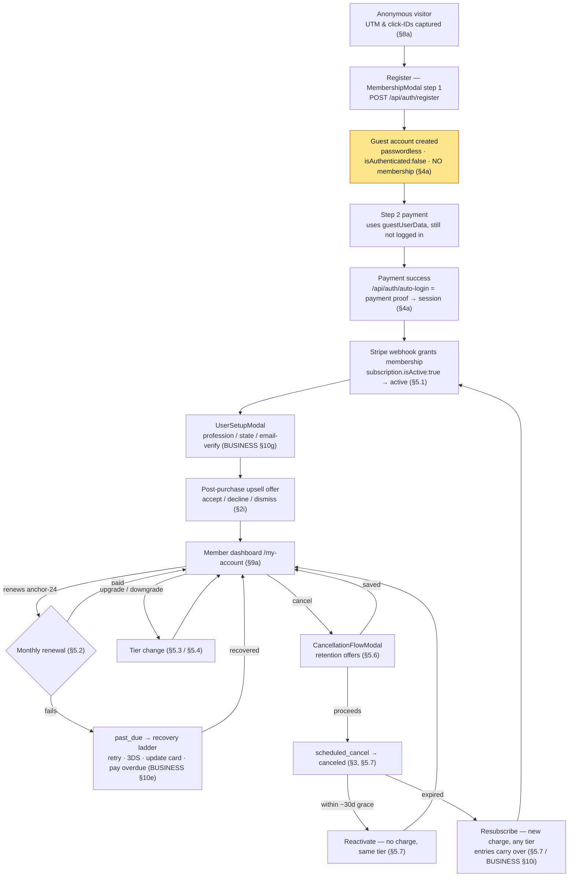
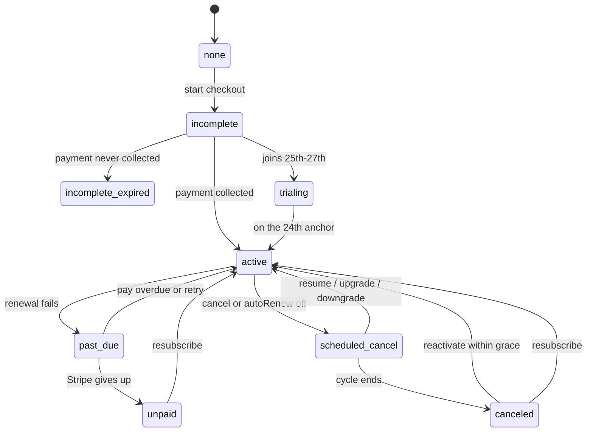

# Tools Australia — Customer Context

> **Audience.** Developers and Claude sessions who need the authoritative reference on *who the customer is*, *what data we hold about them*, and their auth/account flows.
>
> **Scope and complementary contract.** CUSTOMER.md **OWNS** the customer entity and data — the `User` model/fields, customer-type taxonomy, PII footprint, data-rights, and the field-level mapping of which field holds which state. For business **mechanics** (state machine, billing rules, cancellation-flow internals, entries mechanics, perk rules, the member dashboard), CUSTOMER.md links to [BUSINESS.md](BUSINESS.md) rather than restating them — **single source of truth per fact**.
>
> The underlying technical entity is the [`src/models/User.ts`](src/models/User.ts) record, a **mixed-class collection**: the same model also holds **staff and admin** accounts (`userType: "customer" | "staff" | "admin"`, `roleId`). A customer is `userType: "customer"` / `roleId: null` ([User.ts:291-292](src/models/User.ts#L291)). Staff/admin RBAC fields are flagged where they appear but are **out of scope** here — see [docs/auth/](docs/auth/) for those.

---

## 1. Who the customer is

There is **no separate "guest" model**. Registered guests and members are the same `User` collection, differentiated at runtime by what their `subscription` and purchase sub-documents hold. "Member" status is **derived** from `subscription.isActive` / `hasActiveSubscription` ([UserContext.tsx:73-77](src/contexts/UserContext.tsx#L73)) — there is no `isMember` boolean field on the model (though `isMember` IS a derived value computed in `UserContext.tsx:77`, not a model field).

| Customer type | How it's represented in code | What they can do |
| --- | --- | --- |
| **Anonymous visitor** | No `User` record at all (not signed in). Only retroactively traceable via `signupAttribution.anonymousId` *after* they register ([User.ts:241-256](src/models/User.ts#L241)). | Browse the public site. No entries, no partner access. |
| **Registered guest** (account, no membership) | A `User` exists but `subscription` is absent / `isActive: false` (`status` defaults to `"incomplete"`) and the purchase arrays are empty ([User.ts:485-496](src/models/User.ts#L485)). | Signed in; can purchase. Gated out of member-only surfaces until first purchase activates them. Classified as **Guest** in the dashboard ([settings/page.tsx:66-108](src/app/(site)/my-account/settings/page.tsx#L66) — `isMember` derived at 66-70, badge ternary with the neutral Guest fallback at 91-108). |
| **Active member / subscriber** | `subscription.isActive: true` with Stripe `status` of `active` / `trialing` ([User.ts:38-40](src/models/User.ts#L38)). **One subscription at a time.** | Monthly entries, partner discounts, retention modals, full member dashboard at `/my-account/`. |
| **One-time-only buyer** | No active `subscription`, but holds entries in `oneTimePackages` ([User.ts:89-96](src/models/User.ts#L89)) and/or `miniDrawPackages` ([User.ts:99-112](src/models/User.ts#L99)). Can hold **multiple** of these. | Entries / partner access from each pack until its `endDate`; no recurring billing. Shows as **One-time** in the dashboard while a pack is active ([settings/page.tsx:102-107](src/app/(site)/my-account/settings/page.tsx#L102), derived from `acct === "onetime"` in [useDashboardState.ts:139-141](src/hooks/useDashboardState.ts#L139)); falls back to **Guest** only once all packs expire. |

A single customer can be more than one of the last two at once (e.g. an active member who also bought a one-time pack). For the package catalog itself (Tradie / Foreman / Boss subscriptions; Apprentice → VIP one-time packs; Additional and upsell packs) see [BUSINESS.md §2](BUSINESS.md).

---

## Journey map — the customer path at a glance

> **This is a router, not a restatement.** Each stage links to the section that OWNS the detail — CUSTOMER.md for *which field / what data*, [BUSINESS.md](BUSINESS.md) for *mechanics*, `docs/<domain>/` for *internals*. Per the single-source-of-truth contract nothing here re-explains a flow; it points you at the one place that does. Keep it a map: update the pointers when sections move, don't grow mechanics here.

### The membership spine — acquisition → conversion → lifecycle → win-back

The **highlighted** node is the codebase's most non-obvious rule: registering in step 1 does **not** log the user in or grant membership — the guest crosses step 2 as `guestUserData` and only becomes a session after Stripe payment-proof (§4a, [docs/auth/gotchas.md](docs/auth/gotchas.md)). Side flows not on this spine (one-time / Additional packs, Mini Pack entry, perks) are in the router table below.

### Subscription lifecycle states

The canonical 9-state enum lives on [`MembershipStatusHistory`](src/models/MembershipStatusHistory.ts); the full table + transition mechanics are [BUSINESS.md §10](BUSINESS.md). The picture:

Two **ghost states** ride on top of the enum without being in it: `pendingChange` (upgrade charge in-flight) and `previousSubscription` (downgrade benefits held until `endDate`). They change what tier the customer effectively has *right now* — see §3b / [BUSINESS.md §10b](BUSINESS.md).

### Stage → authoritative source

| Journey stage | What happens | Owns the detail |
|---|---|---|
| Acquisition / attribution | UTM + click-IDs captured; converting platform resolved at purchase | §8a, §8b · [docs/tracking/](docs/tracking/) |
| Register (guest bridge) | Step-1 register creates a passwordless guest — **no login, no membership** | §4a, §4b · [docs/auth/gotchas.md](docs/auth/gotchas.md) |
| Login | password / email sign-in code / Google / post-payment auto-login | §4c–§4f |
| First payment & activation | Full price at signup; webhook grants membership | §5.1 · [BUSINESS.md §9, §10g](BUSINESS.md) |
| Post-purchase setup | UserSetupModal captures profession/state + email-verify prompt | [BUSINESS.md §10g](BUSINESS.md) · [docs/USER_SETUP_MODAL.md](docs/USER_SETUP_MODAL.md) |
| Upsell offer | Post-success offer; per-trigger dedup | §2i · [docs/upsell/](docs/upsell/) · [BUSINESS.md §5](BUSINESS.md) |
| Member dashboard | The ROI surface at `/my-account` | §9a · [BUSINESS.md §10h](BUSINESS.md) |
| Renewal (anchor-24) | Monthly renew; 25th–27th joiners anchored to the 24th | §5.2 · [BUSINESS.md §9b](BUSINESS.md) · [BILLING_ANCHOR_24.md](docs/BILLING_ANCHOR_24.md) |
| Upgrade / Downgrade | Immediate charge + cycle reset vs. deferred with benefits preserved | §5.3, §5.4 · [BUSINESS.md §10c, §10d](BUSINESS.md) |
| Auto-renew toggle | Soft-cancel shortcut (`cancel_at_period_end`) | §5.5 · [BUSINESS.md §10a](BUSINESS.md) |
| Past-due recovery | Self-serve retry → 3DS → update card → pay overdue | §3a · [BUSINESS.md §10e](BUSINESS.md) · [FAILED_RENEWAL_PAY_NOW.md](docs/FAILED_RENEWAL_PAY_NOW.md) |
| Cancellation & retention | CancellationFlowModal; five save-offers, seven reasons. **Streak-stakes step (2026-07-15, dark until streak launch):** non-past-due members see a Membership Streak stakes screen between reason and the offers — loss framing (streak ≥ 2: banked renewals + next milestone + pause-freezes-your-streak) or forward framing (streak 0/1: the ladder); "Continue cancelling" always visible; exit recorded as `stakesAction` with `streakMonthsAtStart` on the event. The pause offer card also states the streak freezes. | §5.6 · [BUSINESS.md §13c](BUSINESS.md) · [docs/subscription/cancellation-flow.md](docs/subscription/cancellation-flow.md) |
| Reactivate vs Resubscribe | Grace-window reactivate vs. fully-expired win-back | §5.7 · [BUSINESS.md §10i](BUSINESS.md) |
| Entries & eligibility | How entries are earned; 18+, SA/ACT excluded | §6, §6a · [BUSINESS.md §3](BUSINESS.md) |
| One-time / Additional packs | Non-recurring packs (guest or member) | [BUSINESS.md §2](BUSINESS.md) · [docs/cart-shop-products/](docs/cart-shop-products/) |
| Mini-draw entry | Threshold-triggered Mini Pack purchase | [docs/draws/](docs/draws/) · [BUSINESS.md §3b](BUSINESS.md) |
| Perks | Partner / referral / affiliate / rewards | §7 · [docs/partner/](docs/partner/), [docs/referrals/](docs/referrals/), [docs/affiliate/](docs/affiliate/), [docs/rewards-redeemables/](docs/rewards-redeemables/) |
| Account surface & data rights | Dashboard, PII footprint, delete chat, sign-out clearing | §9 |

---

## 2. The customer data model

Every field below lives on the `User` Mongoose model ([src/models/User.ts](src/models/User.ts); interface lines 3-313, schema 315-1133). This is a **load-bearing** inventory — keep it intact when the model changes.

**PII legend:** **PII** = personal/identifying or payment data (email/phone/address/name/payment/DOB); **Sensitive** = secret/credential material; **—** = non-sensitive.

> **Caveats.** The schema is `strict: true` + `strictQuery: true` — fields not in the schema are rejected ([User.ts:1130-1131](src/models/User.ts#L1130)). `mobile` is normalized to `+61…` format on every save via a pre-save hook ([User.ts:1136-1158](src/models/User.ts#L1136)). The exact client-facing `UserData` shape returned to the browser (defined in `@/hooks/queries/useUserQueries`) is **unverified** here; credential/secret fields below are presumed stripped from API responses but that projection was not traced.

### 2a. Identity & profile

| Field | Type | Meaning | PII |
|---|---|---|---|
| `_id` | string | Mongo document id (typed as string) ([User.ts:4](src/models/User.ts#L4)) | — |
| `firstName` | string (req, ≤50) | Given name ([User.ts:5](src/models/User.ts#L5)) | **PII** |
| `lastName` | string (req, ≤50) | Family name ([User.ts:6](src/models/User.ts#L6)) | **PII** |
| `state` | string (opt) | AU state/territory code; validated against NSW/VIC/QLD/WA/SA/TAS/ACT/NT ([User.ts:10](src/models/User.ts#L10)) | **PII** (coarse) |
| `profession` | string (opt, ≤100) | e.g. Builder, Electrician, Other ([User.ts:11](src/models/User.ts#L11)) | — |
| `birthdate` | Date (opt) | DOB; drives age-based eligibility; cannot be future ([User.ts:12](src/models/User.ts#L12)) | **PII** |
| `profileSetupCompleted` | boolean (def false) | Whether profile setup is done ([User.ts:13](src/models/User.ts#L13)) | — |
| `role` | "user" \| "admin" (def "user") | Legacy coarse role marker ([User.ts:14](src/models/User.ts#L14)) | — |

### 2b. Authentication & credentials

| Field | Type | Meaning | PII |
|---|---|---|---|
| `email` | string (req, unique, lowercase) | Login + primary contact; regex-validated ([User.ts:7](src/models/User.ts#L7)) | **PII** |
| `password` | string (opt, ≥6) | bcrypt hash; **optional** — passwordless customers have none ([User.ts:8](src/models/User.ts#L8)) | **Sensitive** |
| `isEmailVerified` | boolean (def false) | Email verified flag ([User.ts:145](src/models/User.ts#L145)) | — |
| `isMobileVerified` | boolean (opt, def false) | Mobile verified flag ([User.ts:146](src/models/User.ts#L146)) | — |
| `emailVerificationToken` / `mobileVerificationToken` | string (opt) | Verification tokens ([User.ts:147-148](src/models/User.ts#L147)) | **Sensitive** |
| `emailVerificationCode` / `…Expires` / `…Attempts` | string / Date / number | 6-char email code + expiry + attempt counter ([User.ts:151-153](src/models/User.ts#L151)) | **Sensitive** (code) |
| `smsOtpCode` / `…Expires` / `…Attempts` | string / Date / number | SMS OTP for passwordless auth ([User.ts:159-161](src/models/User.ts#L159)) | **Sensitive** (code) |
| `loginCode` / `…Expires` / `…Attempts` | string / Date / number | Emailed passwordless sign-in code ([User.ts:164-166](src/models/User.ts#L164)) | **Sensitive** (code) |
| `passwordResetToken` / `passwordResetExpires` | string / Date | Single-use reset token + expiry ([User.ts:169-170](src/models/User.ts#L169)) | **Sensitive** (token) |

### 2c. Contact & marketing consent

| Field | Type | Meaning | PII |
|---|---|---|---|
| `mobile` | string (opt) | AU mobile; validated + normalized to `+61…` on save ([User.ts:9](src/models/User.ts#L9), hook [1136-1158](src/models/User.ts#L1136)) | **PII** |
| `acceptsPromotionalEmail` | boolean (opt) | Klaviyo marketing opt-in; **omitted/undefined ⇒ opted in** ([User.ts:180](src/models/User.ts#L180)) | — |
| `pendingKlaviyoMergeFromEmail` | string (opt, lowercase) | Old email to merge from in Klaviyo after a verified email change; cleared after merge ([User.ts:156](src/models/User.ts#L156)) | **PII** |

### 2d. Subscription / membership

Embedded subdocument `subscription` (one active membership at a time; [User.ts:29-86](src/models/User.ts#L29), schema 466-595). `packageId` is `Schema.Types.Mixed` to allow ObjectId or string.

| Field | Type | Meaning | PII |
|---|---|---|---|
| `subscription.packageId` | string\|null | Current package id after any changes ([User.ts:30](src/models/User.ts#L30)) | — |
| `subscription.startDate` / `endDate` | Date | Membership start / cycle end ([User.ts:31-32](src/models/User.ts#L31)) | — |
| `subscription.cancelledAt` | Date (opt) | When the user triggered cancellation ([User.ts:33](src/models/User.ts#L33)) | — |
| `subscription.pastDueAt` | Date (opt) | First past_due timestamp ([User.ts:35](src/models/User.ts#L35)) | — |
| `subscription.lastReanchoredInvoiceId` | string (opt) | Idempotency marker for past-due re-anchor ([User.ts:37](src/models/User.ts#L37)) | — |
| `subscription.isActive` | boolean (def false) | Active membership flag ([User.ts:38](src/models/User.ts#L38)) | — |
| `subscription.autoRenew` | boolean (opt, def true) | Auto-renew toggle (soft-cancel shortcut) ([User.ts:39](src/models/User.ts#L39)) | — |
| `subscription.status` | string (def "incomplete") | Stripe status string — for the full state machine see [BUSINESS.md §10](BUSINESS.md) ([User.ts:40](src/models/User.ts#L40)) | — |
| `subscription.pendingStripeSubscriptionId` / `…RequestId` / `…CreatedAt` | string / string / Date | Non-canonical pending Stripe sub from initial checkout ([User.ts:43-45](src/models/User.ts#L43)) | — |
| `subscription.previousSubscription` | subdoc (opt) | **Downgrade ghost state**: cached old `packageId`, `packageName`, `benefits{entriesPerMonth, discountPercentage}`, `startDate`, `endDate`, `downgradeDate` ([User.ts:49-59](src/models/User.ts#L49)) | — |
| `subscription.pendingChange` | subdoc (opt) | **Upgrade ghost state**: `newPackageId`, `changeType: "upgrade"`, `stripeSubscriptionId?`, `paymentIntentId?`, `upgradeAmount?` ([User.ts:63-69](src/models/User.ts#L63)) | — |
| `subscription.lastDowngradeDate` / `lastUpgradeDate` | Date (opt) | Anti-gaming / anti-webhook-interference guards ([User.ts:72-75](src/models/User.ts#L72)) | — |
| `subscription.lastMonthAccumulatedEntries` | number (opt) | Carry-over for renewal entry calc; **persists through cancel** ([User.ts:80](src/models/User.ts#L80)) | — |
| `subscription.streakMonths` | number (opt, default 0) | **Membership Streak**: consecutive paid renewals (join = month 0; +1 per paid renewal). Recovery keeps it, a retention pause freezes it, a grace-window (≤30 days) resubscribe **continues it (carried across the resubscribe/renew routes' subscription replacement — in-route grace/reset decision via `carryStreakAcrossSubscriptionReplace`)**, upgrades/downgrades never touch it; only a longer lapse resets it. **A fully refunded counted renewal decrements it by 1** (its `MembershipRenewalCycle` row flips to `refunded` so repairs agree). Written only by the Stripe webhook, the resubscribe/renew carry, the refund reversal, and the backfill script. **Customer-visible (P3, currently DARK behind `DASHBOARD_FEATURES.loyaltyStreak` until launch)**: the `/my-account` streak medallion card, milestones track, wallet Streak bucket, and a once-only celebration toast (localStorage marker `ta-streak-seen:<userId>` — user-scoped client storage, cleared on sign-out; re-seeded downward after a reset). Cobber FAQ ids 69–71 explain the feature to customers. | — |
| `subscription.streakGeneration` | number (opt, default 1) | Bumps on each out-of-grace resubscribe reset; scopes milestone re-earning (P2 engine built — streak rungs auto-grant free entries into the Major Draw once activated at launch; new streak issuances are strictly payment-coupled — cron only re-delivers failed grants). | — |
| `subscription.lastStreakStartInvoiceId` | string (opt) | Idempotency marker for the streak start/reset writer (internal). | — |
| `subscription.lastResubscribedAt` | Date (opt) | Most-recent resubscribe time (drives carry-over banner) ([User.ts:85](src/models/User.ts#L85)) | — |
| `stripeCustomerId` | string (opt) | Stripe customer id ([User.ts:17](src/models/User.ts#L17)) | **PII** (payment link) |
| `stripeSubscriptionId` | string (opt, sparse) | Canonical Stripe subscription id ([User.ts:18](src/models/User.ts#L18)) | — |

**One-time / mini-draw purchase arrays** (a customer can hold many):

| Field | Type | Meaning | PII |
|---|---|---|---|
| `oneTimePackages[]` | array | Each: `packageId, purchaseDate, startDate, endDate, isActive, entriesGranted` ([User.ts:89-96](src/models/User.ts#L89)) | — |
| `miniDrawPackages[]` | array (opt, def []) | Each: `packageId, packageName, miniDrawId?, purchaseDate, startDate, endDate, isActive, entriesGranted, price, partnerDiscountHours, partnerDiscountDays, stripePaymentIntentId` ([User.ts:99-112](src/models/User.ts#L99)) | — |

### 2e. Entries & draw history

| Field | Type | Meaning | PII |
|---|---|---|---|
| `miniDrawParticipation[]` | array (opt, def []) | Per-mini-draw tracking: `miniDrawId, totalEntries, entriesBySource{"mini-draw-package"?, "free-entry"?}, firstParticipatedDate, lastParticipatedDate, isActive` ([User.ts:116-126](src/models/User.ts#L116)) | — |
| `accumulatedEntries` | number (def 0) | Total entries ever received ([User.ts:129](src/models/User.ts#L129)) | — |
| `entryWallet` | number (def 0) | **Deprecated — kept at 0** ([User.ts:130](src/models/User.ts#L130)) | — |
| `rewardsPoints` | number (def 0) | Points earned from purchases (legacy; see §7d) ([User.ts:131](src/models/User.ts#L131)) | — |
| `cart[]` | array | Cart items, `type: "product" \| "ticket"` with `productId?` / `miniDrawId?`, `quantity`, `price?` ([User.ts:136-142](src/models/User.ts#L136)) | — |

> **Major-draw entries are NOT on `User`.** They were removed; the single source of truth is `MajorDraw.entries` ([User.ts:133,752](src/models/User.ts#L133)). See [BUSINESS.md §3](BUSINESS.md).

### 2f. Saved payment methods (PCI note)

| Field | Type | Meaning | PII |
|---|---|---|---|
| `savedPaymentMethods[]` | array | Each: `paymentMethodId` (req), `isDefault` (def false), `createdAt`, `lastUsed?` ([User.ts:21-26](src/models/User.ts#L21)) | **PII** (payment) |

**PCI note:** by design **only the Stripe payment-method id is stored** — no raw card numbers / PAN. Card data lives with Stripe ([User.ts:20-22,443](src/models/User.ts#L20)).

### 2g. Perks state — partner / referral / affiliate

| Field | Type | Meaning | PII |
|---|---|---|---|
| `partnerDiscountQueue[]` | array (opt, def []) | Stacked partner-discount access periods. Each: `_id?, packageId, packageName, packageType("membership"\|"one-time"\|"mini-draw"\|"upsell"), discountDays, discountHours, purchaseDate, startDate?, endDate?, status("active"\|"queued"\|"expired"\|"cancelled"), queuePosition, expiryDate (12mo from purchase), stripePaymentIntentId?` ([User.ts:274-288](src/models/User.ts#L274)) | — |
| `referral` | subdoc (opt) | This user's code: `code` (unique sparse index), `successfulConversions` (def 0), `totalEntriesAwarded` (def 0) ([User.ts:224-228](src/models/User.ts#L224)) | — |
| `affiliateReferral` | subdoc (opt) | Link to the Affiliate who referred this user: `affiliateId (ref Affiliate), affiliateCode, referredAt, firstPurchaseCompleted (def false), membershipTied (def false)` ([User.ts:232-238](src/models/User.ts#L232)) | — |

### 2h. Attribution / marketing snapshot

| Field | Type | Meaning | PII |
|---|---|---|---|
| `signupAttribution` | subdoc (opt) | Promo page + UTM/ad context at signup: `promotionPageType("evergreen"\|"toolset"), promotionSlug, visitedAt, anonymousId, utmSource, utmMedium, utmCampaign, utmContent, utmTerm, campaignId, adsetId, adId` ([User.ts:241-256](src/models/User.ts#L241)) | — |

> The resolved **`convertingPlatform`** is **not** on `User` — it lives on the `PaymentEvent` record (see §8).

### 2i. Preferences, flags & engagement history

| Field | Type | Meaning | PII |
|---|---|---|---|
| `isActive` | boolean (def true) | Account-active flag ([User.ts:174](src/models/User.ts#L174)). `false` blocks login on every path (clear "account deactivated" message) and invalidates any live session on its next refresh — see §4c | — |
| `processedPayments[]` | string[] | Processed-payment ids (idempotency safety) ([User.ts:185](src/models/User.ts#L185)) | — |
| `cancellationUpsellRedeemed` / `…RedeemedAt` | boolean / Date | One-time cancellation upsell (+100 entries) redeemed flag + timestamp ([User.ts:188-189](src/models/User.ts#L188)) | — |
| `retentionOffersConsumed` | subdoc (opt) | One-time retention flags: `pause30d?`, `discount50_2mo?` ([User.ts:193](src/models/User.ts#L193)) | — |
| `upsellPurchases[]` | array (opt) | Each: `offerId, offerTitle, entriesAdded, amountPaid, purchaseDate, triggeringPaymentIntentId?` ([User.ts:867-897](src/models/User.ts#L867)). `triggeringPaymentIntentId` keys the per-trigger "one purchase per appearance" upsell dedup ([upsell/purchase/route.ts:203-214](src/app/api/upsell/purchase/route.ts#L203)). **Caveat:** rows written before 2026-07-10 lack it — the field was missing from the schema block and `strict: true` stripped it on write (fixed 2026-07-10), so the dedup only bites on purchases made after the fix. | — |
| `upsellHistory[]` | array (opt) | Each: `offerId, action, triggerEvent, timestamp` ([User.ts:207-212](src/models/User.ts#L207)) | — |
| `upsellStats` | subdoc (opt) | `totalShown, totalAccepted, totalDeclined, totalDismissed, conversionRate, lastInteraction` ([User.ts:215-222](src/models/User.ts#L215)) | — |
| `redemptionHistory[]` | array (opt, def []) | Points-redemption log: `redemptionId?, redemptionType("discount"\|"entry"\|"shipping"\|"package"), packageId?, packageName?, pointsDeducted, value, description, redeemedAt, status("completed"\|"pending"\|"cancelled")` ([User.ts:259-269](src/models/User.ts#L259)) | — |

### 2j. Timestamps

| Field | Type | Meaning | PII |
|---|---|---|---|
| `lastLogin` | Date (opt) | Last login time ([User.ts:173](src/models/User.ts#L173)) | — |
| `createdAt` / `updatedAt` | Date | Auto (`timestamps: true`) ([User.ts:311-312](src/models/User.ts#L311)) | — |

### 2k. Staff / admin-only fields — NOT part of the customer record

These exist on the same collection but are RBAC / service-account machinery ([User.ts:290-308](src/models/User.ts#L290)). **Do not document or treat as customer-facing.** A customer always has `userType: "customer"` and `roleId: null`.

| Field | Type | Meaning |
|---|---|---|
| `roleId` | ObjectId\|null (def null) | Staff role ref; `null` = customer |
| `userType` | "customer"\|"staff"\|"admin" (def "customer") | Account class |
| `serviceAccount` | boolean (opt, def false) | Non-human service account (e.g. Norm AI) |
| `inviteToken` / `inviteTokenExpires` / `invitedBy` / `invitedAt` | mixed | Staff invite machinery (`inviteToken` is **Sensitive**) |
| `tokenVersion` | number (def 0) | Permission-change counter forcing JWT re-auth |
| `role: "admin"` | (see §2a) | Legacy admin marker — not a customer value |

---

## 3. Customer lifecycle & states

`User.subscription.status` is a free-form `String` that defaults to `"incomplete"` and receives Stripe status values directly ([User.ts:493-496](src/models/User.ts#L493)). The **canonical enum** lives on `MembershipStatusHistory.membershipStatus` ([MembershipStatusHistory.ts:26-40](src/models/MembershipStatusHistory.ts#L26)) and is mirrored as `MembershipNormalizedStatus` ([membershipAnalytics.ts:15-24](src/types/admin/membershipAnalytics.ts#L15)).

**For the full 9-state table and transition mechanics, see [BUSINESS.md §10](BUSINESS.md); for the visual lifecycle diagram, see the Journey map near the top of this doc.** What follows is the customer-OWNED field mapping and a customer's-eye summary.

### 3a. Field mapping

| What's changing | Field(s) that hold the state |
|---|---|
| Subscription status (active, past_due, canceled, etc.) | `subscription.status` + `subscription.isActive` |
| Scheduled cancellation (benefits-through-period) | `subscription.autoRenew: false` + `subscription.cancelledAt` + `subscription.endDate`; analytics label: `scheduled_cancel` |
| Past-due recovery | `subscription.pastDueAt`; re-anchor marker: `subscription.lastReanchoredInvoiceId` |
| Downgrade ghost state (old benefits preserved through cycle) | `subscription.previousSubscription` ([User.ts:49-59](src/models/User.ts#L49)) |
| Upgrade ghost state (charge in-flight) | `subscription.pendingChange` ([User.ts:63-69](src/models/User.ts#L63)) |

### 3b. Customer's-eye notes

- **`trialing`** — late-month joiners (25th/26th/27th AEST) sit here until the 24th anchor. They've **paid full price** — this is a billing-anchor artifact, not a free trial. See [BUSINESS.md §9b](BUSINESS.md).
- **`scheduled_cancel`** — the customer requested cancellation; benefits stay live until `subscription.endDate`. The raw `status` string is NOT rewritten to `scheduled_cancel` — that is an analytics label only.
- **Ghost states** — `previousSubscription` (downgrade: old tier's benefits live until cycle end) and `pendingChange` (upgrade: desired package parked while charge is in-flight). See [BUSINESS.md §10b](BUSINESS.md).

---

## 4. Account creation & authentication

Auth is **NextAuth (JWT session strategy)** with two customer-facing providers — `credentials` (email + password) and `google` (OAuth) — plus an internal `auto-login` bridge provider used to convert a guest into a session after a server-verified action ([auth.ts:45-171](src/lib/auth.ts#L45)). New accounts are created **passwordless** (no `password` field). See [docs/auth/](docs/auth/).

### 4a. CRITICAL — registering in step 1 does NOT auto-login or grant membership (verified)

This is the most important and non-obvious behaviour. Registering in **step 1** of the `MembershipModal` only creates/updates a guest account and bridges to step 2 — it leaves `isAuthenticated: false` and grants no membership.

- Step-1 success calls `POST /api/auth/register`, which returns `{ success: true, message: "Step 1 completed", data: { userId, email, firstName, lastName, mobile, ... } }`. **No session token, no auth cookie is issued** ([register/route.ts:904-919](src/app/api/auth/register/route.ts#L904)).
- The modal stores that response in component state `guestUserData` and advances to step 2. It does **not** call `signIn()` ([MembershipModal/index.tsx:1512-1527](src/components/modals/MembershipModal/index.tsx#L1512)).
- The bridge is `hasCompletedRegistration = isAuthenticated || guestUserData !== null` ([MembershipModal/index.tsx:624](src/components/modals/MembershipModal/index.tsx#L624)). A guest passes through step 2 (payment) as `isAuthenticated: false` the entire time, using `guestUserData` as the credential for the subscription/payment-intent calls.
- The new account is created with `subscription.isActive: false`, `subscription.status: "incomplete"`, `accumulatedEntries: 0`, and **no `password`** ([register/route.ts:704-742](src/app/api/auth/register/route.ts#L704)). **Membership is granted only later, via the Stripe payment + webhook path**, not by registering.
- The account becomes a real session **only after payment**: on payment success the modal POSTs `/api/auth/auto-login` with the `paymentIntentId` and then `signIn("auto-login", { token })` ([MembershipModal/index.tsx:2448-2477](src/components/modals/MembershipModal/index.tsx#L2448)). `/api/auth/auto-login` requires a Stripe `paymentIntentId` belonging to the user's Stripe customer **as proof of payment** before minting the bridge token ([auto-login/route.ts:64-102](src/app/api/auth/auto-login/route.ts#L64)).

The register route even hard-codes `isAuthenticated: false` in its Klaviyo "Started Checkout" event "because this path runs at registration submit and the user is, by definition, a guest" ([register/route.ts:109-111](src/app/api/auth/register/route.ts#L109)). Documented at [docs/auth/gotchas.md:26-50](docs/auth/gotchas.md#L26).

### 4b. Registration internals (guest account creation)

`POST /api/auth/register` validates `firstName`, `lastName`, `email`, Australian `mobile` (normalised to `+61…`), plus optional `affiliateCode`, `promotionSlug`, `packageId`, and UTM/click-ID fields ([register/route.ts:56-86](src/app/api/auth/register/route.ts#L56)). Rate limited at 20/min/IP. A **"plain account"** = `!accumulatedEntries || accumulatedEntries === 0`.

| Case | Behaviour |
|------|-----------|
| Email/mobile belong to a **converted** account (`accumulatedEntries > 0`) | Rejected `400` with `isExistingAccount: true` + `existingAccountEmail`; told to log in ([register/route.ts:302-337](src/app/api/auth/register/route.ts#L302)). |
| Email/mobile belong to an account with **saved payment methods** | Same rejection ([register/route.ts:341-378](src/app/api/auth/register/route.ts#L341)). |
| Email **and** mobile match the **same plain account** | Account is **updated in place** (name/email/mobile/attribution), re-fires `User Registered` ([register/route.ts:382-502](src/app/api/auth/register/route.ts#L382)). |
| Email and mobile match **different** accounts | Rejected `400` "Registration conflict" ([register/route.ts:503-519](src/app/api/auth/register/route.ts#L503)). |
| Only email **or** only mobile matches a plain account | That plain account is updated ([register/route.ts:523-700](src/app/api/auth/register/route.ts#L523)). |
| No match | New passwordless account created; a Stripe customer is created and linked (`stripeCustomerId`) ([register/route.ts:702-770](src/app/api/auth/register/route.ts#L702)). |

### 4c. Login paths

| Path | Mechanism |
|------|-----------|
| **Email + password** | `LoginModal` → `signIn("credentials")`; the provider looks up the user and `bcrypt.compare`s the password. **Passwordless users (no `password`) cannot use this provider** — `authorize` returns `null` ([auth.ts:56-135](src/lib/auth.ts#L56)). |
| **Email sign-in code (passwordless)** | "Send code to sign in instead" → `POST /api/auth/send-login-code` then `POST /api/auth/verify-login-code`, which returns a bridge `token` consumed by `signIn("auto-login", { token })`. This is how no-password customers log in ([LoginModal/index.tsx:464-556](src/components/modals/LoginModal/index.tsx#L464)). |
| **Google OAuth** | `signIn("google")` via popup. The `signIn` callback **rejects Google sign-in for emails with no existing account** (`return false`) — new users must register the normal way first. On success it sets `isEmailVerified = true` ([auth.ts:373-399](src/lib/auth.ts#L373)). |
| **Post-payment auto-login** | `/api/auth/auto-login` (payment-proof) → `signIn("auto-login")` — converts a paying guest into a session ([MembershipModal/index.tsx:2448-2477](src/components/modals/MembershipModal/index.tsx#L2448)). |

**Deactivated accounts (`User.isActive: false`) are rejected at login on every path (2026-07-09).** Credentials `authorize` throws `ACCOUNT_DEACTIVATED` (checked **after** password validation so account status is only revealed to a valid credential holder) and both login UIs surface "This account has been deactivated. Please contact an administrator."; the email sign-in-code path rejects at `verify-login-code` (403 + the same message, after the OTP is validated); Google's `signIn` callback returns `false` (AccessDenied); the auto-login provider re-checks `isActive` in the DB before accepting any bridge token and throws the same `ACCOUNT_DEACTIVATED`; and the jwt callback refuses to mint a first token for an inactive account. Previously login *succeeded* and the session-refresh guard killed the token seconds later — an unexplained login→auto-logout loop (hit by removed staff, admin-deactivated accounts, and invited staff who set a password via the public reset flow without completing `/staff-setup`).

After a successful login the client reads the fresh id via `getSession()`, invalidates user-scoped caches via `usePurchaseInvalidation`, then `router.push("/my-account")` + `router.refresh()`.

### 4d. Email verification — what it actually gates

`User.isEmailVerified` (def false) is set by a 6-character code flow (not a click-link) and is **not required to register or to pay**. It functions as an **alternate login gate inside `LoginModal`**: when a password login fails with an email-verify error, the modal shows the verification flow; on success, `verify-email` mints a **membership-gated** bridge `token` (only if the user has membership/`stripeCustomerId`) and signs them in. Google OAuth implicitly verifies the email.

> For the full verification mechanics (rate limits, attempt counters, code expiry), see [BUSINESS.md §10f](BUSINESS.md).

### 4e. Password reset

- `POST /api/auth/request-password-reset` — looks up the user (returns `404` if no account — it does **not** mask existence), generates a 32-byte-hex `passwordResetToken` + expiry, emails a reset link. Rate limited to once per 5 minutes ([request-password-reset/route.ts:27-87](src/app/api/auth/request-password-reset/route.ts#L27)).
- `POST /api/auth/reset-password` — finds the user by unexpired token, `bcrypt.hash`es the new password (min 6 chars, cost 12), then **clears the token** so it is single-use ([reset-password/route.ts:23-36](src/app/api/auth/reset-password/route.ts#L23)). Setting a password this way lets a previously-passwordless customer subsequently use the `credentials` provider.

### 4f. Per-path summary

| Path | Flow |
|------|------|
| **New guest (membership signup)** | `MembershipModal` step 1 → `POST /api/auth/register` creates passwordless account, returns `guestUserData`; **still `isAuthenticated: false`, no membership** → step 2 payment uses `guestUserData` → on payment success, `/api/auth/auto-login` (payment proof) + `signIn("auto-login")` establishes the session; membership is granted via Stripe/webhook. |
| **Returning member (password)** | `LoginModal` → `signIn("credentials")`. If password fails on an unverified email, switch to the email-code verify flow (bridge token). No-password members use the "send sign-in code" path instead. |
| **Returning member (Google)** | `LoginModal` "Sign in with Google" → popup OAuth → callback rejects unknown emails, marks known emails verified → poll `getSession()` → redirect to `/my-account`. |

---

## 5. The membership journey

Members manage their membership from **My Account → Membership → Manage plan** (the "manage" overlay sheet), reachable from the Membership page or the `/my-account?open=subscription` deep-link. (The old **Settings → Subscription** tab was removed in the 2026-07 dashboard revamp; Settings now holds only Profile / Theme / Password.) This section covers only the customer-OWNED facts (where the action happens, which fields change). For pricing, proration mechanics, retention-offer tables, and the full cancellation-flow internals, see [BUSINESS.md §9, §10, §13](BUSINESS.md).

### 5.1 Joining

Customer pays full package price immediately at signup via Stripe. There is **no free trial** — `trialing` is a billing-anchor artifact for 25th–27th joiners only (see [BUSINESS.md §9b](BUSINESS.md)).

**Fields set on activation:** `subscription.isActive: true`, `subscription.status: "active"` (or `"trialing"`), `subscription.startDate`, `subscription.endDate`, `subscription.packageId`.

### 5.2 Renewal date — the 24th rule

Membership renews monthly on the customer's own billing date — except 25th/26th/27th joiners are anchored to the **24th** of each month. See [BUSINESS.md §9b](BUSINESS.md) and [BILLING_ANCHOR_24.md](docs/BILLING_ANCHOR_24.md) for the mechanics.

### 5.3 Upgrade (move to a higher tier)

Customer confirms in `UpgradeConfirmModal` and completes a Stripe payment. Blocked while `past_due`. **Fields that change:** `subscription.packageId`, `subscription.startDate`/`endDate` (cycle resets to today), `subscription.pendingChange` (parked during charge, cleared on webhook confirmation). For charge-amount and proration detail see [BUSINESS.md §10c](BUSINESS.md).

### 5.4 Downgrade (move to a lower tier)

No charge now; takes effect at cycle end. **Fields that change:** `subscription.packageId` (updated immediately to new tier), `subscription.previousSubscription` (old tier's benefits cached here until `endDate`). For no-refund / entry-preservation rules see [BUSINESS.md §10d](BUSINESS.md).

### 5.5 Auto-renew toggle

`PATCH /api/stripe/update-auto-renew` sets `cancel_at_period_end`. **Fields:** `subscription.autoRenew`, `subscription.cancelledAt`, `subscription.endDate` (cleared when re-enabled). With auto-renew off the customer keeps full access until period end and is not charged again.

### 5.6 Cancellation & retention flow

No instant cancel — always routes through `CancellationFlowModal`. **Customer-OWNED fields consumed/set:** `retentionOffersConsumed` (tracks one-time saves used: `pause30d`, `discount50_2mo`), `cancellationUpsellRedeemed` (one-time +100-entry offer). For the five save-offer types, the seven cancellation reasons, and `past_due` short-circuit logic see [BUSINESS.md §13c](BUSINESS.md).

### 5.7 Reactivate vs Resubscribe

Two distinct paths via `POST /api/stripe/renew-subscription`:

- **Reactivate** — within ~30-day grace window; no charge, same tier only, clears `cancel_at_period_end`. **Fields:** `subscription.cancelledAt` cleared; `subscription.endDate` re-synced from Stripe to the end of the current billing period, so the UI shows the correct next renewal date ([renew-subscription/route.ts:464-476](src/app/api/stripe/renew-subscription/route.ts#L464)). `endDate` is only *cleared* on the auto-renew re-enable path (§5.5).
- **Resubscribe (`create_new`)** — fully-expired member, new charge, new subscription. **Fields:** `subscription.*` reset; `subscription.lastMonthAccumulatedEntries` survives so entry history carries over.

For the branch logic (retry_payment / reactivate / create_new) see [BUSINESS.md §10i](BUSINESS.md).

---

## 6. Entries & draw participation

**Major-draw entries are NOT on `User`.** Source of truth is `MajorDraw.entries`. The customer earns entries by subscription renewal, one-time/additional pack purchase, upsells, referrals, and promos — for the full earn table, carry-forward rules, and the freeze/gap blackout window see [BUSINESS.md §3, §3e](BUSINESS.md).

**Customer-OWNED fields:**
- `subscription.lastMonthAccumulatedEntries` — carry-over balance (persists through cancel).
- `accumulatedEntries` — total entries ever received (informational; major-draw pool is on `MajorDraw`).
- `miniDrawParticipation[]` — per-mini-draw tracking on the user record.

### 6a. Draw eligibility

A customer is **ineligible** for any giveaway if either condition holds ([giveaway-eligibility.ts:6-19](src/utils/giveaway-eligibility.ts#L6)):

| Rule | Detail |
|---|---|
| **Age** | Must be **18+**; `MIN_AGE = 18`, computed from `birthdate`. |
| **State** | **SA and ACT residents excluded**; `INADMISSIBLE_STATES = ["SA", "ACT"]`. |

The Australian-resident requirement is enforced via the `state` field (codes are AU states/territories); there is **no explicit "Australian resident" boolean** in `giveaway-eligibility.ts` — eligibility keys only on state code + age. *(Unverified: whether residency is gated elsewhere, e.g. at registration.)* Customer-facing eligibility checks route through this shared helper — its only consumers are the profile settings form ([ProfileTab.tsx](src/app/(site)/my-account/components/settings/ProfileTab.tsx)) and the post-purchase setup modal ([Step2Demographics.tsx](src/components/modals/UserSetupModal/Step2Demographics.tsx)). The admin major-draw winner-export and eligibility-summary paths do **not** call it — they re-implement the SA/ACT exclusion inline with hard-coded state comparisons ([MajorDrawService.ts:758-762](src/services/admin/MajorDrawService.ts#L758), [export/route.ts:130-131](src/app/api/admin/major-draw/export/route.ts#L130)) and apply no age check at export time.

---

## 7. Customer perks

Four customer-facing perk systems. For the full mechanics (tier-% ladders, referral payout rules, affiliate commission model, redeemables campaign config) see [BUSINESS.md §4, §7, §8, §13](BUSINESS.md) and [docs/partner/](docs/partner/), [docs/referrals/](docs/referrals/), [docs/affiliate/](docs/affiliate/), [docs/rewards-redeemables/](docs/rewards-redeemables/).

### 7a. Partner discounts

`User.partnerDiscountQueue[]` stores stacked access periods (field detail in §2g). Subscription tiers get lifecycle access (active while membership is active); one-time packs get a time-limited window capped at 12 months from purchase. When both are held, the higher catalog-visibility tier wins. Foreman subscription visibility uses `Math.round(total × 0.75)` ([partner-catalog-visibility.ts:114-116](src/utils/partner-discounts/partner-catalog-visibility.ts#L114)). The access-% "ring" the customer sees on the /my-account hero is derived by the shared queue-aware resolver ([partner-access-ring.ts](src/utils/partner-discounts/partner-access-ring.ts), 2026-07-09 — the admin user-detail modal now shows the identical ring; no customer-facing behavior changed). For the full tier-% table and stacking rules see [BUSINESS.md §4](BUSINESS.md).

### 7b. Referrals

`User.referral` holds the customer's own code (`referral.code`, unique sparse index) and conversion counters (`successfulConversions`, `totalEntriesAwarded`). `User.affiliateReferral` stamps which affiliate referred this user. For reward amounts, eligibility rules, and conversion mechanics see [BUSINESS.md §13b](BUSINESS.md).

### 7c. Affiliate program

A customer participates passively — visiting via an affiliate link stamps `User.affiliateReferral`. Affiliates are a separate account type (admin-created). For commission model and payout structure see [BUSINESS.md §13a](BUSINESS.md).

### 7d. Rewards / redeemables

**Legacy points balance — paused/deprecated.** `User.rewardsPoints` and `redemptionHistory` still exist on the model; `entryWallet` is explicitly **deprecated — set to 0** ([User.ts:130-131](src/models/User.ts#L130)). The rewards surface is gated by a feature flag that **defaults OFF** (`rewardsEnabled()` returns false unless `REWARDS_ENABLED`/`NEXT_PUBLIC_REWARDS_ENABLED = "true"`, [featureFlags.ts:27-39](src/config/featureFlags.ts#L27)). When off, reward API routes return HTTP **503** with code `REWARDS_PAUSED` ([rewardsGuard.ts:32-38](src/lib/rewardsGuard.ts#L32)).

**Event-based redeemables ledger (current).** An issuance ledger (not a points balance) — each grant is a discrete `RedeemableIssuance` / `MilestoneIssuance` record. Items auto-issue for active campaigns on wallet read; redeemable when `status === "active"` and not past `expiresAt`. For campaign config, milestone types, and `purchaseRequirement` rules see [docs/rewards-redeemables/](docs/rewards-redeemables/).

---

## 8. Marketing & attribution data captured

What marketing/attribution data we capture about a customer, and which of it **leaves to third parties** (Klaviyo, Meta/TikTok/Snapchat). See [docs/tracking/](docs/tracking/).

### 8a. UTM / attribution capture & persistence

On landing with marketing query params, the client persists **`utm_source`, `utm_medium`, `utm_campaign`, `utm_content`, `utm_term`, `campaign_id`, `adset_id`, `ad_id`** ([utm-helpers.ts:79-96](src/utils/tracking/utm-helpers.ts#L79)):

| Storage | Key | Lifetime | Notes |
|---|---|---|---|
| `sessionStorage` | legacy session store | per-tab, max 30 min from capture ([utm-storage.ts:16,59-62](src/utils/tracking/utm-storage.ts#L16)) | "transitional"; expired entry deleted on read |
| First-party cookie | `_ta_attr` | 90 days | **first-touch** (never overwrites a non-expired value), `SameSite=Lax`, `Domain=.toolsaustralia.com.au; Secure` in prod ([attribution-cookie.ts:11,56-69](src/utils/tracking/attribution-cookie.ts#L11)) |
| First-party cookie | `_ta_attr_last` | 7 days | **last-touch** (always overwritten on every UTM landing) — feeds the Tier-2 owned-channel (Klaviyo) resolution in §8b ([attribution-cookie.ts:13-19,71-77](src/utils/tracking/attribution-cookie.ts#L13)) |

Paid **click IDs** are captured into separate cookies on mount: Meta `_fbc`/`_fbc_ts` (synthesized from `?fbclid=` so it survives without the Meta SDK), TikTok `ttclid`, Snapchat `_sc_click`; the Meta browser-ID `_fbp` is set by the Pixel. A **signup snapshot** is also persisted server-side in `User.signupAttribution` (§2h).

### 8b. The "converting platform" concept

At purchase, `resolveAttributionAtEdge` reads the click cookies + `_ta_attr` + the last-touch `_ta_attr_last` ([resolveAtEdge.ts:19-27](src/services/attribution/resolveAtEdge.ts#L19)) and resolves a **single** converting platform via a priority+recency ladder ([resolveConvertingPlatform.ts:11-76](src/services/attribution/resolveConvertingPlatform.ts#L11)). Window durations are defined in `platformPriority.ts` (`windowDaysFor`) ([platformPriority.ts:25](src/services/attribution/platformPriority.ts#L25)):

- **Tier 1 (paid clicks, 7-day window):** `meta`, `tiktok`, `snapchat`, `google` (google reserved). Most-recent click wins.
- **Tier 2 (owned channels, 5-day window):** `klaviyo_email`, `klaviyo_sms` — resolved from the last-touch cookie, so a recent Klaviyo touch wins even when the durable first-touch cookie holds an older source ([resolveConvertingPlatform.ts:45-66](src/services/attribution/resolveConvertingPlatform.ts#L45)).
- **Fallback (first-touch UTM):** normalized `utm_source` (+ `utm_medium`) resolves to the matching platform with confidence `utm_only`, honoring that platform's window ([resolveConvertingPlatform.ts:68-87](src/services/attribution/resolveConvertingPlatform.ts#L68)); a present-but-unrecognized source → `other`, absent or window-expired → `direct` ([resolveConvertingPlatform.ts:89-98](src/services/attribution/resolveConvertingPlatform.ts#L89)).

The result is persisted on the **`PaymentEvent`** record (not `User`): `convertingPlatform`, `attributionConfidence` (`click`/`utm_only`/`inferred_backfill`), and denormalized `attributionAdId/AdsetId/CampaignId` ([PaymentEvent.ts:30-36,126-135](src/models/PaymentEvent.ts#L30)). *Verified: no `convertingPlatform` field on the `User` model.*

### 8c. Customer profile properties synced to Klaviyo (PII leaving to a third party)

`userToKlaviyoProfile` builds the profile sent to Klaviyo ([klaviyo-helpers.ts:114-357](src/utils/integrations/klaviyo/klaviyo-helpers.ts#L114)). **Top-level identifiers are sent in clear (PII):** `email`, `first_name`, `last_name`, `phone_number` (`+61…`). Custom `properties` include (non-exhaustive):

| Category | Properties |
|---|---|
| Identity / account | `user_id`, `created_at`, `last_login`, `is_active`, `role`, `state`, `profession`, `is_email_verified`, `is_mobile_verified`, `profile_setup_completed`, `app_accepts_promotional_email` |
| Subscription | `has_active_subscription`, `subscription_tier`, `subscription_start/end_date`, `subscription_auto_renew`, `subscription_status`, `subscription_has_pending_upgrade`, `subscription_previous_tier`, `subscription_last_upgrade/downgrade_date`, `past_due_renewal_entries`, `membership_status`, `membership_active_duration_months`, `next_renewal_date` |
| Entries / points / spend | `accumulated_entries`, `rewards_points`, `entries_purchased`, `giveaways_entered`, `member/one_time/upsell/mini_draw_entries`, `lifetime_value`, `total_spent`, `first/last_purchase_date`, `total_one_time/mini_draw_packages` |
| Upsell engagement | `total_upsells_purchased`, `upsell_total_shown/accepted/declined`, `upsell_conversion_rate`, `upsell_last_interaction` |
| Referral / partner | `referral_code`, `referral_successful_conversions`, `referral_total_entries_awarded`, `partner_discount_active/queued_count/total_days/next_activation_date` |
| Segmentation / current draw | `brand_interest` (removed once any purchase is made); `current_draw_id/name/start_date/subscription_active/one_time_packages/entries` |

**Note:** UTM / converting-platform values are **not** synced as Klaviyo properties — only `brand_interest` (from signup slug) is. **List/consent:** marketing subscribe happens **once at registration**, gated by `acceptsPromotionalEmail`; SMS marketing + transactional subscribe if a phone exists; later syncs update data only, never re-subscribe ([klaviyo-profile-sync.ts:34-70,150-177](src/utils/integrations/klaviyo/klaviyo-profile-sync.ts#L34)). Exception: `syncKlaviyoEmailMarketingFromAdminPreference` re-subscribes or unsubscribes email + SMS *marketing* (transactional SMS untouched) when an admin toggles `acceptsPromotionalEmail` ([klaviyo-profile-sync.ts:81-146](src/utils/integrations/klaviyo/klaviyo-profile-sync.ts#L81), called from the admin users PATCH route `src/app/api/admin/users/[id]/route.ts`); the cancellation flow's retention unsubscribe reuses the same helper with `false` ([RetentionUnsubscribeService.ts](src/services/subscription/RetentionUnsubscribeService.ts)).

### 8d. Meta / TikTok / Snapchat CAPI customer events

Events sent to Meta (Pixel + server CAPI, deduped by shared `event_id`): `PageView` (pixel only), `Purchase`, `ViewContent`, `AddToCart`, `InitiateCheckout`, `AddPaymentInfo`, `Lead`, `CompleteRegistration`, `Subscribe` (initial), and custom `MembershipUpgrade`/`MembershipDowngrade`. **Renewals are intentionally NOT sent as `Purchase`** ([EVENT_PARAMETER_MATRIX.md:76-85](docs/tracking/EVENT_PARAMETER_MATRIX.md#L76)).

Identity payload (`user_data`, [facebook-helpers.ts:200-275](src/utils/tracking/facebook-helpers.ts#L200)):

| Identifier | Meta key | Sent as |
|---|---|---|
| Email / phone / first / last name | `em` / `ph` / `fn` / `ln` | **SHA-256 hashed** |
| City / state / zip / country / birthdate | `ct` / `st` / `zp` / `country` / `db` | **SHA-256 hashed** |
| User `_id` | `external_id` | **SHA-256 hashed** |
| Click ID / browser ID | `fbc` / `fbp` | **raw** |
| IP address / user agent | `client_ip_address` / `client_user_agent` | **raw** |

Hashing is plain SHA-256 of lowercased+trimmed input. The same identity model applies to TikTok (`email`, `phone`, `external_id` hashed; `ttclid`, `ttp`, IP, UA raw) and Snapchat.

### 8e. PII flowing to third parties — flags

- **Klaviyo receives raw, unhashed PII** — email, first/last name, mobile (E.164), state, profession, plus the full behavioral/spend profile. **This is the largest clear-text PII export.**
- **Meta/TikTok/Snapchat receive PII only as SHA-256 hashes** (email, phone, name, location, DOB, user `_id`), but **raw** click IDs, browser IDs, IP, and user agent. A SHA-256 email is a stable pseudonymous identifier, **not** anonymization.
- **The first-touch `_ta_attr` cookie persists 90 days** and survives login/OAuth; it holds only campaign metadata, no direct PII.

---

## 9. Account surface & privacy

What a guest/member sees and can do, their PII footprint, retention, and data rights. **Key files:** `src/app/(site)/my-account/**`, `src/app/(site)/privacy/page.tsx`, `src/lib/support-chat/chatStorage.ts`, `src/components/support-chat/SupportChatWidget.tsx`, `src/components/layout/Header.tsx`.

### 9a. The account dashboard (`/my-account`)

All `/my-account/*` routes require a signed-in session; an unauthenticated visitor is redirected to `/login` ([page.tsx:89-94](src/app/(site)/my-account/page.tsx#L89)). A customer is classified as `past_due`, `member`, `one-time`, or `guest` (precedence: past-due > member > one-time > guest); a holder of a still-active one-time pack without an active subscription shows an info-toned **One-time** badge ("a paying customer with an active pack, not a guest"), and only customers with no active subscription or active pack fall back to **Guest** ([settings/page.tsx:66-108](src/app/(site)/my-account/settings/page.tsx#L66)). For the full dashboard surface (ROI cards, entry breakdown, draw stats) see [BUSINESS.md §10h](BUSINESS.md).

**How the Membership surface (`/my-account/membership`) frames free entries.** A member's **base** tier rate is the recurring, per-cycle number ("15 / 40 / 100 free entries **/ mo**" for Tradie / Foreman / Boss); on renewal it is **added** to their accumulated total (the Carry-forward rule — [BUSINESS.md §3e](BUSINESS.md)), never reset and **never re-multiplied** by an active promo. So the current-plan card shows the base rate plus an accumulation hint — "*Free entries accumulate each month — {N} land on your renewal, {date}*" (N = the same accumulated renewal grant the Dashboard shows) — and an **ⓘ** that re-opens the one-time `SubscriptionExplainerModal` (the accumulation chart) on demand. A promo **multiplier (e.g. 10×) is a one-time grant applied only at join / resubscribe / upgrade**, so the "Change your tier" list shows upgrade/join targets as "**{boosted}** free entries **to start**" (not "/ mo"), while the member's **current** tier shows its base "/ mo" — matching the upgrade preview's "N to start + base per cycle after".

**Reaching Cobber (the AI support assistant):** everywhere on the site a customer opens Cobber via the **floating chat bubble** (`SupportChatWidget`, bottom corner). On `/my-account` that bubble is **suppressed** and the dashboard's **"Ask Cobber" support card** ("Start a chat", in the Support sheet / `/my-account/support`) is the single entry point instead — so members see one clear way to start a chat, not two. Both open the same chat panel. **Guest vs member access** is controlled by `CHAT_ALLOW_GUEST_GENERATIVE` (hCaptcha is deferred). **Off (default):** anonymous visitors get free **FAQ answers** + a "sign in to chat" nudge for anything the FAQ can't cover; **signed-in members get the full AI assistant**. **On (chosen launch posture):** anonymous visitors also get **full AI answers** — routed to the cheaper **Gemini** model (members keep the admin-toggled provider), guarded by the per-IP rate limit + daily budget. Either way members get the full bot. See [ai-chatbot/merge-to-main.md § 4g](docs/ai-chatbot/merge-to-main.md).

### 9b. PII footprint

The `User` document (§2) holds the bulk of customer PII — identity (name, email, mobile, birthdate, state, profession), auth secrets, billing (`stripeCustomerId`, `savedPaymentMethods[]` — **only Stripe payment-method IDs, no card numbers**), activity/history, marketing consent, and attribution. The **chat** models also hold customer data, but **PII is redacted at the service layer before storage** and raw tool arguments are never stored ([ChatMessage.ts:6-9](src/models/ChatMessage.ts#L6)). *(Other collections — orders, payment events, draw entries — hold transactional references but were not exhaustively enumerated.)*

### 9c. Data retention

- **Chat data** — `ChatConversation` and `ChatMessage` carry a **MongoDB TTL index of 90 days** (auto-purge), aligned across both collections ([ChatConversation.ts:99-104](src/models/ChatConversation.ts#L99), [ChatMessage.ts:77-82](src/models/ChatMessage.ts#L77)). The in-chat disclosure states chats are "stored securely in Australia and automatically deleted after 90 days".
- **Privacy-policy stated retention** ([privacy/page.tsx:213-227](src/app/(site)/privacy/page.tsx#L213)): account info — while active + 7 years; competition records — min 3 years; transaction records — 7 years; marketing opt-out records — indefinite.

### 9d. Data rights

| Right | How it works in code | Self-service? |
|---|---|---|
| **Delete chat history** | "Delete my chat history" button (signed-in members only, two-tap confirm) → `DELETE /api/chat/history` → deletes all that member's conversations + messages, scoped by session userId ([deleteMemberChatHistory.ts:32-80](src/services/support-chat/deleteMemberChatHistory.ts#L32)) | **Yes** |
| Access / correction / **account deletion** / opt-out | Email request to support; responded within 30 days; deletion "subject to legal retention requirements" ([privacy/page.tsx:236-264](src/app/(site)/privacy/page.tsx#L236)) | **No** — there is **no customer-facing self-service "delete my account" endpoint** (matching routes are all admin/staff, e.g. `/api/admin/users/[id]/actions`). *(Verified: no `/api/user/delete`-style customer endpoint.)* |
| Marketing opt-out | Email unsubscribe / SMS STOP / contact support | Yes (via email links) |

### 9e. What sign-out clears client-side

Every sign-out trigger — the dashboard Settings page, the site Header, the AdminSidebar, and the 401 / 404+`USER_NOT_FOUND` forced-logout in `lib/queries.ts` (`shouldInvalidateSession()`, [queries.ts:63-65](src/lib/queries.ts#L63) — 403 is deliberately **not** a logout trigger: it's routine for limited-role staff, and treating it as an auth failure force-logged-out every limited-role staff member; regression test `npm run test:session-invalidation`) — clears user-scoped client storage **before** the server `signOut` through one canonical helper, `totalSignOut()` / `clearUserScopedClientStorage()` ([total-sign-out.ts](src/utils/auth/total-sign-out.ts)) (this satisfies the privacy + multi-user-safety rule that user-scoped client storage be cleared at the auth boundary). The helper:

1. Removes auth breadcrumbs (`wasAuthenticated`, `topBarHidden`, `auth-token`), per-user "seen" flags, and in-progress checkout/upsell/setup state from `localStorage` + `sessionStorage`.
2. Clears the per-user chat keys `ta_support_chat_conversation_id` and `ta_support_chat_messages` — delegated to the chat module's own `clearSupportChatStorage()` so chat history can't leak to the next user on a shared device; each removal is independently fault-tolerant ([chatStorage.ts:21-24,108-117](src/lib/support-chat/chatStorage.ts#L21)).
3. Calls `signOut({ callbackUrl: "/" })` (the `queries.ts` forced-logout keeps its own bare `signOut()`).

**Intentionally NOT cleared:** the device-level `ta_support_chat_disclosure_ack` key (the one-time "I've seen the AI notice" flag) — treated as a device pref like cookie-consent, so users aren't re-nagged on every account switch ([chatStorage.ts:65-70](src/lib/support-chat/chatStorage.ts#L65)).

---

## 10. Glossary

Customer-unique terms are defined here. For shared draw/billing terms (Anchor, Major Draw, Mini Draw, Carry-forward, ghost state, Reactivate/Resubscribe, etc.) see [BUSINESS.md §17](BUSINESS.md).

| Term | Meaning |
|---|---|
| **Customer** | A `User` record with `userType: "customer"` / `roleId: null`. Guest or member. The subject of this document. |
| **Guest (registered)** | Signed-in customer with no active subscription and no active packs. Derived, not a field. Shows as "Guest" in the dashboard. |
| **Member / subscriber** | Customer with `subscription.isActive: true` (Stripe `active`/`trialing`). One subscription at a time. |
| **One-time / mini-draw buyer** | Customer holding entries in `oneTimePackages` / `miniDrawPackages` without an active subscription. Can hold many. |
| **`guestUserData`** | Client-side step-1 registration payload that bridges `MembershipModal` step 1 → step 2 **without** a session. Step-1 register does NOT log in or grant membership (§4a). |
| **Passwordless account** | A customer with no `password` field. Logs in via emailed sign-in code or Google, not the `credentials` provider. |
| **`auto-login` provider** | Internal NextAuth bridge that mints a session from a server-verified action (payment proof / verification token). |
| **Attribution cookie (`_ta_attr`)** | First-touch 90-day cookie holding campaign metadata only — no direct PII. Survives login/OAuth (§8a). |
| **Converting platform** | The single resolved acquisition channel at purchase time, stored on `PaymentEvent` (not `User`) (§8b). |
| **`entryWallet`** | Deprecated field on `User`, always 0 (§2e). |
