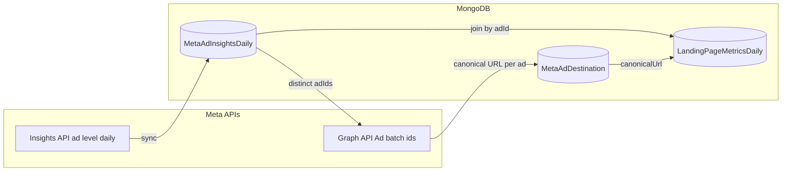

# Spend by URL (Meta) — feature & technical documentation

This document describes the **Spend by destination URL** feature in the admin: what it shows, how data flows from Meta into MongoDB, and where the code lives so engineers can maintain or extend it.

---

## 1. What it does (product)

- **Goal:** Attribute Meta ad **spend**, **delivery** (impressions, clicks), **purchase conversions**, and **purchase revenue** to a **canonical landing URL** (your site path), not just to campaigns or ads.
- **Where:** Admin → **Analytics** → **Facebook Ads** → tab **Spend by URL** (or open with `?viewMode=spend-by-url` on the Facebook Ads admin view).
- **Table:** One row per canonical URL with metrics; expand a row to see **per-ad** breakdown grouped by creative format (video / static / carousel / other).
- **Sync:** **Sync from Meta** runs a server job for the selected date range: pull insights → resolve each ad’s landing URL(s) → rebuild daily aggregates.
- **Unresolved rows:** If Meta’s creative payload has no extractable website URL, the system stores a placeholder like `unknown://meta-ad/…`. The UI can **hide** those by default and offers a checkbox to show them.

**Attribution note:** Insights use Meta’s **`7d_click`** window (see `facebook-marketing.ts`). Revenue and conversion counts are Meta-reported; they are useful for **relative** comparison to account-level cards, not as a substitute for finance/shop systems.

---

## 2. End-to-end pipeline

1. **Insights sync** — Fetch ad-level, **daily** rows (`time_increment=1`) for the date range; upsert **`MetaAdInsightsDaily`**.
2. **Destination sync** — For those `ad_id`s, batch-fetch **Ad → Creative** from Graph API; extract landing URL(s); upsert **`MetaAdDestination`** (one document per `adId`).
3. **Aggregation** — For each calendar day in range, join insights with destinations, sum metrics by **`canonicalUrl`**, write **`LandingPageMetricsDaily`**.
4. **Read path** — Dashboard reads **aggregated** rows across dates; detail API filters by one `canonicalUrl` and returns per-ad totals.

Orchestration entrypoint: **`runMetaSpendByUrlSync`** in `src/services/meta/runMetaSpendByUrlSync.ts`.

---

## 3. MongoDB collections

| Collection | Role | Idempotency / keys |
|------------|------|---------------------|
| **`MetaAdInsightsDaily`** | Raw daily ad metrics from Insights API | Unique: `(adAccountId, date, adId)` |
| **`MetaAdDestination`** | Resolved landing URL(s) per ad from Graph API | Unique: `adId` |
| **`LandingPageMetricsDaily`** | Materialized **per URL per day** rollups | Unique: `(adAccountId, date, canonicalUrl)` |

### 3.1 `MetaAdInsightsDaily`

- **File:** `src/models/MetaAdInsightsDaily.ts`
- Stores **spend** (cents), impressions, clicks, **conversions**, **revenue** (cents), names/ids, optional **`raw`** payload.
- Filled by **`MetaInsightsSyncService.syncDateRange`**, which calls **`fetchFacebookAdInsightsDaily`** (`src/lib/facebook-marketing.ts`) and **`processInsightData`** for normalized metrics.

### 3.2 `MetaAdDestination`

- **File:** `src/models/MetaAdDestination.ts`
- **`canonicalUrl`** — Primary URL used for reporting (first URL when multiple exist).
- **`rawUrls`** — All URLs discovered (e.g. carousel cards).
- **`multiUrl`** — More than one distinct URL on the creative.
- **`creativeType`** — e.g. `object_story`, `asset_feed`, `unknown`.
- **`adFormat`** — `video` | `static` | `carousel` | `unknown` (inferred from creative shape).
- **`fetchedAt`** — When the destination row was last written.

### 3.3 `LandingPageMetricsDaily`

- **File:** `src/models/LandingPageMetricsDaily.ts`
- Per **day** and **canonical URL**: summed spend, impressions, clicks, conversions, revenue, and list of **`adIds`** that contributed.
- Rebuilt by **`SpendByUrlAggregationService.recomputeForDateRange`** for the synced date range (not incremental patch-by-patch in the same sense as insights).

---

## 4. Sync pipeline (code path)

### 4.1 Orchestrator

**`src/services/meta/runMetaSpendByUrlSync.ts`**

1. `MetaInsightsSyncService.syncDateRange` → insights rows + list of **`adIds`**.
2. `MetaAdDestinationService.syncDestinationsForAdIds` → upsert destinations for those ads.
3. `SpendByUrlAggregationService.recomputeForDateRange` → rebuild `LandingPageMetricsDaily`.

Returns a structured result: insights rows upserted, destination upserts + `missingUrlAds`, aggregation stats.

### 4.2 Insights (Meta Marketing API)

**`src/lib/facebook-marketing.ts` — `fetchFacebookAdInsightsDaily`**

- Endpoint: `{adAccountId}/insights`
- **`level: ad`**, **`time_increment: 1`** → one row per ad per calendar day.
- **`action_attribution_windows: ["7d_click"]`**
- Fields include spend, impressions, clicks, actions, action_values, hierarchy names, `ad_id`, `date_start`, etc.
- Paginates until **`paging.next`** is empty.

**`src/services/meta/MetaInsightsSyncService.ts`**

- Maps each API row to **`MetaAdInsightsDaily`** with **`processInsightData`** (purchase actions / values → conversions & revenue cents).

### 4.3 Destinations (Graph API)

**`src/services/meta/MetaAdDestinationService.ts`**

- Batch request: `GET /v21.0/?ids={adId1,adId2,...}&fields=creative{object_story_spec,asset_feed_spec,url_tags}`
- **`extractUrlsFromCreative`** walks:
  - **`object_story_spec`** — `video_data`, **`link_data`**, **`photo_data`**, **`template_data`** (links and CTAs where present).
  - If still no URL: **`asset_feed_spec.link_urls`** — `website_url` (and `deeplink_url` as secondary), required for Dynamic Creative / Advantage+ style creatives where the link is **not** on `object_story_spec`.
- **`inferAdFormatFromStorySpec` / `inferAdFormatFromAssetFeed`** — UI grouping (video / static / carousel / unknown).
- If no URL is found: **`primary = unknown://meta-ad/{adId}`** (and `missingUrlAds` records that ad).

**`src/utils/meta/canonicalize-landing-url.ts`**

- Normalizes to **`origin + path`** (lowercase origin), strips query/hash, trims trailing slash except root. Non-`http(s)` strings are returned as-is (placeholders stay distinct).

---

## 5. Aggregation & read APIs

### 5.1 Aggregation service

**`src/services/analytics/SpendByUrlAggregationService.ts`**

- **`recomputeForDateRange`** — For each date in `[since, until]`, load all `MetaAdInsightsDaily` for that day, map each `adId` → `MetaAdDestination.canonicalUrl` (fallback `unknown://meta-ad/{adId}`), sum into buckets, replace `LandingPageMetricsDaily` rows for that account+date.
- **`getAggregatedSpendByUrl`** — Sums **daily** rows across the requested window; merges `adIds`; sorts by spend descending (API layer does not depend on sort order for correctness).
- **`getSpendByUrlDetail`** — Given one `canonicalUrl`, finds all `MetaAdDestination` docs with that URL, loads insights in range, aggregates **per ad**, sorts by format then spend.

### 5.2 HTTP routes

| Method | Path | Auth | Purpose |
|--------|------|------|---------|
| `GET` | `/api/admin/analytics/spend-by-url` | Admin session | Query params: `startDate`, `endDate` (YYYY-MM-DD). Returns aggregated rows + meta. Uses `FACEBOOK_AD_ACCOUNT_ID`. |
| `GET` | `/api/admin/analytics/spend-by-url/detail` | Admin session | `canonicalUrl`, `startDate`, `endDate` — per-ad breakdown for one URL. |
| `POST` | `/api/admin/analytics/spend-by-url/sync` | Admin session | Body: `{ startDate, endDate }`. Runs full sync. `maxDuration` 300s. Needs `FACEBOOK_AD_ACCOUNT_ID` + `FACEBOOK_MARKETING_ACCESS_TOKEN`. |

Implementation files:

- `src/app/api/admin/analytics/spend-by-url/route.ts`
- `src/app/api/admin/analytics/spend-by-url/detail/route.ts`
- `src/app/api/admin/analytics/spend-by-url/sync/route.ts`

### 5.3 Cron & CLI

- **Cron:** `vercel.json` schedules **`GET /api/cron/sync-meta-spend-by-url`** (daily). Implementation: `src/app/api/cron/sync-meta-spend-by-url/route.ts` (uses env + a default date range; read that file when changing behavior).
- **Script:** `npm run sync:meta-spend-by-url` → `scripts/sync-meta-spend-by-url.ts` (optional `--since` / `--until`).

---

## 6. Frontend

### 6.1 Hooks

**`src/hooks/queries/useSpendByUrlAnalytics.ts`**

- React Query keys under `["admin", "analytics", "spend-by-url", ...]`.
- Types: **`SpendByUrlRow`**, **`SpendByUrlDetailRow`** (includes **`adFormat`**).

### 6.2 UI

- **`src/components/admin/SpendByUrlSection.tsx`** — Info panel (UTM template from **`META_ADS_UTM_TEMPLATE`** in `src/lib/utm/meta-ads-utm.ts`), unresolved URL toggle, sync button, main table with **column-header sort** (first click descending, second ascending; default sort spend desc), expandable rows with nested per-ad table grouped by format.
- **`src/components/admin/FacebookAdsManagement.tsx`** — Embeds `SpendByUrlSection` when **view mode** is `spend-by-url`; can sync URL query `viewMode`.

Invalidation: after sync, queries with key **`["admin", "analytics", "spend-by-url"]`** are invalidated (see `SpendByUrlSection` and `AdminPage`).

---

## 7. UTM & joining to site traffic

**`src/lib/utm/meta-ads-utm.ts`** documents the recommended **URL parameters** template (e.g. `utm_content={{ad.id}}`) so landing-page analytics can correlate with **`MetaAdDestination.adId`** and synced insights. Spend-by-URL reporting itself is **destination-URL–based**, not UTM-parsed in the aggregation layer.

---

## 8. Environment variables

| Variable | Used for |
|----------|----------|
| `FACEBOOK_AD_ACCOUNT_ID` | Ad account id (e.g. `act_…`) for insights + aggregation scoping |
| `FACEBOOK_MARKETING_ACCESS_TOKEN` | Marketing API / Graph API calls in sync routes and scripts |

---

## 9. Troubleshooting

| Symptom | Likely cause |
|---------|----------------|
| Many **`unknown://meta-ad/…`** | Creative uses a shape we didn’t parse (e.g. only shop onsite destinations), or sync failed for that ad; re-run sync after creative changes. Asset-feed / photo / link_data coverage is in **`MetaAdDestinationService`**. |
| Spend by URL doesn’t match Ads Manager totals | Different attribution window, date timezone boundaries, or aggregation across URL buckets vs account-level API. |
| Stale numbers after editing ads | Run **Sync from Meta** for the relevant range so insights + destinations + **`LandingPageMetricsDaily`** refresh. |
| Empty table | No sync for range, or env not set; check API errors in network tab and server logs. |

---

## 10. File index (quick reference)

| Area | Path |
|------|------|
| Orchestrator | `src/services/meta/runMetaSpendByUrlSync.ts` |
| Insights sync | `src/services/meta/MetaInsightsSyncService.ts`, `src/lib/facebook-marketing.ts` |
| Destinations | `src/services/meta/MetaAdDestinationService.ts`, `src/utils/meta/canonicalize-landing-url.ts` |
| Aggregation | `src/services/analytics/SpendByUrlAggregationService.ts` |
| Models | `src/models/MetaAdInsightsDaily.ts`, `MetaAdDestination.ts`, `LandingPageMetricsDaily.ts` |
| Admin APIs | `src/app/api/admin/analytics/spend-by-url/**` |
| Cron | `src/app/api/cron/sync-meta-spend-by-url/route.ts`, `vercel.json` |
| CLI | `scripts/sync-meta-spend-by-url.ts` |
| Hooks / UI | `src/hooks/queries/useSpendByUrlAnalytics.ts`, `src/components/admin/SpendByUrlSection.tsx` |
| UTM template | `src/lib/utm/meta-ads-utm.ts` |

---

*Last updated to match the codebase layout and behavior at documentation time; if behavior changes, update this file alongside code reviews.*
