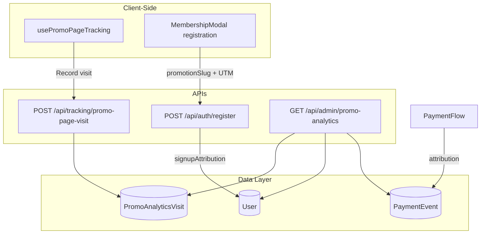

# Promotion Analytics

This guide documents the promotion page analytics system that tracks visits, signups, and conversions for evergreen and toolset promotion pages. It enables attribution analysis to identify which promotion pages perform best.

## Overview

The system uses an **event-sourced attribution model** with a funnel: **Visits → Signups → Conversions**.

- **Visits**: Promotion page views (tracked via `PromoAnalyticsVisit`)
- **Signups**: Registrations attributed to a promotion page (`User.signupAttribution`)
- **Conversions**: Purchases attributed to promotion source (`PaymentEvent.data`)

## Architecture



## Promotion Page Types

| Type      | Slug Examples                          | Description                               |
|-----------|----------------------------------------|-------------------------------------------|
| **Evergreen** | `ryobi-milwaukee`, `cash-prize`, `milwaukee-sidchrome` | Prize-based pages from prize catalog |
| **Toolset**   | `ryobi`, `milwaukee`, `dewalt`, `makita`             | Brand-centric landing pages              |

Slug validation and page-type derivation: `[src/utils/promo-analytics/validate-promo-slug.ts](src/utils/promo-analytics/validate-promo-slug.ts)`.

## Data Model: PromoAnalyticsVisit

**File:** `[src/models/PromoAnalyticsVisit.ts](src/models/PromoAnalyticsVisit.ts)`

| Field       | Type   | Description                                      |
|------------|--------|--------------------------------------------------|
| pageType   | string | `"evergreen"` or `"toolset"`                     |
| slug       | string | Promotion page slug                              |
| referrerSlug| string| Toolset slug user was on before visiting (e.g. from "Explore other toolsets" carousel) |
| anonymousId| string | Session/cookie ID (pre-auth)                      |
| userId     | ObjectId| Set when user registers (optional)               |
| referrer   | string | Referrer URL                                     |
| utmSource  | string | UTM source (e.g. `facebook`, `klaviyo`)          |
| utmMedium  | string | UTM medium (e.g. `cpc`, `email`)                 |
| utmCampaign| string | UTM campaign name                                |
| timestamp  | Date   | Visit time                                       |

**Indexes:** `{ pageType, slug, timestamp }`, `{ referrerSlug, slug, timestamp }`, `{ anonymousId, timestamp }`, `{ userId, timestamp }`  
**TTL:** 90 days (auto-delete for data retention)

## User.signupAttribution

**File:** `[src/models/User.ts](src/models/User.ts)`

Stores which promotion page led to registration:

```typescript
signupAttribution?: {
  promotionPageType: "evergreen" | "toolset";
  promotionSlug: string;
  visitedAt: Date;
  anonymousId?: string;
  utmSource?: string;   // e.g. "klaviyo", "facebook"
  utmMedium?: string;   // e.g. "email", "cpc"
  utmCampaign?: string; // Campaign name
};
```

Set during registration when `promotionSlug` is provided (from URL pathname or stored attribution).

## PaymentEvent Attribution

**File:** `[src/utils/payment/payment-processing.ts](src/utils/payment/payment-processing.ts)`

When a user converts, `PaymentEvent.data` includes promo attribution from `User.signupAttribution`:

- `promotionPageType`, `promotionSlug`, `attributionSource: "signup"`
- `utmSource`, `utmMedium`, `utmCampaign` (when present)

## Tracking Flow

### 1. Visit Tracking

- **Hook:** `usePromoPageTracking()` in `[src/hooks/usePromoPageTracking.ts](src/hooks/usePromoPageTracking.ts)`
- **Layout:** `PromotionsLayoutShell` at `[src/components/promo/PromotionsLayoutShell.tsx](src/components/promo/PromotionsLayoutShell.tsx)`
- **Flow:**
  1. On `/promotions/*`, extracts `pageType` and `slug` from pathname
  2. Stores attribution in sessionStorage (`tools-aus:promo-attribution`) for checkout
  3. Reads `tools-aus:from-promo-slug` from sessionStorage when set (user navigated from another toolset via "Explore other toolsets" carousel)
  4. Sends `POST /api/tracking/promo-page-visit` with UTM params and optional `referrerSlug`

### 2. Signup Attribution

- **Registration:** `MembershipModal` sends `promotionSlug` from current pathname
- **API:** `/api/auth/register` persists `signupAttribution` via `buildSignupAttribution()`
- **Signup count:** `User` documents with `signupAttribution.promotionSlug` and `createdAt` in date range

### 3. Conversion Attribution

- Payment processing reads `user.signupAttribution` and attaches to `PaymentEvent.data`
- Conversions aggregated by `data.promotionSlug` in date range

## Repository & Service Layer

| Layer       | File                                                                | Responsibility                    |
|-------------|---------------------------------------------------------------------|-----------------------------------|
| Repository  | `[src/repositories/PromoAnalyticsRepository.ts](src/repositories/PromoAnalyticsRepository.ts)` | DB access: createVisit, getAggregatedByPage |
| Service     | `[src/services/promo-analytics/PromoAnalyticsService.ts](src/services/promo-analytics/PromoAnalyticsService.ts)` | Business logic, slug validation    |

## Admin UI: Promo Page Analytics

**Location:** Admin → Promo Page Analytics tab

**Component:** `[src/components/admin/PromoAnalyticsManagement.tsx](src/components/admin/PromoAnalyticsManagement.tsx)`

**Features:**

- Date filter: Today, Yesterday, Current Draw, Last Draw, All Time, Custom (matches Overview/Facebook Ads)
- Summary cards: Visits, Signups, Conversions, Revenue
- Funnel: Visits → Signups → Conversions with rates
- Per-page table: page name, visits, **Cross-visits** (from other toolset pages), signups, conversions, revenue, Visit→Signup %, Signup→Conversion %, Overall %
- Sortable columns
- PromoPageDetailModal: "Visits from" breakdown (e.g. Milwaukee 12, DeWalt 8) when users navigated from another toolset page

## API Reference

### POST /api/tracking/promo-page-visit

Track a promotion page visit.

- **Auth:** None
- **Body:** `{ pageType, slug, referrerSlug?, utmSource?, utmMedium?, utmCampaign? }`
- **Deduplication:** One visit per slug per anonymousId within 1 minute

### GET /api/admin/promo-analytics

Aggregated metrics by promotion page.

- **Auth:** Admin only
- **Query:** `dateRange`, `startDate`, `endDate`
- **Returns:** `{ totalVisits, totalSignups, totalConversions, totalRevenue, byPage[] }` (each page includes `crossVisits` when users came from another toolset)

## File Structure

```
src/
├── models/
│   └── PromoAnalyticsVisit.ts
├── repositories/
│   └── PromoAnalyticsRepository.ts
├── services/
│   └── promo-analytics/
│       └── PromoAnalyticsService.ts
├── utils/
│   └── promo-analytics/
│       └── validate-promo-slug.ts
├── app/api/
│   ├── tracking/promo-page-visit/route.ts
│   └── admin/promo-analytics/route.ts
├── components/
│   └── admin/
│       └── PromoAnalyticsManagement.tsx
├── hooks/
│   └── usePromoPageTracking.ts
└── config/
    └── promo-landing-slugs.ts
```
