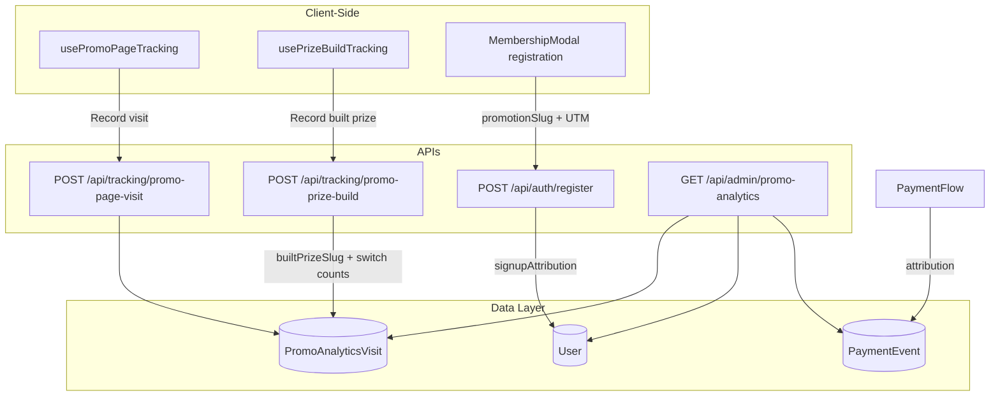

# Promotion Analytics

This guide documents the promotion page analytics system that tracks visits, signups, and conversions for evergreen and toolset promotion pages. It enables attribution analysis to identify which promotion pages perform best.

## Overview

The system uses an **event-sourced attribution model** with a funnel: **Visits → Signups → Conversions**.

- **Visits**: Promotion page views (tracked via `PromoAnalyticsVisit`)
- **Signups**: Registrations attributed to a promotion page (`User.signupAttribution`)
- **Conversions**: Purchases attributed to promotion source (`PaymentEvent.data`)

## Architecture



## Promotion Page Types

| Type      | Slug Examples                          | Description                               |
|-----------|----------------------------------------|-------------------------------------------|
| **Evergreen** | `ryobi-milwaukee`, `cash-prize`, `milwaukee-sidchrome` | Prize-based pages from prize catalog |
| **Toolset**   | `ryobi`, `milwaukee`, `dewalt`, `makita`             | Brand-centric landing pages              |

Slug validation and page-type derivation: `[src/utils/promo-analytics/validate-promo-slug.ts](src/utils/promo-analytics/validate-promo-slug.ts)`.

## Data Model: PromoAnalyticsVisit

**File:** `[src/models/PromoAnalyticsVisit.ts](src/models/PromoAnalyticsVisit.ts)`

| Field       | Type   | Description                                      |
|------------|--------|--------------------------------------------------|
| pageType   | string | `"evergreen"` or `"toolset"`                     |
| slug       | string | Promotion page slug                              |
| referrerSlug| string| Toolset slug user was on before visiting (e.g. from "Explore other toolsets" carousel) |
| builtPrizeSlug| string| Prize combination the visitor assembled in "Build your prize" (e.g. `makita-kincrome`, `cash-prize`); absent if they never touched the reels |
| toolboxSwitches| number| How many times the visitor changed the toolbox lane on this page (0/absent = never engaged) |
| toolsetSwitches| number| How many times the visitor changed the power-toolset lane on this page |
| anonymousId| string | Session/cookie ID (pre-auth)                      |
| userId     | ObjectId| Set when user registers (optional)               |
| referrer   | string | Referrer URL                                     |
| utmSource  | string | UTM source (e.g. `facebook`, `klaviyo`)          |
| utmMedium  | string | UTM medium (e.g. `cpc`, `email`)                 |
| utmCampaign| string | UTM campaign name                                |
| timestamp  | Date   | Visit time                                       |

**Indexes:** `{ pageType, slug, timestamp }`, `{ referrerSlug, slug, timestamp }`, `{ anonymousId, timestamp }`, `{ userId, timestamp }`  
**TTL:** 90 days (auto-delete for data retention)

## User.signupAttribution

**File:** `[src/models/User.ts](src/models/User.ts)`

Stores which promotion page led to registration:

```typescript
signupAttribution?: {
  promotionPageType: "evergreen" | "toolset";
  promotionSlug: string;
  visitedAt: Date;
  anonymousId?: string;
  utmSource?: string;   // e.g. "klaviyo", "facebook"
  utmMedium?: string;   // e.g. "email", "cpc"
  utmCampaign?: string; // Campaign name
};
```

Set during registration when `promotionSlug` is provided (from URL pathname or stored attribution).

## PaymentEvent Attribution

**File:** `[src/utils/payment/payment-processing.ts](src/utils/payment/payment-processing.ts)`

When a user converts, `PaymentEvent.data` includes promo attribution from `User.signupAttribution`:

- `promotionPageType`, `promotionSlug`, `attributionSource: "signup"`
- `utmSource`, `utmMedium`, `utmCampaign` (when present)

## Tracking Flow

### 1. Visit Tracking

- **Hook:** `usePromoPageTracking()` in `[src/hooks/usePromoPageTracking.ts](src/hooks/usePromoPageTracking.ts)`
- **Layout:** `PromotionsLayoutShell` at `[src/components/promo/PromotionsLayoutShell.tsx](src/components/promo/PromotionsLayoutShell.tsx)`
- **Flow:**
  1. On `/promotions/*`, extracts `pageType` and `slug` from pathname
  2. Stores attribution in sessionStorage (`tools-aus:promo-attribution`) for checkout
  3. Reads `tools-aus:from-promo-slug` from sessionStorage when set. **NOTE (2026-07-22): nothing writes this key any more** — its only writer was the "Explore other toolsets" carousel, deleted when the prize builder's power-toolset reel took over that job (a visitor now switches brand in place instead of navigating between toolset pages). The reader is retained so the field would populate again if a writer is reintroduced. **This does not mean the derived Cross-visits figure reads as zero today.** `PromoAnalyticsVisit` has a 90-day TTL, and historical rows written by the old carousel are still inside that window (measured 2026-07-28: 174 of 712 visit rows carry a `referrerSlug`, most recently written 2026-07-24). Cross-visits is only genuinely zero once every pre-removal row has aged out of the TTL — until then, date ranges that overlap that history still report a non-zero count.
  4. Sends `POST /api/tracking/promo-page-visit` with UTM params and optional `referrerSlug`

### 2. Prize Build Tracking

- **Hook:** `usePrizeBuildTracking()` in `[src/hooks/usePrizeBuildTracking.ts](src/hooks/usePrizeBuildTracking.ts)`, called from the "Build your prize" configurator
- **API:** `POST /api/tracking/promo-prize-build` in `[src/app/api/tracking/promo-prize-build/route.ts](src/app/api/tracking/promo-prize-build/route.ts)`, functional core in `[src/utils/promo-analytics/record-prize-build.ts](src/utils/promo-analytics/record-prize-build.ts)`
- **Body:** `{ slug, builtPrizeSlug, toolboxSwitches, toolsetSwitches }`, keyed by the `anonymousId` cookie
- **Flow:** Debounced (settles 1s after the last reel change) and flushed on `pagehide`; counts are cumulative and `$set` server-side, so a double flush is idempotent. Deliberately a second beacon, separate from the landing visit beacon — visits must be recorded regardless of interaction, so waiting for a build would lose every bounced visitor. Sends nothing until the visitor has actually switched something. It attaches `builtPrizeSlug` + engagement counters to the visitor's existing visit row (`upsert: false` — never creates a new row, since that would inflate the visit count)
- **No visit row case:** if the visitor's landing beacon never landed (dedup race, expired TTL), the update is a no-op (`no_visit_row`) and is not treated as an error

### 3. Signup Attribution

- **Registration:** `MembershipModal` sends `promotionSlug` from current pathname
- **API:** `/api/auth/register` persists `signupAttribution` via `buildSignupAttribution()`
- **Signup count:** `User` documents with `signupAttribution.promotionSlug` and `createdAt` in date range

### 4. Conversion Attribution

- Payment processing reads `user.signupAttribution` and attaches to `PaymentEvent.data`
- Conversions aggregated by `data.promotionSlug` in date range

## Repository & Service Layer

| Layer       | File                                                                | Responsibility                    |
|-------------|---------------------------------------------------------------------|-----------------------------------|
| Repository  | `[src/repositories/PromoAnalyticsRepository.ts](src/repositories/PromoAnalyticsRepository.ts)` | DB access: createVisit, updateVisitBuild, getAggregatedByPage |
| Service     | `[src/services/promo-analytics/PromoAnalyticsService.ts](src/services/promo-analytics/PromoAnalyticsService.ts)` | Business logic, slug validation    |

## Admin UI: Promo Page Analytics

**Location:** Admin → Promo Page Analytics tab

**Component:** `[src/components/admin/PromoAnalyticsManagement.tsx](src/components/admin/PromoAnalyticsManagement.tsx)`

**Features:**

- Date filter: Today, Yesterday, Current Draw, Last Draw, All Time, Custom (matches Overview/Facebook Ads)
- Summary cards: Visits, Signups, Conversions, Revenue
- Funnel: Visits → Signups → Conversions with rates
- Per-page table: page name, visits, **Cross-visits** (from other toolset pages), **Builds** (unique visitors who assembled a prize), **Top built prize** (most-built combination on that page, or none), signups, conversions, revenue, Visit→Signup %, Signup→Conversion %, Overall %
- Sortable columns
- PromoPageDetailModal: "Visits from" breakdown (e.g. Milwaukee 12, DeWalt 8) when users navigated from another toolset page

## API Reference

### POST /api/tracking/promo-page-visit

Track a promotion page visit.

- **Auth:** None
- **Body:** `{ pageType, slug, referrerSlug?, utmSource?, utmMedium?, utmCampaign? }`
- **Deduplication:** One visit per slug per anonymousId within 1 minute (handles refresh)
- **Aggregation:** Visits and cross-visits count **unique visitors** (by userId or anonymousId) per slug — each user recorded at most once per page

### POST /api/tracking/promo-prize-build

Attach the prize a visitor assembled in "Build your prize" — plus reel engagement counters — to their existing visit row.

- **Auth:** None; keyed by the `anonymousId` cookie
- **Body:** `{ slug, builtPrizeSlug, toolboxSwitches, toolsetSwitches }`
- **Update semantics:** `$set` with absolute totals (not `$inc`) on the visitor's most recent matching visit row; `upsert: false` — never creates a row. A missing visit row (dedup race, expired TTL, landing beacon never landed) is a silent no-op, not an error.

### GET /api/admin/promo-analytics

Aggregated metrics by promotion page.

- **Auth:** Admin only
- **Query:** `dateRange`, `startDate`, `endDate`
- **Returns:** `{ totalVisits, totalSignups, totalConversions, totalRevenue, byPage[] }` — each page includes `crossVisits` (visitors who arrived from another toolset page), `builds` (unique visitors who assembled a prize, same dedup as `visits`), and `topBuiltPrize` (the most-built combination on that page, or `null`)

## File Structure

```
src/
├── models/
│   └── PromoAnalyticsVisit.ts
├── repositories/
│   └── PromoAnalyticsRepository.ts
├── services/
│   └── promo-analytics/
│       └── PromoAnalyticsService.ts
├── utils/
│   └── promo-analytics/
│       ├── validate-promo-slug.ts
│       └── record-prize-build.ts
├── app/api/
│   ├── tracking/promo-page-visit/route.ts
│   ├── tracking/promo-prize-build/route.ts
│   └── admin/promo-analytics/route.ts
├── components/
│   └── admin/
│       └── PromoAnalyticsManagement.tsx
├── hooks/
│   ├── usePromoPageTracking.ts
│   └── usePrizeBuildTracking.ts
└── config/
    └── promo-landing-slugs.ts
```
