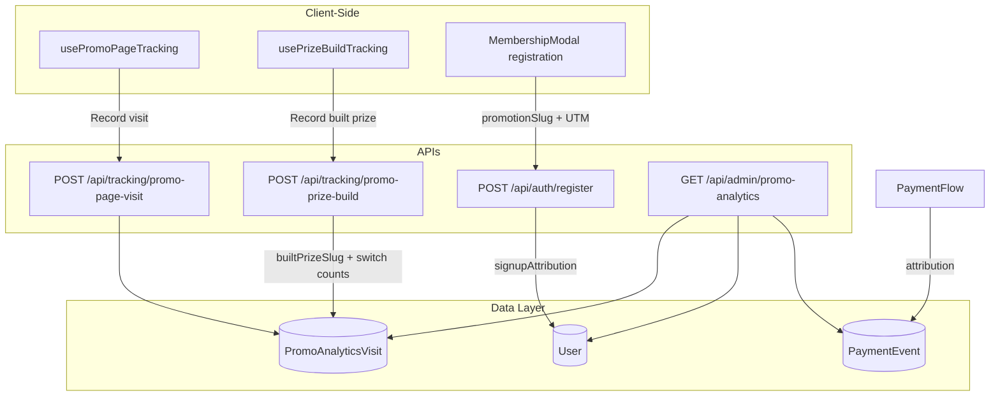

# Promotion Analytics

This guide documents the promotion page analytics system that tracks visits, signups, and conversions for evergreen and toolset promotion pages. It enables attribution analysis to identify which promotion pages perform best.

## Overview

The system uses an **event-sourced attribution model** with a funnel: **Visits → Signups → Conversions**.

- **Visits**: Promotion page views (tracked via `PromoAnalyticsVisit`)
- **Signups**: Registrations attributed to a promotion page (`User.signupAttribution`)
- **Conversions**: Purchases attributed to promotion source (`PaymentEvent.data`)

## Architecture



## Promotion Page Types

| Type      | Slug Examples                          | Description                               |
|-----------|----------------------------------------|-------------------------------------------|
| **Evergreen** | `ryobi-milwaukee`, `cash-prize`, `milwaukee-sidchrome` | Prize-based pages from prize catalog |
| **Toolset**   | `ryobi`, `milwaukee`, `dewalt`, `makita`             | Brand-centric landing pages              |

Slug validation and page-type derivation: `[src/utils/promo-analytics/validate-promo-slug.ts](src/utils/promo-analytics/validate-promo-slug.ts)`.

## Data Model: PromoAnalyticsVisit

**File:** `[src/models/PromoAnalyticsVisit.ts](src/models/PromoAnalyticsVisit.ts)`

| Field       | Type   | Description                                      |
|------------|--------|--------------------------------------------------|
| pageType   | string | `"evergreen"` or `"toolset"`                     |
| slug       | string | Promotion page slug                              |
| builtPrizeSlug| string| Prize combination that was **on screen** in "Build your prize" when the visitor left (e.g. `makita-kincrome`, `cash-prize`). Since F-018 (2026-07-29) this is recorded for **every** visitor, touched or not — its presence means exposure, **not** engagement |
| buildInteracted| boolean| Did the visitor actually touch the builder? The engagement signal. Required end-to-end below the route boundary since 2026-07-31 |
| toolboxSwitches| number| How many times the visitor changed the toolbox lane on this page. **Not** an engagement proxy — the cash toggle is not a reel card, and a `?toolbox=` URL arrival re-hydrates a switched build at 0 |
| toolsetSwitches| number| How many times the visitor changed the power-toolset lane on this page |
| anonymousId| string | Session/cookie ID (pre-auth)                      |
| userId     | ObjectId| Set when user registers (optional)               |
| referrer   | string | Referrer URL                                     |
| utmSource  | string | UTM source (e.g. `facebook`, `klaviyo`)          |
| utmMedium  | string | UTM medium (e.g. `cpc`, `email`)                 |
| utmCampaign| string | UTM campaign name                                |
| utmBasis   | string | `"first_touch"` or `"landing_url"` — where the three UTM values above came from (added 2026-07-31; absent on older rows) |
| timestamp  | Date   | Visit time                                       |

**Removed 2026-07-31:** `referrerSlug` (the toolset the visitor was on before this page). Its only
writer was the "Explore other toolsets" carousel, replaced by the in-place two-reel configurator on
2026-07-22; the last row carrying it is that same date, so the derived Cross-visits metric was a
structural zero inside the 90-day TTL.

**Indexes:** `{ pageType, slug, timestamp }`, `{ anonymousId, timestamp }`, `{ userId, timestamp }`, and the PARTIAL `builtPrizeSlug_ts_partial`  
**TTL:** 90 days, exported as `PROMO_VISIT_RETENTION_DAYS` — the read side clamps its date range to
this floor, because `User` and `PaymentEvent` never expire and an older window would divide complete
signups by truncated visits

## User.signupAttribution

**File:** `[src/models/User.ts](src/models/User.ts)`

Stores which promotion page led to registration:

```typescript
signupAttribution?: {
  promotionPageType: "evergreen" | "toolset";
  promotionSlug: string;
  visitedAt: Date;
  anonymousId?: string;
  utmSource?: string;   // e.g. "klaviyo", "facebook"
  utmMedium?: string;   // e.g. "email", "cpc"
  utmCampaign?: string; // Campaign name
};
```

Set during registration when `promotionSlug` is provided (from URL pathname or stored attribution).

## PaymentEvent Attribution

**File:** `[src/utils/payment/payment-processing.ts](src/utils/payment/payment-processing.ts)`

When a user converts, `PaymentEvent.data` includes promo attribution from `User.signupAttribution`:

- `promotionPageType`, `promotionSlug`, `attributionSource: "signup"`
- `utmSource`, `utmMedium`, `utmCampaign` (when present)

## Tracking Flow

### 1. Visit Tracking

- **Hook:** `usePromoPageTracking()` in `[src/hooks/usePromoPageTracking.ts](src/hooks/usePromoPageTracking.ts)`
- **Layout:** `PromotionsLayoutShell` at `[src/components/promo/PromotionsLayoutShell.tsx](src/components/promo/PromotionsLayoutShell.tsx)`
- **Flow:**
  1. On `/promotions/*`, extracts `pageType` and `slug` from pathname
  2. Stores attribution in sessionStorage (`tools-aus:promo-attribution`) for checkout
  3. Sends `POST /api/tracking/promo-page-visit` with the URL's UTM params
  4. **Server-side**, the route reads the durable first-touch `_ta_attr` cookie and prefers it over
     the body/URL values, recording which basis it used in `utmBasis` (2026-07-31). It is read in
     the route, not the hook: `request` cannot be touched inside `after()`, and a client read would
     race the write — the hook that WRITES `_ta_attr` mounts above this one, and React runs child
     effects first.

  > **`referrerSlug` and the `tools-aus:from-promo-slug` sessionStorage read are gone (2026-07-31).**
  > The key's only writer, the "Explore other toolsets" carousel, was deleted on 2026-07-22 when the
  > prize builder's power-toolset reel took over that job (a visitor now switches brand in place
  > instead of navigating between toolset pages). A July 2026 measurement kept the reader alive on
  > the grounds that pre-removal rows were still inside the 90-day TTL; the last such row is dated
  > 2026-07-22, so by 2026-07-31 Cross-visits was a structural zero and the field, its index
  > declaration, the beacon parameter and the derived column were all removed.

### 2. Prize Build Tracking

- **Hook:** `usePrizeBuildTracking()` in `[src/hooks/usePrizeBuildTracking.ts](src/hooks/usePrizeBuildTracking.ts)`, called from the "Build your prize" configurator
- **API:** `POST /api/tracking/promo-prize-build` in `[src/app/api/tracking/promo-prize-build/route.ts](src/app/api/tracking/promo-prize-build/route.ts)`, functional core in `[src/utils/promo-analytics/record-prize-build.ts](src/utils/promo-analytics/record-prize-build.ts)`
- **Body:** `{ slug, builtPrizeSlug, toolboxSwitches, toolsetSwitches, interacted? }`, keyed by the `anonymousId` cookie
- **Flow:** Debounced (settles 1s after the last reel change) and flushed on `pagehide`; counts are cumulative and `$set` server-side, so a double flush is idempotent. Deliberately a second beacon, separate from the landing visit beacon — visits must be recorded regardless of interaction, so waiting for a build would lose every bounced visitor. Since F-018 the **unload flush is never gated**, so every visitor's on-screen combination reaches the row (the debounced sender stays gated on `hasInteracted`, otherwise every visitor produces two writes). It attaches `builtPrizeSlug` + engagement counters to the visitor's existing visit row (`upsert: false` — never creates a new row, since that would inflate the visit count)
- **`interacted` is optional on the wire and REQUIRED below it** (2026-07-31). The route resolves the default exactly once (`validatedData.interacted !== false`) and every layer beneath takes a non-optional boolean, so a caller that drops it fails to compile. It used to be optional at all three layers **and** the route rebuilt the payload without forwarding it — so `buildInteracted` was written `true` on 100% of rows and the admin "Builds" column counted exposure while claiming engagement. Production: 1,754 of 1,941 build rows carry zero reel switches. Not retro-derivable, so no backfill
- **No visit row case:** if the visitor's landing beacon never landed (dedup race, expired TTL), the update is a no-op (`no_visit_row`) and is not treated as an error

### 3. Signup Attribution

- **Registration:** `MembershipModal` sends `promotionSlug` from current pathname
- **API:** `/api/auth/register` persists `signupAttribution` via `buildSignupAttribution()`
- **Signup count:** `User` documents with `signupAttribution.promotionSlug` whose **attribution touch** falls in the date range — `signupAttribution.visitedAt`, with `createdAt` only as a fallback when `visitedAt` is absent (`signupTouchWindowMatch`, 2026-07-31). Registration writes `signupAttribution` onto pre-existing plain accounts without touching `createdAt`, so `createdAt` is the age of the ACCOUNT, not the date of the signup event. Every signup query on this tab uses this rule, including `getAggregatedByBuiltPrize`.

### 4. Conversion Attribution

- Payment processing reads `user.signupAttribution` and attaches to `PaymentEvent.data`
- Conversions aggregated by `data.promotionSlug` in date range

## Repository & Service Layer

| Layer       | File                                                                | Responsibility                    |
|-------------|---------------------------------------------------------------------|-----------------------------------|
| Repository  | `[src/repositories/PromoAnalyticsRepository.ts](src/repositories/PromoAnalyticsRepository.ts)` | DB access: createVisit, updateVisitBuild, getAggregatedByPage, getAggregatedByChannel, getAggregatedByBuiltPrize, getPageDetailByUTMCampaign, getPageBuildBreakdown, getChannelDetail |
| Service     | `[src/services/promo-analytics/PromoAnalyticsService.ts](src/services/promo-analytics/PromoAnalyticsService.ts)` | Business logic, slug validation, `resolvePromoAnalyticsRange` (AEST window + retention clamp) |
| Channel identity | `[src/services/attribution/normalizePlatform.ts](src/services/attribution/normalizePlatform.ts)` + `[src/config/attribution-channels.ts](src/config/attribution-channels.ts)` | Canonical `ConvertingPlatform` bucketing (JS + generated Mongo `$switch`) and its display labels |

## Admin UI: Promo Page Analytics

**Location:** Admin → Promo Page Analytics tab

**Component:** `[src/components/admin/PromoAnalyticsManagement.tsx](src/components/admin/PromoAnalyticsManagement.tsx)`

**Features:**

- Date filter: Today, Yesterday, Current Draw, Last Draw, All Time, Custom (matches Overview/Facebook Ads). **All of these silently returned "today" until 2026-07-31** — the resolver's parameter name did not match the key its callers passed. Ranges are additionally clamped to the 90-day visit-retention floor, with an amber banner when that happens
- Summary cards: Visits, Signups, Conversions, Revenue
- Funnel: Visits → Signups → Conversions with rates
- Channel Attribution table, keyed on the canonical channel (`meta`, `klaviyo_email`, …) rather than a raw `utm_source` — `facebook.com` / `ig` / `fb` fold into one "Facebook / Instagram" row
- Per-page table: page name, visits, **Builds** (visitors who CHANGED the build, over `buildVisitors` who merely saw one), **Changed %**, signups, conversions, revenue, Visit→Signup %, Signup→Conversion %, Overall %. Numeric columns sortable
- By Built Prize + By Toolbox rollups (cross-page, grouped by the combination built)
- `PromoPageDetailModal`: campaign breakdown + a **Prize builds** section (per-combination builders / changed / signups / conversions / revenue, with the page's default combination marked). The old "Visits from" panel was removed with `referrerSlug`
- `ChannelDetailModal`: pages + campaigns for one channel, plus a **Traffic sources** strip showing the raw `utm_source` values that folded into it

## API Reference

### POST /api/tracking/promo-page-visit

Track a promotion page visit.

- **Auth:** None (rate limited: 60 req / 5 min, keyed on the `ta_anon_id` cookie)
- **Body:** `{ pageType, slug, utmSource?, utmMedium?, utmCampaign? }`. The three UTM fields are bounded — trimmed, ≤200 chars, no control characters. `referrerSlug` was removed 2026-07-31
- **Attribution basis:** the durable first-touch `_ta_attr` cookie wins over the body/URL values; the row records which in `utmBasis`
- **Deduplication:** One visit per slug per anonymousId within 1 minute (handles refresh)
- **Aggregation:** Visits count **unique visitors** (by userId or anonymousId, else a synthetic per-row id) per slug — each user recorded at most once per page. A drill-down's `summary.visits` is deduped once for the whole scope and is deliberately **not** the sum of its per-page/per-campaign rows

### POST /api/tracking/promo-prize-build

Attach the prize a visitor assembled in "Build your prize" — plus reel engagement counters — to their existing visit row.

- **Auth:** None; keyed by the `anonymousId` cookie
- **Body:** `{ slug, builtPrizeSlug, toolboxSwitches, toolsetSwitches, interacted? }`
- **Update semantics:** `$set` with absolute totals (not `$inc`) on the visitor's most recent matching visit row; `upsert: false` — never creates a row. A missing visit row (dedup race, expired TTL, landing beacon never landed) is a silent no-op, not an error.

### GET /api/admin/promo-analytics

Aggregated metrics by promotion page.

- **Auth:** `requirePermission("pageAnalytics.view")` (was `promos.view` until 2026-07-31)
- **Query:** `dateRange`, `startDate`, `endDate` (`YYYY-MM-DD`, regex-validated)
- **Returns:** `{ totalVisits, totalSignups, totalConversions, totalRevenue, byPage[], byChannel[], byBuiltPrize[], dateRange }`
  - `byPage[]` — `visits`, `buildVisitors` (exposure), `builds` (engagement), `buildChangeRate`, `topBuiltPrize`, `buildDistribution`, signups/conversions/revenue + three rates. `crossVisits` removed
  - `byChannel[]` — renamed from `byUTMSource`; `channel` + `channelLabel` on each row
  - `dateRange` — `{ start, end, visitsRetainedFrom, clampedToRetention }`

### GET /api/admin/promo-analytics/channel-detail

- **Query:** `channel` (closed enum — was a free-string `utmSource`), optional `startDate`/`endDate`
- **Returns:** `{ channel, channelLabel, summary, byPage[], byCampaign[], rawSources[] }`

### GET /api/admin/promo-analytics/page-detail

- **Query:** `pageType`, `slug`, optional `startDate`/`endDate`
- **Returns:** `{ pageType, slug, pageLabel, summary, byCampaign[], buildBreakdown }` — `visitsFrom` removed

## File Structure

```
src/
├── models/
│   └── PromoAnalyticsVisit.ts
├── repositories/
│   └── PromoAnalyticsRepository.ts
├── services/
│   └── promo-analytics/
│       └── PromoAnalyticsService.ts
├── utils/
│   └── promo-analytics/
│       ├── validate-promo-slug.ts
│       └── record-prize-build.ts
├── app/api/
│   ├── tracking/promo-page-visit/route.ts
│   ├── tracking/promo-prize-build/route.ts
│   └── admin/promo-analytics/route.ts
├── components/
│   ├── admin/
│   │   ├── PromoAnalyticsManagement.tsx
│   │   └── promo-analytics/
│   │       ├── UTMCampaignBreakdownTable.tsx
│   │       └── PrizeBuildBreakdownTable.tsx
│   └── modals/
│       ├── ChannelDetailModal.tsx
│       └── PromoPageDetailModal.tsx
├── hooks/
│   ├── usePromoPageTracking.ts
│   └── usePrizeBuildTracking.ts
├── services/attribution/
│   └── normalizePlatform.ts
├── types/
│   └── promo-analytics.ts
└── config/
    ├── promo-landing-slugs.ts
    └── attribution-channels.ts
```
