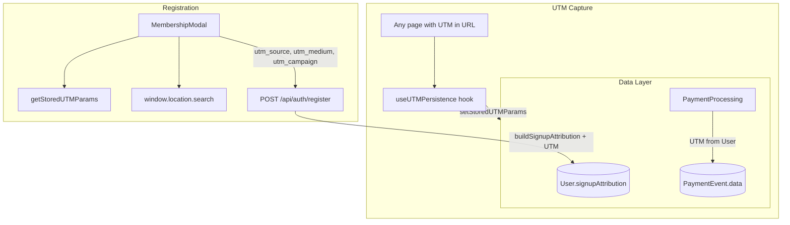

# UTM Signup Attribution

This guide documents the UTM (Urchin Tracking Module) attribution system that stores marketing channel data (e.g. Klaviyo, Facebook) at signup. It enables analysis of which channels drive registrations and conversions.

## Overview

UTM parameters are standard query parameters used for marketing attribution:

- **utm_source** – Channel (e.g. `klaviyo`, `facebook`, `google`)
- **utm_medium** – Medium type (e.g. `email`, `cpc`, `social`)
- **utm_campaign** – Campaign name

The system captures UTM on landing, persists it across navigation, and stores it at signup on `User.signupAttribution` and optionally on `PaymentEvent.data` for conversion-level reporting.

## Architecture



## Components

### 1. UTM Storage Utilities

**File:** `[src/utils/tracking/utm-storage.ts](src/utils/tracking/utm-storage.ts)`

| Function               | Purpose                                   |
|------------------------|-------------------------------------------|
| `getStoredUTMParams()` | Read UTM from sessionStorage (with expiry)|
| `setStoredUTMParams()` | Write UTM to sessionStorage               |

- **Key:** `tools-aus:utm-attribution`
- **Expiry:** 30 minutes (avoids stale UTM from prior sessions)

### 2. UTM Persistence Hook

**File:** `[src/hooks/useUTMPersistence.ts](src/hooks/useUTMPersistence.ts)`

- Runs on every route change (`pathname`, `searchParams`)
- Reads `window.location.search` for UTM parameters
- Persists to sessionStorage when UTM is present
- **Integration:** Called from `PromoLinkTracker` for site-wide capture

### 3. UTM Helpers

**File:** `[src/utils/tracking/utm-helpers.ts](src/utils/tracking/utm-helpers.ts)`

- `extractUTMParams(urlOrParams)` – Extracts `utm_source`, `utm_medium`, `utm_campaign` from URL or URLSearchParams

## User.signupAttribution (UTM Fields)

**File:** `[src/models/User.ts](src/models/User.ts)`

```typescript
signupAttribution?: {
  promotionPageType: "evergreen" | "toolset";
  promotionSlug: string;
  visitedAt: Date;
  anonymousId?: string;
  utmSource?: string;   // e.g. "klaviyo", "facebook"
  utmMedium?: string;   // e.g. "email", "cpc"
  utmCampaign?: string; // Campaign name
};
```

UTM fields are optional and backward compatible; existing users have no UTM.

## Registration Flow

**File:** `[src/app/api/auth/register/route.ts](src/app/api/auth/register/route.ts)`

1. **Schema:** Accepts optional `utm_source`, `utm_medium`, `utm_campaign` in request body.
2. **Source priority:**
   - Client-sent UTM (primary)
   - Fallback: `extractUTMParams(Referer header)` when client does not send UTM
3. **buildSignupAttribution(promotionSlug, utm):** Includes UTM in returned attribution when present.

**File:** `[src/components/modals/MembershipModal.tsx](src/components/modals/MembershipModal.tsx)`

Before calling `/api/auth/register`:

1. Read UTM from `window.location.search` (current page)
2. Fallback to `getStoredUTMParams()` (sessionStorage from earlier landing)
3. Include `utm_source`, `utm_medium`, `utm_campaign` in request body when present

## PaymentEvent.data (UTM)

**File:** `[src/utils/payment/payment-processing.ts](src/utils/payment/payment-processing.ts)`

When creating `PaymentEvent` for conversions, promo attribution from `User.signupAttribution` includes:

- `utmSource`, `utmMedium`, `utmCampaign` when present on the user

Enables conversion-level UTM reporting (e.g. revenue by `utm_source`).

## Facebook Conversions API

The register route sends UTM to Facebook CAPI via `custom_data` for `CompleteRegistration` events. UTM is taken from the same source used for `signupAttribution` (client or Referer), not from `request.url`.

## Design Decisions

| Decision                     | Rationale                                                  |
|-----------------------------|------------------------------------------------------------|
| Client-sent UTM primary     | Client has the real page URL; Referer can be stripped      |
| sessionStorage + 30min      | Survives navigation; avoids stale UTM from prior sessions  |
| Optional fields on User     | Backward compatible; existing users unaffected              |
| Reuse extractUTMParams     | Centralized logic; no duplication                          |

## File Structure

```
src/
├── utils/
│   └── tracking/
│       ├── utm-storage.ts      # sessionStorage helpers
│       └── utm-helpers.ts      # extractUTMParams
├── types/
│   └── tracking.ts             # UTMParams interface
├── hooks/
│   └── useUTMPersistence.ts
├── components/
│   └── tracking/
│       └── PromoLinkTracker.tsx  # calls useUTMPersistence
└── app/api/
    └── auth/
        └── register/
            └── route.ts        # buildSignupAttribution + getUTMFromRequest
```

## Usage Example: Campaign URLs

For Klaviyo or Facebook campaigns, use UTM in links:

```
https://yoursite.com/promotions/ryobi?utm_source=klaviyo&utm_medium=email&utm_campaign=winter_sale
https://yoursite.com/promotions/milwaukee?utm_source=facebook&utm_medium=cpc&utm_campaign=brand_awareness
```

When users land and eventually register, their `signupAttribution` will include `utmSource: "klaviyo"` (or `"facebook"`), enabling channel-level analytics in the admin and exports.

## Future Enhancements

- Admin Promo Analytics: optional “by UTM source” breakdown
- User list/export: show `signupAttribution.utmSource`
- `utm_term` and `utm_content` support in types and storage
